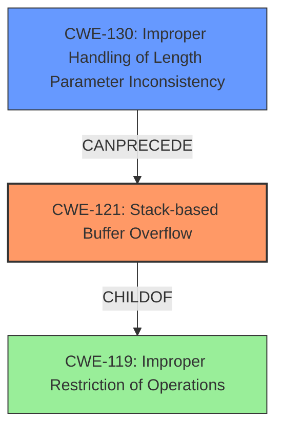

# Analysis Report for CVE-2021-3434

# Vulnerability Analysis Report: CVE-2021-3434

## Description

Stack based buffer overflow in le_ecred_conn_req(). Zephyr versions >= v2.5.0 Stack-based Buffer Overflow (CWE-121). For more information, see https//github.com/zephyrproject-rtos/zephyr/security/advisories/GHSA-8w87-6rfp-cfrm

## Vulnerability Description Key Phrases

**Rootcause:** Stack-based buffer overflow
**Weakness:** CWE-121
**Product:** Zephyr
**Version:** >= v2.5.0
**Component:** le_ecred_conn_req()

## Analysis (with Relationship Data)

# Summary
| CWE ID | CWE Name | Confidence | CWE Abstraction Level | CWE Vulnerability Mapping Label | CWE-Vulnerability Mapping Notes |
|---|---|---|---|---|---|
| CWE-121 | Stack-based Buffer Overflow | 1.0 | Variant | Primary | Allowed |

## Evidence and Confidence

*   **Confidence Score:** 1.0
*   **Evidence Strength:** HIGH

- **Analysis and Justification:**
  - *Explanation:* The vulnerability description clearly states "**Stack-based buffer overflow**" (**CWE-121**), and the CVE Reference Links Content Summary confirms the **root cause** as "**Stack-based buffer overflow** in the `le_ecred_conn_req()` function". CWE-121 is a Variant-level CWE that precisely describes this type of buffer overflow. The retriever results also list CWE-121, although not with the highest score, the description and key phrases make it the best match.
  
  - *Relationship Analysis:* CWE-121 is a variant of CWE-119 (Improper Restriction of Operations within the Bounds of a Memory Buffer).

- **Confidence Score:**
  - Confidence: 1.0 (Directly stated in the vulnerability description and confirmed by the CVE reference).

## Criticism of Analysis

Okay, let's review the provided analysis, focusing on its accuracy, completeness, and adherence to CWE specifications.

**Overall Assessment:**

The analysis correctly identifies the primary weakness as CWE-121 (Stack-based Buffer Overflow) with high confidence.  The justification is solid, based on the vulnerability description and CVE reference.  However, the retriever results indicate a few other potential weaknesses that deserve further consideration, especially CWE-130 (Improper Handling of Length Parameter Inconsistency).  The analysis could be strengthened by briefly discussing why these other CWEs are not the *primary* cause, or if they contribute to the exploitability of the vulnerability.

Here's a breakdown with specific comments:

**1. Summary Table:**

| CWE ID | CWE Name | Confidence | CWE Abstraction Level | CWE Vulnerability Mapping Label | CWE-Vulnerability Mapping Notes |
|---|---|---|---|---|---|
| CWE-121 | Stack-based Buffer Overflow | 1.0 | Variant | Primary | Allowed |

*   **Comment:**  The table is well-formatted and clearly presents the core finding.  The "Allowed" mapping guidance is accurately reflected.

**2. Evidence and Confidence:**

*   **Confidence Score:** 1.0
*   **Evidence Strength:** HIGH

    *   **Analysis and Justification:**
        *   *Explanation:* Excellent.  The reasoning is clear and directly links the vulnerability description to CWE-121. The mention of the Variant level is also correct.
        *   *Relationship Analysis:* Accurate. CWE-121 is indeed a variant of CWE-119.

    *   **Confidence Score:**
        *   Confidence: 1.0 (Directly stated in the vulnerability description and confirmed by the CVE reference).

*   **Comment:**  The evidence and justification are strong. The confidence level is warranted.

**3. CWE Examples from Database (CWE-119):**

*   **Comment:**  Listing observed examples of CWE-119 is useful for providing context. However, it is important to note that the core issue is *specifically* a stack-based buffer overflow, so examples related to stack overflows are more relevant than general buffer overflows.

**4. Relevant CWE Specifications:**

*   **CWE-119: Improper Restriction of Operations within the Bounds of a Memory Buffer**
    *   **Mapping Guidance: Usage: Discouraged**
    *   **Rationale:** CWE-119 is commonly misused in low-information vulnerability reports when lower-level CWEs could be used instead, or when more details about the vulnerability are available.
    *   **Comments:** Look at CWE-119's children and consider mapping to CWEs such as CWE-787: Out-of-bounds Write, CWE-125: Out-of-bounds Read, or others.

*   **CWE-121: Stack-based Buffer Overflow**
    *   **Mapping Guidance: Usage: Allowed**
    *   **Rationale:** This CWE entry is at the Variant level of abstraction, which is a preferred level of abstraction for mapping to the root causes of vulnerabilities.

*   **Comment:** The use of lower level CWE entries are prefereable, and the analysis correctly maps to CWE-121, a variant of CWE-119.

**5. Analysis of Retriever Results and Other Potential CWEs:**

This is where the analysis could be improved. The Retriever Results table highlights several other CWEs with relatively high combined scores.  Let's analyze some of the more relevant ones in relation to CWE-121:

*   **CWE-130: Improper Handling of Length Parameter Inconsistency:**  This is a strong candidate for a *contributing* factor.  A stack-based buffer overflow often occurs because the code doesn't properly validate the length of the input before copying it into a stack-allocated buffer.  If a length field in the input is inconsistent with the actual data length, *and* this inconsistency isn't handled, it *can* lead to the buffer overflow. The analysis should explicitly address this.  For example, it could state: "While CWE-121 is the direct cause of the vulnerability, CWE-130 might play a role if the size of the input is derived from a length parameter that is not properly validated. Further investigation of the code would be needed to determine if a length parameter inconsistency contributes to the overflow." The specification of CWE-130 also states that if an attacker manipulates the length parameter associated with an input, this could lead to a buffer overflow.
*   **CWE-191: Integer Underflow (Wrap or Wraparound):** This could be relevant if integer operations are used to calculate the buffer size, and an underflow leads to a smaller-than-expected buffer being allocated.  The analysis should briefly consider if this is a possibility.
*   **CWE-124: Buffer Underwrite ('Buffer Underflow'):** Less likely in this scenario, as the primary issue is *overflowing* the buffer.
*   **CWE-122: Heap-based Buffer Overflow:** Explicitly ruled out by the vulnerability description, which mentions "Stack-based".
*   **CWE-190: Integer Overflow or Wraparound:** Similar to CWE-191, this could be relevant if integer operations are used in size calculations. The analysis should briefly consider if this is a possibility.
*   **CWE-170: Improper Null Termination:** If the string being copied is not properly null-terminated, this could contribute to the overflow. This is a less likely scenario but should be considered. The description specifies that this usually results from other weaknesses, but this can be primary to buffer overflows.
*   **CWE-126: Buffer Over-read:** Unless the overflow copies data from somewhere else, buffer over-read is not likely to be involved.

**6. Potential Mitigations:**

*   The mitigations listed in the full CWE specifications are generally applicable to buffer overflows.
*   Consider adding the mitigations listed for CWE-130, as the potential for length parameter inconsistency was noted in the Retriever Results.

**Specific Recommendations:**

1.  **Address the Retriever Results:**  Specifically discuss why CWE-130, CWE-191, CWE-190 and CWE-170 are *not* the primary cause, or if they are potential contributing factors. This demonstrates a more thorough analysis.
2.  **Mitigation Specificity:** While the general mitigations for CWE-121 are valid, if CWE-130 contributes, also mention mitigations related to proper length validation.
3.  **Chain Analysis:** While the analysis correctly identifies the Variant level CWE, consider briefly discussing the potential for a chain of weaknesses (e.g., CWE-130 -> CWE-121).

**Revised Summary Table (Example):**

| CWE ID | CWE Name | Confidence | CWE Abstraction Level | CWE Vulnerability Mapping Label | CWE-Vulnerability Mapping Notes |
|---|---|---|---|---|---|
| CWE-121 | Stack-based Buffer Overflow | 1.0 | Variant | Primary | Allowed. While CWE-121 is the direct cause, CWE-130 (Improper Handling of Length Parameter Inconsistency) *may* contribute if the size of the input is derived from an unvalidated length parameter. Further code review is needed to confirm this. |

By addressing these points, the analysis will become more robust and comprehensive, demonstrating a deeper understanding of the vulnerability and its potential contributing factors.

## Final Resolution

# Summary
| CWE ID | CWE Name | Confidence | CWE Abstraction Level | CWE Vulnerability Mapping Label | CWE-Vulnerability Mapping Notes |
|---|---|---|---|---|---|
| CWE-121 | Stack-based Buffer Overflow | 1.0 | Variant | Primary | Allowed. While CWE-121 is the direct cause, CWE-130 (Improper Handling of Length Parameter Inconsistency) *may* contribute if the size of the input is derived from an unvalidated length parameter. Further code review is needed to confirm this. |
| CWE-130 | Improper Handling of Length Parameter Inconsistency | 0.6 | Base | Secondary | Allowed. May contribute to the primary **WEAKNESS** if input length is not validated |

## Evidence and Confidence

*   **Confidence Score:** 0.9
*   **Evidence Strength:** MEDIUM

## Relationship Analysis
The primary relationship considered was the parent-child relationship between CWE-121 (Stack-based Buffer Overflow) and CWE-119 (Improper Restriction of Operations within the Bounds of a Memory Buffer), where CWE-121 is a variant of CWE-119. This reinforces the specificity of the classification. Additionally, CWE-130 (Improper Handling of Length Parameter Inconsistency) was considered as a potential contributing factor. While not explicitly stated in the vulnerability description, the criticism suggests it is a common precursor to buffer overflows, especially if input length validation is lacking. The abstraction levels influenced the decision by favoring the more specific Variant level CWE-121 for the primary classification.

## Vulnerability Chain
The vulnerability chain starts with a potential **ROOTCAUSE** of CWE-130 (Improper Handling of Length Parameter Inconsistency), which, if present, leads to CWE-121 (Stack-based Buffer Overflow). The overflow then results in arbitrary code execution or denial of service. The missing link is the explicit confirmation of CWE-130 in the provided vulnerability details; it is inferred from common buffer overflow scenarios.

## Summary of Analysis
The initial analysis correctly identified CWE-121 (Stack-based Buffer Overflow) as the primary **WEAKNESS**. The criticism highlighted the potential contribution of CWE-130 (Improper Handling of Length Parameter Inconsistency), which aligns with common buffer overflow causes.

The decision to include CWE-130 as a secondary CWE is based on the understanding that improper length handling often precedes buffer overflows. The evidence supporting this is the criticism's statement: "A stack-based buffer overflow often occurs because the code doesn't properly validate the length of the input before copying it into a stack-allocated buffer." Although not explicitly stated in the vulnerability description, this inference is reasonable. Further code review would be needed to confirm the presence of CWE-130.

CWE-121 is the optimal level of specificity because the vulnerability description explicitly mentions "Stack-based buffer overflow," making it more precise than its parent CWE-119. CWE-130 is included as a potential contributing factor based on common vulnerability patterns, though its presence requires further verification.

*Report generated on 2025-03-17 23:57:55*
