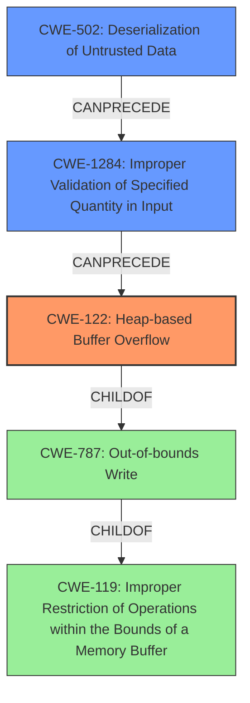

# Final Resolution for CVE-2021-34394

# Summary
| CWE ID | CWE Name | Confidence | CWE Abstraction Level | CWE Vulnerability Mapping Label | CWE-Vulnerability Mapping Notes |
|---|---|---|---|---|---|
| CWE-122 | Heap-based Buffer Overflow | 0.90 | Variant | Allowed | Primary CWE |
| CWE-502 | Deserialization of Untrusted Data | 0.75 | Base | Allowed | Secondary Candidate |
| CWE-1284 | Improper Validation of Specified Quantity in Input | 0.60 | Base | Allowed | Secondary Candidate |

## Evidence and Confidence

*   **Confidence Score:** 0.85
*   **Evidence Strength:** HIGH

## Relationship Analysis
The analysis hinges on the relationships between **CWE-502 (Deserialization of Untrusted Data)**, **CWE-1284 (Improper Validation of Specified Quantity in Input)**, and **CWE-122 (Heap-based Buffer Overflow)**. **CWE-502** can precede **CWE-1284**, which in turn can precede **CWE-122**. **CWE-122** is a variant of **CWE-787 (Out-of-bounds Write)**, which is a child of **CWE-119 (Improper Restriction of Operations within the Bounds of a Memory Buffer)**. The abstraction levels guided the selection, favoring the more specific variant **CWE-122** over the base **CWE-787** and class **CWE-119**, while acknowledging the role of base CWEs like **CWE-502** and **CWE-1284** as contributing factors.

## Vulnerability Chain
The vulnerability chain begins with **CWE-502 (Deserialization of Untrusted Data)**, where an attacker-controlled message stream is processed. This leads to **CWE-1284 (Improper Validation of Specified Quantity in Input)**, as the deserialized data, potentially containing a size or length value, is not properly validated. This unchecked value is then used in a memory allocation on the heap, resulting in **CWE-122 (Heap-based Buffer Overflow)**. The overflow allows for information disclosure and data modification.

## Summary of Analysis
The initial analysis correctly identified **CWE-122 (Heap-based Buffer Overflow)** and **CWE-502 (Deserialization of Untrusted Data)**. The criticism suggested considering **CWE-1284 (Improper Validation of Specified Quantity in Input)**, which is now included due to the likelihood that the deserialization process involves a size field that isn't validated.

The decision to include **CWE-1284** is based on the vulnerability description, which mentions "incorrect message stream deserialization allows an attacker to use the malicious CA that is run by the user to cause the **buffer overflow**". This suggests that the attacker has control over the data being deserialized, potentially including a size parameter. The absence of validation on this parameter directly aligns with **CWE-1284**.

The confidence in **CWE-122** is increased to 0.90 due to the explicit mention of "buffer overflow" and the reasonable assumption of heap allocation in the context of Trusty TAs and message passing. The confidence in **CWE-502** is adjusted to 0.75, reflecting its role as a contributing factor rather than the direct cause. **CWE-1284** is assigned a confidence of 0.60, acknowledging its potential relevance given the deserialization process.

The selected CWEs are at the optimal level of specificity. **CWE-122** is more precise than its base **CWE-787** and class **CWE-119**. **CWE-502** and **CWE-1284** provide valuable context regarding the root cause of the vulnerability.