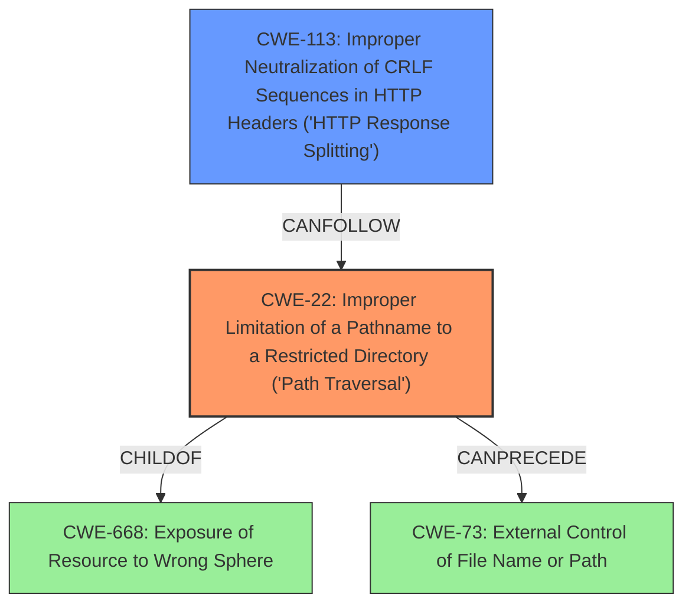

# Final Resolution for CVE-2021-34429

# Summary

| CWE ID | CWE Name | Confidence | CWE Abstraction Level | CWE Vulnerability Mapping Label | CWE-Vulnerability Mapping Notes |
|---|---|---|---|---|---|
| CWE-22 | Improper Limitation of a Pathname to a Restricted Directory ('Path Traversal') | 0.95 | Base | Allowed | Primary CWE |
| CWE-113 | Improper Neutralization of CRLF Sequences in HTTP Headers ('HTTP Response Splitting') | 0.8 | Variant | Allowed | Secondary Candidate |

## Evidence and Confidence

*   **Confidence Score:** 0.9
*   **Evidence Strength:** HIGH

## Relationship Analysis

The primary focus is on the hierarchical relationship, ensuring that CWE-22 is selected for its specificity compared to its parents like CWE-668. The secondary classification involves selecting a child of CWE-116 that is more specific. The chain relationships help understand how **path traversal** can lead to further vulnerabilities.

## Vulnerability Chain

The vulnerability chain starts with the **improper handling of encoded characters** in URIs, leading to **path traversal**, and potentially enabling access to sensitive directories like WEB-INF and bypassing security constraints. The lack of proper CRLF neutralization can enable HTTP Response Splitting.

## Summary of Analysis

The initial analysis correctly identified CWE-22 as the primary **weakness**. The criticism highlighted the need to explore children of CWE-116.
*   **CWE-22:** The evidence from the vulnerability description strongly supports CWE-22, as it explicitly mentions the ability to access restricted directories using crafted URIs with **encoded characters**.
*   **CWE-113:** After reviewing the children of CWE-116, CWE-113 (Improper Neutralization of CRLF Sequences in HTTP Headers ('HTTP Response Splitting')) emerges as a more specific and relevant secondary CWE. The ability to craft URIs with **encoded characters** could allow an attacker to inject CRLF sequences into HTTP headers, leading to HTTP Response Splitting.

The final decision is based on the evidence provided and the relationships between CWEs, ensuring the selected CWEs are at the optimal level of specificity. CWE-41 was considered but deemed less relevant, as it focuses on file system contents disclosure through path equivalence, which is similar to **path traversal** but deals with the generation of multiple names for the same object.

Here's the refined justification for the secondary CWE:
The use of **encoded characters** in the URI to exploit the **path traversal** vulnerability suggests that the application is not properly handling or decoding these characters. By injecting %0D%0A (CRLF) characters via the URI, an attacker can manipulate HTTP headers, leading to HTTP Response Splitting.