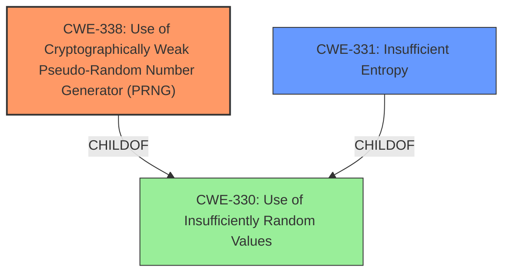

# Final Resolution for CVE-2021-34430

# Summary
| CWE ID | CWE Name | Confidence | CWE Abstraction Level | CWE Vulnerability Mapping Label | CWE-Vulnerability Mapping Notes |
|---|---|---|---|---|---|
| CWE-338 | Use of Cryptographically Weak Pseudo-Random Number Generator (PRNG) | 0.95 | Base | Allowed | Primary CWE |
| CWE-331 | Insufficient Entropy | 0.75 | Base | Allowed | Secondary Candidate |

## Evidence and Confidence

*   **Confidence Score:** 0.95
*   **Evidence Strength:** HIGH

## Relationship Analysis
The primary relationship influencing the decision is that **CWE-338 (Use of Cryptographically Weak Pseudo-Random Number Generator (PRNG))** is a more specific child of **CWE-330 (Use of Insufficiently Random Values)**. While **CWE-330** could apply, **CWE-338** is preferred due to its focus on cryptographic contexts, aligning precisely with the vulnerability description. **CWE-331 (Insufficient Entropy)** is related to both **CWE-338** and **CWE-330** and describes a contributing factor. There are no strong chain relationships to consider in this instance.

## Vulnerability Chain
The vulnerability chain starts with the **ROOTCAUSE**, which is the use of `rand()` function, a **cryptographically weak PRNG** (**CWE-338**). This is exacerbated by **insufficient entropy** in the seed used to initialize the PRNG (**CWE-331**). This allows an attacker to predict or brute-force the PRNG's output, compute the master key, and then decrypt the DTLS traffic, leading to a compromise of confidentiality.

## Summary of Analysis
The initial analysis and criticism are both strong and lead to a clear conclusion. The primary **WEAKNESS** is the use of a **cryptographically weak PRNG** (**CWE-338**), as evidenced by the vulnerability description stating that Eclipse TinyDTLS relies on the `rand` function in the C library. This is further confirmed by the CVE reference, which states that the `server_random` and `client_random` values are derived from this **insecure PRNG**.

The relationship analysis reinforces the decision to choose **CWE-338** over its parent, **CWE-330**, due to the greater specificity of **CWE-338** in the context of cryptography. The inclusion of **CWE-331** as a secondary candidate is also justified, as the quick brute-forcing of the PRNG state suggests **insufficient entropy** in the seed.

The selected CWEs are at the optimal level of specificity. **CWE-338** is a Base-level CWE that directly addresses the use of a **cryptographically weak PRNG**, while **CWE-331** is another Base-level CWE that describes a contributing factor, the **insufficient entropy** in the seed.