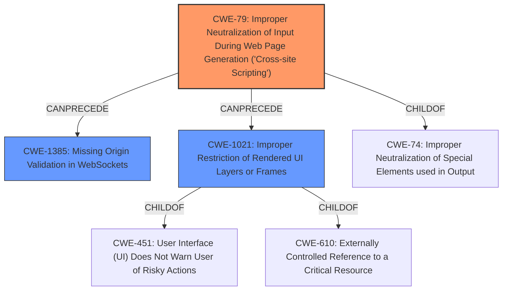

# Final Resolution for CVE-2021-34435

# Summary
| CWE ID  | CWE Name  | Confidence | CWE Abstraction Level | CWE Vulnerability Mapping Label | CWE-Vulnerability Mapping Notes |
|-----------------|-------------------------------------------------------------------------------|-------------------|-----------------------|------------------------------------|------------------------------------|
| CWE-79 | Improper Neutralization of Input During Web Page Generation ('Cross-site Scripting') | 0.9 | Base |   Primary CWE Match |   Allowed |
| CWE-1385 | Missing Origin Validation in WebSockets | 0.8 | Variant |   Secondary CWE Candidate |   Allowed |
| CWE-1021 | Improper Restriction of Rendered UI Layers or Frames | 0.6 | Base |   Secondary CWE Candidate |   Allowed |

## Evidence and Confidence

*   **Confidence Score:** 0.85
*   **Evidence Strength:** HIGH

## Relationship Analysis
The analysis focuses on the primary **WEAKNESS** of improper neutralization of input leading to cross-site scripting (CWE-79) and the secondary **WEAKNESS** of missing origin validation in WebSockets (CWE-1385). The addition of CWE-1021 accounts for the improper restriction of UI layers.

- Parent-child hierarchical relationships: CWE-79 is a child of CWE-74 (Improper Neutralization of Special Elements used in Output). CWE-1385 has no direct relationships. CWE-1021 is a child of CWE-451 and CWE-610.
- Chain relationships showing progression of vulnerability: The XSS (CWE-79) allows connection to the backend, which lacks WebSocket origin validation (CWE-1385), leading to Remote Code Execution (RCE). The lack of proper iframe restrictions (CWE-1021) contributed to the exploitability of the vulnerability.
- Peer relationships that offered alternative classifications: CWE-434 and CWE-494 were considered but deemed less directly relevant than the selected CWEs.
- How abstraction levels influenced your selection: The base and variant levels were preferred for their specificity, avoiding overly broad classifications like CWE-20.

## Vulnerability Chain
The chain of **ROOTCAUSE** and **WEAKNESSES** are as follows:
1. User previews a malicious HTML file.
2. **CWE-79:** The HTML file is not properly neutralized, leading to potential XSS.
3. **CWE-1385:** The lack of WebSocket origin validation allows the malicious HTML to connect to the Theia backend.
4. **CWE-1021:** Improper iframe restrictions allow the javascript code from the malicious HTML to make the connection.
5. Result: Remote Code Execution (RCE) is achieved.

## Summary of Analysis
The initial analysis correctly identified CWE-79 and CWE-1385 as relevant. The criticism highlighted the need to strengthen the chain of reasoning and consider additional factors. The updated analysis incorporates these suggestions by:

- Increasing the confidence score for CWE-1385 due to a clearer explanation of its role in the RCE.
- Adding CWE-1021 to account for the improper restriction of UI layers.
- Strengthening the chain of reasoning by clearly articulating how each **WEAKNESS** directly enables the RCE.
- Providing a more detailed vulnerability chain.

The graph relationships influenced the final selection by highlighting the connections between the different **WEAKNESSES**. The selected CWEs are at the optimal level of specificity because they accurately reflect the root causes and contributing factors of the vulnerability, avoiding overly broad classifications.

The evidence for CWE-79 is strong, as the CVE summary explicitly mentions the possibility of XSS. The evidence for CWE-1385 is also strong, as the CVE summary highlights the lack of WebSocket origin validation. The evidence for CWE-1021 comes from the fact that the mini-browser extension renders HTML files in an iframe inside the IDE which allows for javascript execution. This directly aligns with the definition for CWE-1021, and is included to strengthen the chain of events that lead to remote code execution.