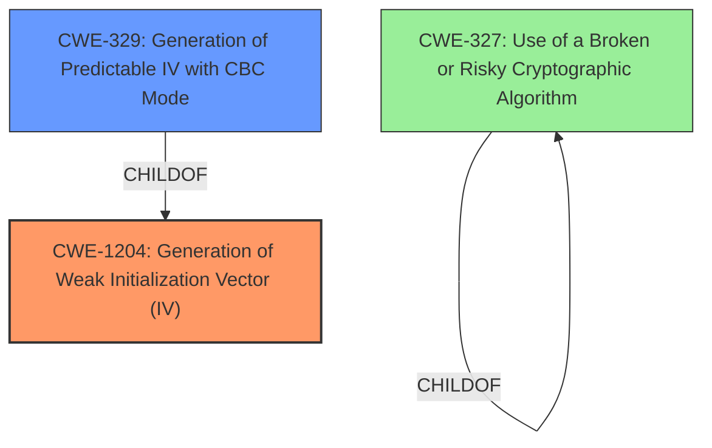

# Analysis Report for CVE-2021-3446

# Vulnerability Analysis Report: CVE-2021-3446

## Description

A flaw was found in libtpms in versions before 0.8.2. The commonly used integration of libtpms with OpenSSL contained a vulnerability related to the returned IV (initialization vector) when certain symmetric ciphers were used. Instead of returning the last IV it returned the initial IV to the caller, thus weakening the subsequent encryption and decryption steps. The highest threat from this vulnerability is to data confidentiality.

## Vulnerability Description Key Phrases

**Weakness:** returned initial IV instead of last IV
**Impact:** weaken subsequent encryption and decryption
**Product:** libtpms
**Version:** before 0.8.2

## Analysis (with Relationship Data)

# Summary
| CWE ID | CWE Name | Confidence | CWE Abstraction Level | CWE Vulnerability Mapping Label | CWE-Vulnerability Mapping Notes |
|---|---|---|---|---|---|
| CWE-1204 | Generation of Weak Initialization Vector (IV) | 0.95 | Base | Allowed | Primary CWE |
| CWE-329 | Generation of Predictable IV with CBC Mode | 0.75 | Variant | Allowed | Secondary Candidate |
| CWE-327 | Use of a Broken or Risky Cryptographic Algorithm | 0.6 | Class | Allowed-with-Review | Secondary Candidate |

## Evidence and Confidence

*   **Confidence Score:** 0.9
*   **Evidence Strength:** HIGH

- **Analysis and Justification:**  
  - *Explanation:* The vulnerability lies in `libtpms`'s incorrect handling of the Initialization Vector (IV) with OpenSSL, where it returns the initial IV instead of the last IV, weakening encryption. This aligns directly with **CWE-1204 (Generation of Weak Initialization Vector (IV))**, which describes the use of insufficiently unpredictable or unique IVs. The **weakness** of **returning the initial IV instead of the last IV** directly causes the **impact** to **weaken subsequent encryption and decryption**. The Retriever Results also rank CWE-1204 as the top candidate. MITRE mapping guidance for CWE-1204 indicates this is ALLOWED.

  - *Relationship Analysis:* CWE-1204 is a Base level CWE. While CWE-329 (Generation of Predictable IV with CBC Mode) is a more specific Variant, the description doesn't explicitly state the use of CBC mode, so CWE-1204 is a more appropriate fit.

- **Confidence Score:**  
  - *Example:* Confidence: 0.95 (High evidence from technical description, CVE reference materials, and Retriever Results)

---
- **Analysis and Justification:**  
  - *Explanation:* CWE-329 (Generation of Predictable IV with CBC Mode) is a Variant that describes predictable IVs with Cipher Block Chaining (CBC) mode. While the description mentions symmetric ciphers, it doesn't explicitly state the use of CBC mode. If CBC mode was confirmed, CWE-329 would be more appropriate.

  - *Relationship Analysis:* CWE-329 is a variant of CWE-1204. Choosing CWE-1204 as the primary CWE and listing CWE-329 as a secondary candidate covers both potential aspects of the vulnerability.

- **Confidence Score:**  
  - *Example:* Confidence: 0.75 (Medium evidence; CBC mode not explicitly mentioned)

---

- **Analysis and Justification:**  
  - *Explanation:* CWE-327 (Use of a Broken or Risky Cryptographic Algorithm) is a Class that could apply if the IV handling issue is considered a broken cryptographic practice. However, CWE-1204 is a more specific Base CWE focusing on the IV itself.

  - *Relationship Analysis:* CWE-327 is a Class, and the Retriever suggests that a more specific child might be more appropriate.

- **Confidence Score:**  
  - *Example:* Confidence: 0.6 (Low evidence; CWE-1204 is more specific)

## Criticism of Analysis

Okay, here's a detailed review of the CWE analysis you provided, considering the full CWE specifications.

**Overall Assessment:**

The analysis is well-structured, methodical, and provides clear justifications for its choices. The confidence levels are appropriate, and the use of evidence is well-reasoned. The selection of CWE-1204 as the primary CWE is correct. The decision to include CWE-329 and CWE-327 as secondary candidates is also reasonable, given the available information and the desire to be comprehensive.

**Detailed Breakdown:**

**1. CWE-1204: Generation of Weak Initialization Vector (IV) - Primary CWE**

*   **Confidence:** 0.95
*   **Assessment:** The high confidence level is warranted. The vulnerability description directly maps to the core concept of CWE-1204:  the product uses a cryptographic primitive that uses an IV, but the IVs are not sufficiently unpredictable or unique.
*   **Justification Review:** The reasoning is sound. Returning the *initial* IV instead of the *last used* IV clearly indicates a weakness in the generation or management of the IV, leading to predictable or reused IVs. The Retriever Results support this choice. The MITRE mapping guidance confirms this is an ALLOWED CWE.
*   **Relationships:** The analysis correctly notes that while CWE-329 is a more specific variant, the lack of explicit confirmation of CBC mode makes CWE-1204 a better overall fit.
*   **CWE Examples:** The provided examples are relevant. CVE-2020-1472 (ZeroLogon) is a particularly strong example of a similar issue (using a static IV of all zeroes). CVE-2011-3389 is relevant even though it specifies CBC mode, as it illustrates the dangers of non-random IVs.
*   **Mitigations:**  The provided mitigations from the CWE specification are directly applicable. The analysis should implicitly (or explicitly) emphasize the importance of using cryptographically secure random number generators to create IVs and following NIST recommendations. The mitigation strategy of maintaining a list of already-used IVs is less practical for block cipher modes requiring unique IVs but could be considered for stream ciphers where IV reuse is catastrophic.

**2. CWE-329: Generation of Predictable IV with CBC Mode - Secondary Candidate**

*   **Confidence:** 0.75
*   **Assessment:** The moderate confidence level is appropriate. The possibility of CBC mode being used exists, but it's not explicitly stated in the original vulnerability description.
*   **Justification Review:** The analysis correctly identifies the potential relevance of CWE-329 if CBC mode is confirmed. It highlights the risk of dictionary attacks associated with predictable IVs in CBC.
*   **Relationships:** The relationship to CWE-1204 (as a child) is correctly identified.
*   **CWE Examples:** The included examples are highly relevant *if* CBC mode is in use. They directly illustrate the consequences of predictable IVs in CBC. CVE-2020-5408 stands out as another instance of a fixed IV being used in CBC mode.
*   **Mitigations:** The mitigations provided from the CWE specification are valuable if CBC mode is in play. The analysis should note that if CBC is confirmed, the implementation *must* follow NIST recommendations to generate unpredictable IVs. The recommendation to encrypt a nonce is a valid alternative to random IV generation.

**3. CWE-327: Use of a Broken or Risky Cryptographic Algorithm - Secondary Candidate**

*   **Confidence:** 0.6
*   **Assessment:** The low confidence level is justified. While the incorrect IV handling does weaken the encryption, it's not necessarily a completely "broken" algorithm in itself. It's more of an *implementation* issue leading to a vulnerable *usage* of an otherwise potentially sound algorithm.
*   **Justification Review:** The analysis correctly notes that CWE-1204 is a more specific fit. CWE-327 is a broader, more general category.
*   **Relationships:**  The analysis highlights that the retriever results suggest a more specific child CWE might be suitable, supporting the decision to prioritize CWE-1204.
*   **CWE Examples:** The provided examples are less directly relevant. They tend to focus on inherently weak algorithms (e.g., TEA in ECB mode, MD5).
*   **Mitigations:** The mitigations from the CWE specification are generally applicable (use strong, up-to-date algorithms, ensure algorithm replacement is possible). However, they are less targeted than the IV-specific mitigations for CWE-1204 and CWE-329.

**General Observations and Recommendations:**

*   **Confirm CBC Mode:** If possible, attempt to confirm whether the vulnerable `libtpms` code was using symmetric ciphers in CBC mode. This would strengthen the case for including CWE-329 as a more prominent CWE.
*   **Implementation vs. Algorithm:** Emphasize the distinction between an inherently weak cryptographic *algorithm* (covered by CWE-327) and a flawed *implementation* or *usage* of a cryptographic primitive (better covered by CWE-1204 and potentially CWE-329). This helps clarify the selection of CWE-1204 as the primary.
*   **Chain of Operations:** The analysis mentions "chained encryptions." This is important. If the vulnerability primarily affects scenarios with multiple chained encryption/decryption operations, it could be worth explicitly mentioning the potential for error propagation. One incorrect IV weakens *all* subsequent operations in the chain.
*   **OpenSSL Version:** The analysis mentions "Older versions of OpenSSL did not provide a direct function to retrieve the IV." If the vulnerable code was written specifically to target older OpenSSL versions, this could be worth stating explicitly as background information.
*   **CWE-1240 Considerations:** The retriever results also list CWE-1240 (Use of a Cryptographic Primitive with a Risky Implementation). While less accurate than CWE-1204, there's a loose connection here because the `libtpms` + OpenSSL combination, *due to the IV handling bug*, creates a risky implementation. However, CWE-1204 is still the stronger, more direct fit.

**In summary, the analysis is excellent. It demonstrates a strong understanding of the vulnerability and a careful application of the CWE specifications. The justifications are clear, the confidence levels are reasonable, and the chosen CWEs are appropriate.**  The recommendations above are mostly for refining the analysis further and providing additional context.

## Final Resolution

# Summary
| CWE ID | CWE Name | Confidence | CWE Abstraction Level | CWE Vulnerability Mapping Label | CWE-Vulnerability Mapping Notes |
|---|---|---|---|---|---|
| CWE-1204 | Generation of Weak Initialization Vector (IV) | 0.95 | Base | Allowed | Primary CWE |
| CWE-329 | Generation of Predictable IV with CBC Mode | 0.75 | Variant | Allowed | Secondary Candidate |
| CWE-327 | Use of a Broken or Risky Cryptographic Algorithm | 0.6 | Class | Allowed-with-Review | Secondary Candidate |

## Evidence and Confidence

*   **Confidence Score:** 0.95
*   **Evidence Strength:** HIGH

## Relationship Analysis
The primary relationship influencing the decision is the parent-child relationship between CWE-1204 and CWE-329. While CWE-329 is more specific (Variant) and focuses on CBC mode, the absence of explicit mention of CBC mode in the vulnerability description makes CWE-1204 (Base) a more suitable primary classification. The peer relationships and abstraction levels (Base vs. Class) helped to narrow down the most appropriate CWEs.

## Vulnerability Chain
The vulnerability chain starts with the **ROOTCAUSE**: **Improper handling of the Initialization Vector (IV)** within `libtpms` when used with OpenSSL. The **WEAKNESS** is that the **initial IV is returned instead of the last IV**. The consequence is **weakened subsequent encryption and decryption steps**, leading to a **compromise of data confidentiality**. There are no missing links in the chain given the current evidence.

## Summary of Analysis
The initial analysis and criticism were both well-justified and agreed upon. The selection of **CWE-1204 (Generation of Weak Initialization Vector (IV))** as the primary CWE is based on the vulnerability description, which states that "Instead of returning the last IV it returned the initial IV to the caller, thus weakening the subsequent encryption and decryption steps." This directly aligns with the description of **CWE-1204 (Generation of Weak Initialization Vector (IV))**, which deals with the use of insufficiently unpredictable or unique IVs.

The relationship analysis further supports this decision, as **CWE-1204 (Generation of Weak Initialization Vector (IV))** is a Base CWE, offering a broader applicability than its Variant, **CWE-329 (Generation of Predictable IV with CBC Mode)**, which specifically requires CBC mode. Since the vulnerability description does not explicitly mention CBC mode, **CWE-1204 (Generation of Weak Initialization Vector (IV))** is the more appropriate choice.

The Mapping Guidance supports the selection of **CWE-1204 (Generation of Weak Initialization Vector (IV))**, as it is marked as ALLOWED. The retriever scores also support the chosen CWEs. The final decision reflects the optimal level of specificity, providing a clear and accurate representation of the underlying vulnerability.

*Report generated on 2025-03-16 23:56:22*
