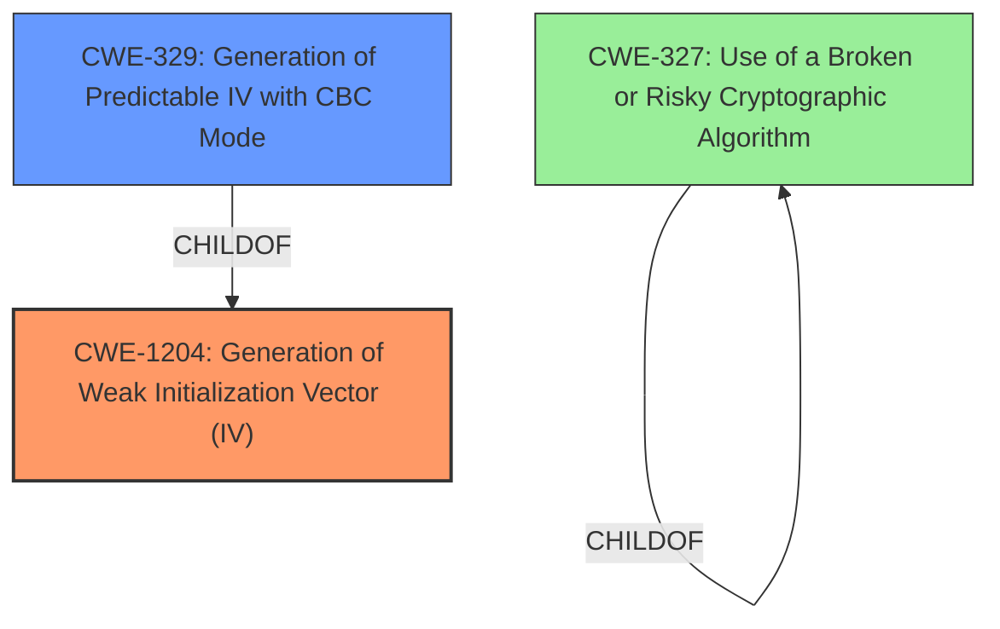

# Final Resolution for CVE-2021-3446

# Summary
| CWE ID | CWE Name | Confidence | CWE Abstraction Level | CWE Vulnerability Mapping Label | CWE-Vulnerability Mapping Notes |
|---|---|---|---|---|---|
| CWE-1204 | Generation of Weak Initialization Vector (IV) | 0.95 | Base | Allowed | Primary CWE |
| CWE-329 | Generation of Predictable IV with CBC Mode | 0.75 | Variant | Allowed | Secondary Candidate |
| CWE-327 | Use of a Broken or Risky Cryptographic Algorithm | 0.6 | Class | Allowed-with-Review | Secondary Candidate |

## Evidence and Confidence

*   **Confidence Score:** 0.95
*   **Evidence Strength:** HIGH

## Relationship Analysis
The primary relationship influencing the decision is the parent-child relationship between CWE-1204 and CWE-329. While CWE-329 is more specific (Variant) and focuses on CBC mode, the absence of explicit mention of CBC mode in the vulnerability description makes CWE-1204 (Base) a more suitable primary classification. The peer relationships and abstraction levels (Base vs. Class) helped to narrow down the most appropriate CWEs.

## Vulnerability Chain
The vulnerability chain starts with the **ROOTCAUSE**: **Improper handling of the Initialization Vector (IV)** within `libtpms` when used with OpenSSL. The **WEAKNESS** is that the **initial IV is returned instead of the last IV**. The consequence is **weakened subsequent encryption and decryption steps**, leading to a **compromise of data confidentiality**. There are no missing links in the chain given the current evidence.

## Summary of Analysis
The initial analysis and criticism were both well-justified and agreed upon. The selection of **CWE-1204 (Generation of Weak Initialization Vector (IV))** as the primary CWE is based on the vulnerability description, which states that "Instead of returning the last IV it returned the initial IV to the caller, thus weakening the subsequent encryption and decryption steps." This directly aligns with the description of **CWE-1204 (Generation of Weak Initialization Vector (IV))**, which deals with the use of insufficiently unpredictable or unique IVs.

The relationship analysis further supports this decision, as **CWE-1204 (Generation of Weak Initialization Vector (IV))** is a Base CWE, offering a broader applicability than its Variant, **CWE-329 (Generation of Predictable IV with CBC Mode)**, which specifically requires CBC mode. Since the vulnerability description does not explicitly mention CBC mode, **CWE-1204 (Generation of Weak Initialization Vector (IV))** is the more appropriate choice.

The Mapping Guidance supports the selection of **CWE-1204 (Generation of Weak Initialization Vector (IV))**, as it is marked as ALLOWED. The retriever scores also support the chosen CWEs. The final decision reflects the optimal level of specificity, providing a clear and accurate representation of the underlying vulnerability.