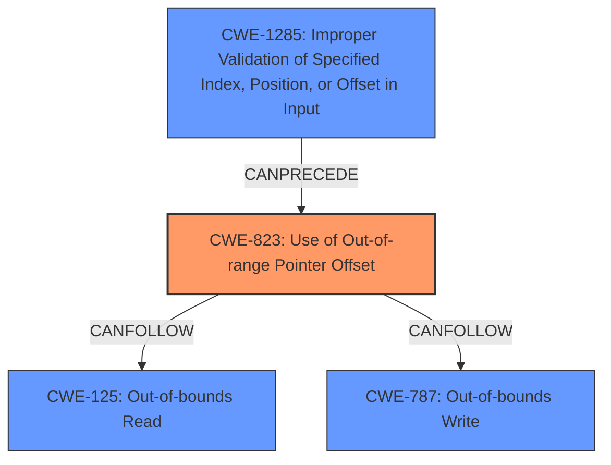

# Final Resolution for CVE-2021-34595

# Summary
| CWE ID | CWE Name | Confidence | CWE Abstraction Level | CWE Vulnerability Mapping Label | CWE-Vulnerability Mapping Notes |
|---|---|---|---|---|---|
| CWE-823 | Use of Out-of-range Pointer Offset | 0.95 | Base | Allowed | Primary CWE. A crafted request with an invalid offset leads to this vulnerability. |
| CWE-1285 | Improper Validation of Specified Index, Position, or Offset in Input | 0.75 | Base | Allowed | Secondary CWE. Contributing Factor. CWE-1285 can lead to CWE-823. Indicates a lack of input validation for the offset value in the crafted request. |
| CWE-125 | Out-of-bounds Read | 0.7 | Base | Allowed | Secondary CWE. Potential consequence of CWE-823.  |
| CWE-787 | Out-of-bounds Write | 0.7 | Base | Allowed | Secondary CWE. Potential consequence of CWE-823. |

## Evidence and Confidence

*   **Confidence Score:** 0.9
*   **Evidence Strength:** HIGH

## Relationship Analysis
The primary weakness is CWE-823 (**Use of Out-of-range Pointer Offset**). This can be preceded by CWE-1285 (**Improper Validation of Specified Index, Position, or Offset in Input**), as the crafted request with invalid offsets indicates a lack of input validation. CWE-823 can then lead to either CWE-125 (**Out-of-bounds Read**) or CWE-787 (**Out-of-bounds Write**), representing the consequences of the out-of-range pointer offset.

## Vulnerability Chain
The vulnerability chain starts with a crafted request containing invalid offsets. The lack of proper input validation (**CWE-1285**) allows this invalid offset to be processed. This leads to the use of an out-of-range pointer offset (**CWE-823**), which then results in either an out-of-bounds read (**CWE-125**) or an out-of-bounds write (**CWE-787**). The final impact is a denial-of-service condition or local memory overwrite.

## Summary of Analysis
The initial analysis correctly identified CWE-823 as the primary **WEAKNESS**, supported by the CVE reference and the vulnerability description which states "A crafted request with invalid offsets may cause an **out-of-bounds read** or **write** access...". The criticism provided additional clarification on the relationships between the CWEs.

The graph relationships influenced the final selection by highlighting the chain of events: CWE-1285 leading to CWE-823, which then leads to CWE-125 or CWE-787. The abstraction levels were also considered, with base-level CWEs being preferred for their specificity.

The selected CWEs are at the optimal level of specificity. CWE-823 accurately captures the core issue of using an out-of-range pointer offset. CWE-1285 represents the contributing factor of improper input validation. CWE-125 and CWE-787 detail the potential consequences of the vulnerability.