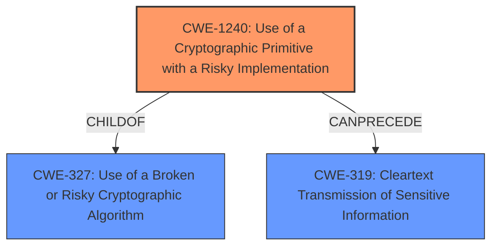

# Final Resolution for CVE-2021-34687

# Summary
| CWE ID | CWE Name | Confidence | CWE Abstraction Level | CWE Vulnerability Mapping Label | CWE-Vulnerability Mapping Notes |
|---|---|---|---|---|---|
| **CWE-1240** | **Use of a Cryptographic Primitive with a Risky Implementation** | 0.9 | Base | Allowed | Primary CWE |
| CWE-319 | Cleartext Transmission of Sensitive Information | 0.7 | Base | Allowed | Secondary Candidate |
| CWE-326 | Inadequate Encryption Strength | 0.6 | Class | Allowed-with-Review | Secondary Candidate |

## Evidence and Confidence

*   **Confidence Score:** 0.9
*   **Evidence Strength:** HIGH

## Relationship Analysis
The primary relationship impacting the decision is the parent-child relationship between CWE-327 (Class) and CWE-1240 (Base). While CWE-327 broadly covers the use of broken or risky cryptographic algorithms, CWE-1240 is more specific, addressing the risky *implementation* of a cryptographic primitive. The vulnerability description highlights the "lightly, and reversibly, obfuscated" Personal Key, directly pointing to a flawed implementation rather than a fundamentally broken algorithm. Furthermore, CWE-319 (Cleartext Transmission) is considered a secondary CWE because the weak implementation effectively results in sensitive data being transmitted in cleartext.

## Vulnerability Chain
The vulnerability chain starts with the **ROOTCAUSE**:
1.  **CWE-1240 (Use of a Cryptographic Primitive with a Risky Implementation):** The developers chose to use a substitution cipher, a weak cryptographic implementation, to encrypt the Personal Key.
2.  **CWE-319 (Cleartext Transmission of Sensitive Information):** Due to the weakness of the substitution cipher, the Personal Key is effectively transmitted in cleartext over the network.
3.  **Impact:** A man-in-the-middle attacker can intercept the transmitted data, easily reverse the obfuscation, and recover the Personal Key, leading to information disclosure.

## Summary of Analysis
The initial analysis and criticism both accurately identify CWE-1240 as the primary **weakness**. The evidence from the vulnerability description – specifically, the statement that the Personal Key is "only lightly, and reversibly, obfuscated" – strongly supports this classification. As stated in the initial analysis "*Explanation:* The primary **weakness** is the use of a **risky cryptographic implementation**, specifically a substitution cipher for encrypting the Personal Key...This directly aligns with CWE-1240, "Use of a Cryptographic Primitive with a Risky Implementation". The use of a substitution cipher is considered a **weakness** because it's easily reversible, leading to information disclosure."

The graph relationships reinforce this decision. CWE-1240 is a more specific Base-level CWE compared to its parent, the Class-level CWE-327. The secondary classification of CWE-319 is also justified, as the weak encryption effectively results in cleartext transmission.

The selected CWEs are at the optimal level of specificity because CWE-1240 precisely captures the **ROOTCAUSE** of the vulnerability (risky cryptographic implementation), while CWE-319 highlights a direct consequence (cleartext transmission).