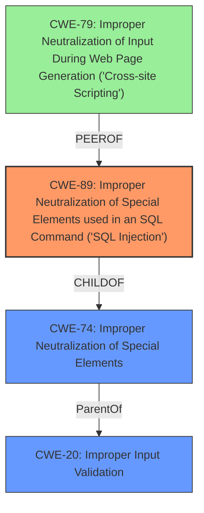

# Analysis Report for CVE-2021-34712

# Vulnerability Analysis Report: CVE-2021-34712

## Description

A vulnerability in the web-based management interface of Cisco SD-WAN vManage Software could allow an authenticated, remote attacker to conduct cypher query language injection attacks on an affected system. This vulnerability is due to insufficient input validation by the web-based management interface. An attacker could exploit this vulnerability by sending crafted HTTP requests to the interface of an affected system. A successful exploit could allow the attacker to obtain sensitive information.

## Vulnerability Description Key Phrases

**Rootcause:** insufficient input validation
**Impact:** obtain sensitive information
**Vector:** crafted HTTP requests
**Attacker:** authenticated remote attacker
**Product:** Cisco SD-WAN vManage Software
**Component:** web-based management interface

## Analysis (with Relationship Data)

# Summary
| CWE ID | CWE Name | Confidence | CWE Abstraction Level | CWE Vulnerability Mapping Label | CWE-Vulnerability Mapping Notes |
|---|---|---|---|---|---|
| CWE-89 | Improper Neutralization of Special Elements used in an SQL Command ('SQL Injection') | 0.9 | Base | Primary | Allowed |
| CWE-20 | Improper Input Validation | 0.6 | Class | Secondary Candidate | Discouraged |

## Evidence and Confidence

*   **Confidence Score:** 0.75
*   **Evidence Strength:** HIGH

- **Analysis and Justification:**
  - *Explanation:* The vulnerability description explicitly states that the root cause is **insufficient input validation** in the web-based management interface of Cisco SD-WAN vManage Software, leading to Cypher Query Language Injection. The CVE Reference Links Content Summary confirms this, highlighting **insufficient input validation** as the root cause and the ability to obtain sensitive information as the impact. This aligns strongly with CWE-89 (Improper Neutralization of Special Elements used in an SQL Command ('SQL Injection')), as Cypher Query Language is a query language similar to SQL, and the **insufficient input validation** allows for injection attacks. While CWE-74 (Improper Neutralization of Special Elements) is a broader category, CWE-89 is more specific and accurately reflects the nature of the injection vulnerability. The MITRE mapping guidance for CWE-89 indicates that it's ALLOWED for SQL injection vulnerabilities.

  - *Relationship Analysis:* CWE-89 is a child of CWE-74 (Improper Neutralization of Special Elements) and is related to CWE-20 (Improper Input Validation), which is also present in the Retriever Results, with a lower similarity score. The relationship graph shows that CWE-89 CanPrecede CWE-456 (Missing Initialization) since SQL injection can lead to further vulnerabilities after successful exploitation.

- **Confidence Score:**
  - Confidence: 0.9 (High evidence due to direct mention of **insufficient input validation** and the specific type of injection being a query language injection in the CVE reference materials.)

---
- **Analysis and Justification:**
  - *Explanation:* CWE-20 (Improper Input Validation) is a Class-level CWE that describes a general lack of input validation. While the description mentions **insufficient input validation** as the root cause, which could initially point to CWE-20, the context of a query language injection attack suggests a more specific weakness. Per MITRE guidance, CWE-20 is discouraged because lower-level CWEs are more appropriate. Since CWE-89 is the more specific weakness, it is the primary CWE, but CWE-20 is still a contributing factor as it is a general cause of injection vulnerabilities.

  - *Relationship Analysis:* CWE-20 is a parent of many other CWEs, including CWE-89. However, given the specifics of the vulnerability (Cypher query language injection), CWE-89 provides a more accurate and detailed classification.

- **Confidence Score:**
  - *Example:* Confidence: 0.6 (Secondary consideration due to its general nature, but still relevant as a contributing factor)

## Criticism of Analysis

Okay, here's a review of the analysis, incorporating the full CWE specifications provided.

**Overall Assessment:**

The analysis is generally well-reasoned and justified. The primary CWE selection (CWE-89) is accurate and supported by evidence. The inclusion of CWE-20 as a secondary consideration is also appropriate, given its role as a general contributing factor. The confidence scores are reasonable. However, there are some points that could be refined for clarity and completeness.

**Specific Comments and Recommendations:**

**1. Primary CWE: CWE-89 (Improper Neutralization of Special Elements used in an SQL Command ('SQL Injection'))**

*   **Strengths:** The justification for selecting CWE-89 is strong. The vulnerability is explicitly described as a Cypher Query Language injection caused by insufficient input validation. Cypher is a query language, and the lack of neutralization aligns perfectly with CWE-89's description.  The MITRE mapping guidance (Usage: Allowed) is correctly observed.
*   **Potential Improvement:** While the analysis mentions that Cypher is *similar* to SQL, it would be even more precise to acknowledge that Cypher is a *graph query language* with similar injection vulnerabilities to SQL.  This strengthens the analogy.  Also, including the MITRE potential mitigations from a development perspective would be valuable.

    *   **Mitigations from CWE-89:**
        *   **Libraries or Frameworks:** Emphasize using libraries designed for Cypher queries that provide built-in protection against injection.  Point to any known libraries for Cypher that offer parameterized queries or similar features.
        *   **Parameterization:** Strongly recommend using parameterized queries or stored procedures (if Cypher supports them).  This is the most effective defense.
        *   **Environment Hardening:**  Mention the importance of least privilege for database accounts used by the vManage software.
*   **Observed Examples:** The CVE examples for CWE-89 are appropriate.

**2. Secondary CWE: CWE-20 (Improper Input Validation)**

*   **Strengths:** Recognizing CWE-20 as a contributing factor is valid. Injection vulnerabilities often stem from a general lack of input validation. The analysis correctly points out that CWE-20 is a broader Class-level CWE, and therefore a more specific CWE is preferred.
*   **Potential Improvement:** Emphasize *why* CWE-20 is *discouraged* by MITRE. The rationale is that lower-level CWEs are more precise and provide better information for remediation and tracking.  CWE-20 is a parent CWE, and the goal is to find a child that is a better fit.  As the analysis mentions, simply stating "**insufficient input validation**" is a general cause of the problem which could apply to multiple different types of flaws, in this case, it can be narrowed down to query injection. The more narrow scope enables mitigation strategies focused on this class of problems.
*   **Observed Examples:** The CVE examples for CWE-20 are also relevant.
*   **Suggested Mitigations**

    *  From CWE-20: Ensure all inputs are validated for length, type, syntax, and allowed values. In this specific context, that would include ensuring the input to the Cypher Query doesn't contain special characters used in the Cypher Language

**3. Retriever Results:**

*   The Retriever Results section identifies some potentially relevant CWEs that the original analysis does not consider.  Here's a breakdown:
    *   **CWE-78 (OS Command Injection):**  This is unlikely and probably a false positive.  The vulnerability description focuses on *query language* injection, not OS commands.  It's highly unlikely an attacker could directly execute OS commands via this vulnerability.  Dismiss this.
    *   **CWE-22 (Path Traversal):**  Also unlikely. The description doesn't mention file system access or path manipulation.  Dismiss.
    *   **CWE-79 (Cross-site Scripting):**  Potentially relevant, but less likely than CWE-89. If the injected Cypher query results are directly displayed in a web page without proper encoding, then XSS *could* be a secondary concern.  However, the description focuses on information disclosure, not arbitrary script execution in a user's browser.  It *might* be worth briefly mentioning as a potential secondary impact, but not as a primary CWE.  If the data is displayed in the browser, CWE-79 is possible.
    *   **CWE-306 (Missing Authentication for Critical Function):** The vulnerability requires an authenticated attacker, therefore authentication is present. This is a false positive.
    *   **CWE-269 (Improper Privilege Management):** This is not applicable since the description states the attacker needs to be an authenticated user to exploit the vulnerability. A missing privilege management could be the case if the authenticated user had more access than required, but this information is not available.
    *   **CWE-287 (Improper Authentication):** This is not applicable since the attacker needs to be authenticated to exploit this.
    *   **CWE-611 (Improper Restriction of XML External Entity Reference):** This is completely irrelevant.  There's no mention of XML processing in the vulnerability description.
    *   **CWE-23 (Relative Path Traversal):**  Again, unlikely.

**4. Confidence Scores:**

*   Confidence: 0.9 for CWE-89 is justified.  The evidence is strong and directly supports this classification.
*   Confidence: 0.6 for CWE-20 is also reasonable, considering it is a supporting but less specific factor.

**5. CWE Examples from Database:**

*   The inclusion of CVE examples from the CWE database is beneficial for demonstrating the applicability of the selected CWEs.

**6. General Recommendations:**

*   **Focus on Specificity:**  The strength of this analysis lies in its ability to identify the *most specific* CWE that accurately represents the vulnerability.  Avoid relying too heavily on general categories (like CWE-20) unless a more precise classification is not possible.
*   **Actionable Mitigation Guidance:** Try to provide specific mitigation recommendations tailored to the technology (Cisco SD-WAN vManage, Cypher Query Language).  Point to specific libraries, functions, or configuration settings that can be used to prevent the vulnerability.
*   **Chain Analysis (Optional):** While not strictly necessary here, consider exploring potential chaining relationships (e.g., could successful CWE-89 exploitation lead to other weaknesses?).

**Revised Summary Table:**

| CWE ID | CWE Name | Confidence | CWE Abstraction Level | CWE Vulnerability Mapping Label | CWE-Vulnerability Mapping Notes |
|---|---|---|---|---|---|
| CWE-89 | Improper Neutralization of Special Elements used in an SQL Command ('SQL Injection') | 0.9 | Base | Primary | Allowed |
| CWE-20 | Improper Input Validation | 0.6 | Class | Secondary Candidate | Discouraged, Contributing Factor |
| CWE-79 | Improper Neutralization of Input During Web Page Generation ('Cross-site Scripting') | 0.3 | Base | Tertiary Candidate | Possible secondary impact if query results are displayed unsanitized. |

By incorporating these suggestions, the analysis becomes even more robust, providing a clearer and more actionable understanding of the vulnerability and its potential mitigations.

## Final Resolution

# Summary
| CWE ID | CWE Name | Confidence | CWE Abstraction Level | CWE Vulnerability Mapping Label | CWE-Vulnerability Mapping Notes |
|---|---|---|---|---|---|
| **CWE-89** | Improper Neutralization of Special Elements used in an SQL Command ('SQL Injection') | 0.9 | Base | Primary | Allowed |
| **CWE-20** | Improper Input Validation | 0.6 | Class | Secondary Candidate | Discouraged, Contributing Factor |
| **CWE-79** | Improper Neutralization of Input During Web Page Generation ('Cross-site Scripting') | 0.3 | Base | Tertiary Candidate | Possible secondary impact if query results are displayed unsanitized. |

## Evidence and Confidence

*   **Confidence Score:** 0.9
*   **Evidence Strength:** HIGH

## Relationship Analysis
The primary relationship influencing the decision is that **CWE-89** (Improper Neutralization of Special Elements used in an SQL Command ('SQL Injection')) is a child of **CWE-74** (Improper Neutralization of Special Elements), which in turn highlights the importance of input validation, relating it to **CWE-20** (Improper Input Validation). While **CWE-20** is a parent class, **CWE-89** provides a more specific and accurate representation of the **ROOTCAUSE**. **CWE-79** (Improper Neutralization of Input During Web Page Generation ('Cross-site Scripting')) is considered a peer and potential secondary impact if the injected query results are displayed without proper sanitization. The abstraction levels further solidify this, with **CWE-89** being a Base level, **CWE-20** being a Class level, and **CWE-79** being a Base level, thus providing the optimal level of specificity.

## Vulnerability Chain
The vulnerability chain starts with **insufficient input validation** (**WEAKNESS**), represented by **CWE-20**. This leads to the **ROOTCAUSE**, which is the ability to inject malicious code into Cypher queries, classified as **CWE-89**. If the results of the injected query are displayed without proper sanitization, it could lead to **CWE-79**, Cross-Site Scripting, which is the impact. The prerequisite is an authenticated user exploiting the insufficient validation in the web-based management interface. The consequence is the potential disclosure of sensitive information and possibly XSS.

## Summary of Analysis
The analysis is based on the provided vulnerability description and the CWE specifications. The initial analysis correctly identified **CWE-89** as the primary **ROOTCAUSE** due to **insufficient input validation** leading to Cypher query language injection. The criticism further refined this by suggesting the acknowledgement that Cypher is a graph query language with similar injection vulnerabilities to SQL. It also correctly suggests mitigations from a development perspective, and to emphasize why **CWE-20** is discouraged by MITRE. The graph relationships influenced the final selection by confirming that while **CWE-20** is a parent, **CWE-89** offers the necessary specificity. The final decision is justified by the explicit mention of query language injection and **insufficient input validation** in the vulnerability description, aligning with the definition and mapping guidance of **CWE-89**. The inclusion of **CWE-20** as a secondary candidate acknowledges the general **WEAKNESS** of **insufficient input validation**, and **CWE-79** as a potential impact. The selected CWEs are at the optimal level of specificity, providing actionable insights for remediation.

*Report generated on 2025-03-16 23:12:27*
