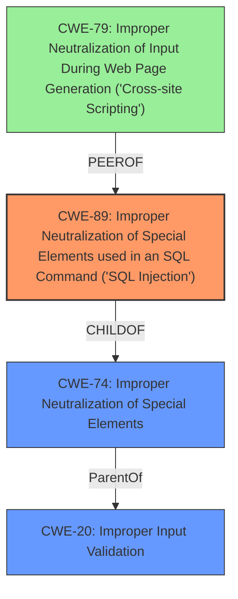

# Final Resolution for CVE-2021-34712

# Summary
| CWE ID | CWE Name | Confidence | CWE Abstraction Level | CWE Vulnerability Mapping Label | CWE-Vulnerability Mapping Notes |
|---|---|---|---|---|---|
| **CWE-89** | Improper Neutralization of Special Elements used in an SQL Command ('SQL Injection') | 0.9 | Base | Primary | Allowed |
| **CWE-20** | Improper Input Validation | 0.6 | Class | Secondary Candidate | Discouraged, Contributing Factor |
| **CWE-79** | Improper Neutralization of Input During Web Page Generation ('Cross-site Scripting') | 0.3 | Base | Tertiary Candidate | Possible secondary impact if query results are displayed unsanitized. |

## Evidence and Confidence

*   **Confidence Score:** 0.9
*   **Evidence Strength:** HIGH

## Relationship Analysis
The primary relationship influencing the decision is that **CWE-89** (Improper Neutralization of Special Elements used in an SQL Command ('SQL Injection')) is a child of **CWE-74** (Improper Neutralization of Special Elements), which in turn highlights the importance of input validation, relating it to **CWE-20** (Improper Input Validation). While **CWE-20** is a parent class, **CWE-89** provides a more specific and accurate representation of the **ROOTCAUSE**. **CWE-79** (Improper Neutralization of Input During Web Page Generation ('Cross-site Scripting')) is considered a peer and potential secondary impact if the injected query results are displayed without proper sanitization. The abstraction levels further solidify this, with **CWE-89** being a Base level, **CWE-20** being a Class level, and **CWE-79** being a Base level, thus providing the optimal level of specificity.

## Vulnerability Chain
The vulnerability chain starts with **insufficient input validation** (**WEAKNESS**), represented by **CWE-20**. This leads to the **ROOTCAUSE**, which is the ability to inject malicious code into Cypher queries, classified as **CWE-89**. If the results of the injected query are displayed without proper sanitization, it could lead to **CWE-79**, Cross-Site Scripting, which is the impact. The prerequisite is an authenticated user exploiting the insufficient validation in the web-based management interface. The consequence is the potential disclosure of sensitive information and possibly XSS.

## Summary of Analysis
The analysis is based on the provided vulnerability description and the CWE specifications. The initial analysis correctly identified **CWE-89** as the primary **ROOTCAUSE** due to **insufficient input validation** leading to Cypher query language injection. The criticism further refined this by suggesting the acknowledgement that Cypher is a graph query language with similar injection vulnerabilities to SQL. It also correctly suggests mitigations from a development perspective, and to emphasize why **CWE-20** is discouraged by MITRE. The graph relationships influenced the final selection by confirming that while **CWE-20** is a parent, **CWE-89** offers the necessary specificity. The final decision is justified by the explicit mention of query language injection and **insufficient input validation** in the vulnerability description, aligning with the definition and mapping guidance of **CWE-89**. The inclusion of **CWE-20** as a secondary candidate acknowledges the general **WEAKNESS** of **insufficient input validation**, and **CWE-79** as a potential impact. The selected CWEs are at the optimal level of specificity, providing actionable insights for remediation.