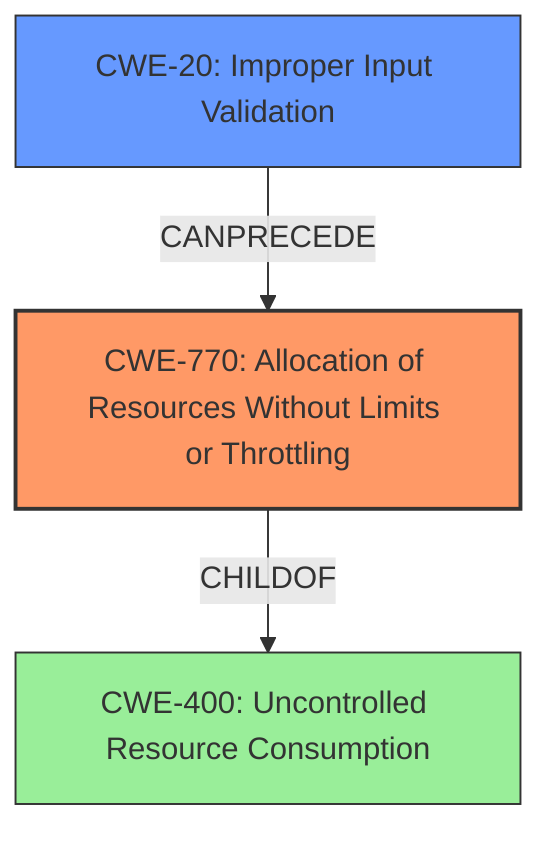

# Final Resolution for CVE-2021-34720

# Summary
| CWE ID | CWE Name | Confidence | CWE Abstraction Level | CWE Vulnerability Mapping Label | CWE-Vulnerability Mapping Notes |
|---|---|---|---|---|---|
| CWE-770 | Allocation of Resources Without Limits or Throttling | 0.90 | Base | Allowed | Primary CWE. The root cause is the mishandling of socket creation failures, leading to uncontrolled resource allocation and memory exhaustion. |
| CWE-20 | Improper Input Validation | 0.30 | Class | Allowed | Contributing Factor. The vulnerability may be triggered by specific packets, indicating a possible failure in rate limiting or packet validation that would normally constrain the number of allocation attempts, although more information is required to confirm this. |

## Evidence and Confidence

*   **Confidence Score:** 0.90
*   **Evidence Strength:** MEDIUM

## Relationship Analysis
The primary relationship impacting the decision is the hierarchical relationship between CWE-400 (Uncontrolled Resource Consumption) and CWE-770 (**Allocation of Resources Without Limits or Throttling**), where CWE-770 is a child of CWE-400. This favors CWE-770 due to its greater specificity. The potential chain relationship where CWE-20 (**Improper Input Validation**) can precede CWE-770 was also considered, acknowledging that specific crafted packets trigger the vulnerability. The abstraction levels influenced the selection, with base-level CWE-770 being preferred over class-level CWE-400.

## Vulnerability Chain
The chain of events starts with potentially **improper input validation** (CWE-20), leading to **uncontrolled allocation of resources** (CWE-770), which then causes **resource exhaustion** and a denial-of-service condition.
  - The root cause is the mishandling of socket creation failures.
  - A prerequisite condition is the attacker's ability to send specific IP SLA or TWAMP packets.
  - The consequence is the exhaustion of packet memory, impacting other processes, or crashing the IP SLA process.

## Summary of Analysis
The analysis is based on the vulnerability description, which states, "This vulnerability exists because socket creation failures are mishandled during the IP SLA and TWAMP processes. An attacker could exploit this vulnerability by sending specific IP SLA or TWAMP packets to an affected device. A successful exploit could allow the attacker to exhaust the packet memory, which will impact other processes, such as routing protocols, or crash the IP SLA process." This statement provides strong evidence for **uncontrolled resource allocation** (CWE-770) as the primary issue.

The graph relationships influenced the decision by highlighting the parent-child relationship between CWE-400 and CWE-770, leading to the selection of the more specific CWE-770. The CANPRECEDE relationship with CWE-20 prompted the inclusion of CWE-20 as a secondary contributing factor, although with lower confidence due to the lack of explicit input validation failures mentioned in the description.

The selected CWEs are at the optimal level of specificity because CWE-770 directly addresses the **allocation of resources without limits**, while CWE-400 is a broader class. The inclusion of CWE-20 acknowledges the potential role of **improper input validation** in triggering the vulnerability, but its lower confidence reflects the need for more evidence to confirm this aspect.