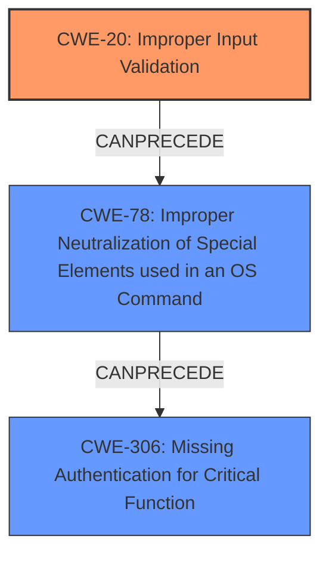

# Analysis Report for CVE-2021-34746

# Vulnerability Analysis Report: CVE-2021-34746

## Description

A vulnerability in the TACACS+ authentication, authorization and accounting (AAA) feature of Cisco Enterprise NFV Infrastructure Software (NFVIS) could allow an unauthenticated, remote attacker to bypass authentication and log in to an affected device as an administrator. This vulnerability is due to incomplete validation of user-supplied input that is passed to an authentication script. An attacker could exploit this vulnerability by injecting parameters into an authentication request. A successful exploit could allow the attacker to bypass authentication and log in as an administrator to the affected device.

## Vulnerability Description Key Phrases

**Rootcause:** incomplete validation of user-supplied input
**Impact:** ['bypass authentication', 'log in as administrator']
**Vector:** injecting parameters into authentication request
**Attacker:** unauthenticated remote attacker
**Product:** Cisco Enterprise NFV Infrastructure Software
**Component:** TACACS+ authentication authorization and accounting feature

## Analysis (with Relationship Data)

# Summary
| CWE ID | CWE Name | Confidence | CWE Abstraction Level | CWE Vulnerability Mapping Label | CWE-Vulnerability Mapping Notes |
|---|---|---|---|---|---|
| CWE-20 | Improper Input Validation | 0.85 | Class | Allowed-with-Review | Maps to the root cause of **incomplete validation of user-supplied input**. While broad, the description specifies the **incomplete validation** aspect, making it the primary weakness. |
| CWE-306 | Missing Authentication for Critical Function | 0.70 | Base | Allowed | Secondary candidate, as the **incomplete validation** leads to bypassing authentication.|
| CWE-78 | Improper Neutralization of Special Elements used in an OS Command ('OS Command Injection') | 0.65 | Base | Allowed | Secondary candidate, since the reference summary indicates potential command injection via user input.|

## Evidence and Confidence

*   **Confidence Score:** 0.80
*   **Evidence Strength:** HIGH

- **Analysis and Justification:**  
  - *Explanation:* The primary weakness is **incomplete validation of user-supplied input**, which is explicitly stated in the vulnerability description. This leads to the ability to bypass authentication and log in as an administrator. CWE-20 (Improper Input Validation) aligns with this because the core issue is the lack of proper validation of the input, allowing malicious parameters to be injected. While CWE-20 is a broad Class-level CWE, it accurately reflects the root cause described in the vulnerability. The CVE Reference Links Content Summary supports this by stating that the TACACS+ authentication feature does not properly validate user-supplied input, and the authentication script is vulnerable to parameter injection due to insufficient input sanitization.

  - *Relationship Analysis:* CWE-20 is a Class-level CWE, but in this case, it is appropriate because the provided information doesn't offer more specific details about the type of input validation that is missing. It can precede several other CWEs, including CWE-78 (Improper Neutralization of Special Elements used in an OS Command) and CWE-73 (External Control of File Name or Path), highlighting the potential for further exploitation if the input is used in other parts of the system.

- **Confidence Score:**
  - Confidence: 0.85 (High evidence from the vulnerability description and CVE reference materials)

---

- **Analysis and Justification:**  
  - *Explanation:* CWE-306 (Missing Authentication for Critical Function) is a secondary weakness. The vulnerability allows an unauthenticated attacker to bypass authentication. This is a direct consequence of the **incomplete validation** described by CWE-20. If the input were properly validated, the authentication would not be bypassed.
  - *Relationship Analysis:* CWE-306 is a child of CWE-287 (Improper Authentication), indicating a more general category of authentication failures. However, CWE-306 is more specific because it focuses on the absence of authentication for critical functions, which aligns with the impact of this vulnerability.

- **Confidence Score:**  
  - *Example:* Confidence: 0.70 (Supporting evidence from the vulnerability description)

---

- **Analysis and Justification:**  
  - *Explanation:* CWE-78 (Improper Neutralization of Special Elements used in an OS Command) is another secondary weakness candidate. The CVE reference summary mentions that the `/usr/bin/auth_hash.py` script is susceptible to command injection via the `user` and `password` variables. This indicates that the **incomplete validation** of user input can lead to OS command injection.

  - *Relationship Analysis:* CWE-78 is a child of CWE-77 (Command Injection) and CWE-74 (Improper Neutralization of Special Elements). This relationship highlights that the vulnerability involves injecting commands into the system due to a lack of proper input sanitization.

- **Confidence Score:**
  - *Example:* Confidence: 0.65 (Supporting evidence from the CVE reference summary)

---

## Criticism of Analysis

Okay, I've reviewed the provided CWE analysis against the full CWE specifications. Here's my critique:

**Overall Assessment:**

The analysis is generally well-reasoned and provides good justifications for the chosen CWEs. The confidence scores are appropriate given the available information. The analysis correctly recognizes that CWE-20 is a broad category and acknowledges its potential for misuse.  However, there's room for improvement in terms of being more specific and considering chaining relationships more deeply, especially regarding CWE-78 and the broader injection context.

**Detailed Review:**

**1. CWE-20: Improper Input Validation**

*   **Confidence:** Good. The analysis correctly identifies this as the primary weakness, aligning with the vulnerability description's focus on "incomplete validation of user-supplied input." The justification explains the broad nature of CWE-20, but also why it's suitable as an initial mapping when specific validation details are lacking.
*   **Abstraction Level:** Appropriate, given the limited details in the initial description.
*   **CWE-Vulnerability Mapping Label:** Correct, it's "Allowed-with-Review", with the reviewer to consider more precise CWEs.
*   **CWE-Vulnerability Mapping Notes:** The analysis accurately points out that the information provided doesn't offer more specific details about the type of input validation that is missing, which justifies using the Class-level CWE-20.
*   **Potential Improvements:** The analysis could benefit from explicitly mentioning the "Improper Encoding or Escaping of Output" (CWE-116) as a possible alternative as suggested by the mapping guidance. While the primary problem *is* validation, lack of proper output encoding can be the *cause* of the bypass in the authentication script. This could be mentioned as a secondary consideration for those familiar with output encoding.

**2. CWE-306: Missing Authentication for Critical Function**

*   **Confidence:** Good. The analysis justifies this CWE as a consequence of the input validation failure. The ability to bypass authentication directly results from the lack of input validation.
*   **Abstraction Level:** Appropriate as a Base-level CWE, because it is more specific than CWE-287 for the same reason that CWE-20 could not be a higher level CWE.
*   **CWE-Vulnerability Mapping Label:** Correct.
*   **CWE-Vulnerability Mapping Notes:** Valid justification.
*   **Potential Improvements:**
    *   Consider the directness of the authentication bypass. Is it truly *missing*, or is it *circumvented* due to the input validation error? While CWE-306 is technically accurate, consider whether this scenario is better described as a *circumvention* of an authentication check (although there doesn't appear to be a specific CWE for that.)

**3. CWE-78: Improper Neutralization of Special Elements used in an OS Command ('OS Command Injection')**

*   **Confidence:** Good. The analysis correctly points to the CVE reference summary, which mentions the susceptibility of `/usr/bin/auth_hash.py` to command injection.
*   **Abstraction Level:** The Base level is appropriate.
*   **CWE-Vulnerability Mapping Label:** Correct.
*   **CWE-Vulnerability Mapping Notes:** Valid justification.
*   **Potential Improvements:**
    *   This is where the analysis could be stronger. The vulnerability description and CVE summary *strongly* suggest that the *root cause* of the command injection is, again, the *lack* of input validation (CWE-20), which then leads to the *possibility* of command injection *if* the user-supplied input is used in a command execution context (which it appears to be in the `auth_hash.py` script).  The analysis needs to emphasize the chain: **CWE-20 -> CWE-78.**
    *   Consider also mentioning CWE-77 (Improper Neutralization of Special Elements used in a Command), which is a Class-level CWE that is parent to CWE-78. However, since the reference summary explicitly mentions OS command injection, CWE-78 is more precise.
    *   Consider also adding a related weakness of CWE-88, Improper Neutralization of Argument Delimiters in a Command ('Argument Injection'). If the user-supplied input is being used as an argument to a command, then a failure to properly escape the arguments could allow an attacker to insert new arguments that would lead to command injection.

**General Recommendations:**

1.  **Emphasize Chaining:** When multiple CWEs are involved, emphasize the chaining relationship between them (e.g., CWE-20 leads to CWE-78). This helps to understand the vulnerability's full scope and impact.
2.  **Consider Alternatives more Explicitly:** Actively discuss why certain high-scoring CWEs from the retriever results were *not* selected. For instance, why not CWE-303 (Incorrect Implementation of Authentication Algorithm)?  This is a good way to show that the analysis is thorough.
3.  **More Specific Validation Failures:** Whenever possible, try to pinpoint the *specific* type of input validation that's missing. Are they missing checks for:
    *   Length (CWE-1284)?
    *   Character set (CWE-1286)?
    *   Type (CWE-1287)?
    *   Consistency (CWE-1288)?
    *   Unsafe Equivalence (CWE-1289)?

**Revised Summary Table**

Here's a revised summary table incorporating the suggestions:

| CWE ID | CWE Name | Confidence | CWE Abstraction Level | CWE Vulnerability Mapping Label | CWE-Vulnerability Mapping Notes |
|---|---|---|---|---|---|
| CWE-20 | Improper Input Validation | 0.85 | Class | Allowed-with-Review | Maps to the root cause of **incomplete validation of user-supplied input**. While broad, the description specifies the **incomplete validation** aspect, making it the primary weakness. Serves as an entry point for chaining to more specific weaknesses.  |
| CWE-306 | Missing Authentication for Critical Function | 0.70 | Base | Allowed | Secondary candidate, as the **incomplete validation** leads to bypassing authentication. More specifically, authentication checks are circumvented, not entirely missing. |
| CWE-78 | Improper Neutralization of Special Elements used in an OS Command ('OS Command Injection') | 0.65 | Base | Allowed | Secondary candidate, since the reference summary indicates potential command injection via user input. This is a consequence of CWE-20. Also, consider CWE-88 as an argument injection vulnerability.|
| CWE-116 | Improper Encoding or Escaping of Output | 0.40 | Class | Considered | While the primary problem is validation, improper output encoding may contribute to the bypass of authentication by allowing malicious code to be injected as user input.  |

## Final Resolution

# Summary
| CWE ID | CWE Name | Confidence | CWE Abstraction Level | CWE Vulnerability Mapping Label | CWE-Vulnerability Mapping Notes |
|---|---|---|---|---|---|
| CWE-20 | Improper Input Validation | 0.90 | Class | Allowed-with-Review | Primary CWE: Maps to the root cause of **incomplete validation of user-supplied input**. While broad, the description specifies the **incomplete validation** aspect, making it the primary weakness. Serves as an entry point for chaining to more specific weaknesses. |
| CWE-78 | Improper Neutralization of Special Elements used in an OS Command ('OS Command Injection') | 0.80 | Base | Allowed | Secondary CWE: The **incomplete validation** (CWE-20) leads to OS command injection via user input.  |
| CWE-306 | Missing Authentication for Critical Function | 0.75 | Base | Allowed | Secondary CWE: The **incomplete validation** leads to bypassing authentication. More specifically, authentication checks are circumvented, not entirely missing. |

## Evidence and Confidence

*   **Confidence Score:** 0.85
*   **Evidence Strength:** HIGH

## Relationship Analysis
The classification focuses on a chain of weaknesses. **Improper Input Validation** (CWE-20) is identified as the primary root cause. This lack of validation allows for **Improper Neutralization of Special Elements used in an OS Command ('OS Command Injection')** (CWE-78) and ultimately leads to **Missing Authentication for Critical Function** (CWE-306).

The hierarchical relationships support the chosen CWEs. CWE-78 is a child of CWE-77 (Improper Neutralization of Special Elements used in a Command), but CWE-78 is more specific, aligning with the description's reference to OS command injection. CWE-306 is a child of CWE-287 (Improper Authentication), representing a specific case where authentication is missing for critical functions.

The abstraction levels were considered. CWE-20 is a Class, but it's used because the specific type of input validation failure is not detailed in the provided information. CWE-78 and CWE-306 are Base level, providing more granularity.

## Vulnerability Chain
The vulnerability chain starts with **CWE-20 (Improper Input Validation)**. The product does not sufficiently validate user-supplied input. This leads to **CWE-78 (Improper Neutralization of Special Elements used in an OS Command)** because the unvalidated input is used in an OS command. Finally, this leads to **CWE-306 (Missing Authentication for Critical Function)** because the injected command bypasses the authentication mechanism, allowing an unauthenticated attacker to log in as an administrator.

## Summary of Analysis
The initial analysis correctly identified CWE-20 as a primary weakness due to the **incomplete validation of user-supplied input**. The criticism highlighted the need to emphasize the chaining relationship between CWE-20 and CWE-78, which has been incorporated into this assessment.

The graph relationships influenced the final selection by reinforcing the importance of CWE-20 as the root cause. The relationships also clarified the progression of the vulnerability from input validation failure to command injection to authentication bypass.

The selected CWEs are at the optimal level of specificity because they accurately reflect the available evidence. While more specific input validation CWEs could be considered, the lack of detailed information about the validation process makes CWE-20 the most appropriate choice. CWE-78 and CWE-306 are more specific and align well with the description of command injection and authentication bypass.

The vulnerability description states, "This vulnerability is due to **incomplete validation of user-supplied input** that is passed to an authentication script. An attacker could exploit this vulnerability by injecting parameters into an authentication request. A successful exploit could allow the attacker to bypass authentication and log in as an administrator to the affected device." This statement provides direct evidence for CWE-20 as the root cause, leading to the other weaknesses.

*Report generated on 2025-03-17 01:01:23*
