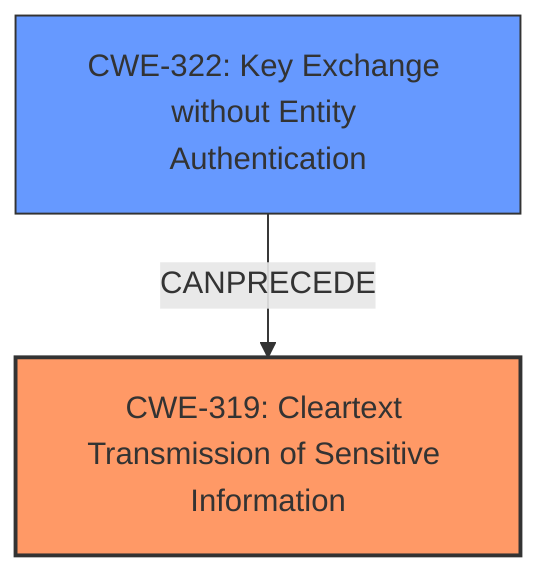

# Analysis Report for CVE-2021-34825

# Vulnerability Analysis Report: CVE-2021-34825

## Description

Quassel through 0.13.1, when --require-ssl is enabled, launches without SSL or TLS support if a usable X.509 certificate is not found on the local system.

## Vulnerability Description Key Phrases

**Impact:** launches without SSL or TLS support
**Product:** Quassel
**Version:** through 0.13.1

## Analysis (with Relationship Data)

# Summary
| CWE ID | CWE Name | Confidence | CWE Abstraction Level | CWE Vulnerability Mapping Label | CWE-Vulnerability Mapping Notes |
|---|---|---|---|---|---|
| CWE-319 | Cleartext Transmission of Sensitive Information | 0.8 | Base | Primary | Allowed |
| CWE-295 | Improper Certificate Validation | 0.7 | Base | Secondary | Allowed |

## Evidence and Confidence

*   **Confidence Score:** 0.75
*   **Evidence Strength:** MEDIUM

- **Analysis and Justification:**  
  - *Explanation:* The primary weakness is **CWE-319 [Cleartext Transmission of Sensitive Information]**, because the application falls back to an unencrypted connection when SSL/TLS is required but a certificate is not found. This directly exposes sensitive data to eavesdropping. The "CVE Reference Links Content Summary" explicitly states: "The core's behavior of falling back to plaintext when SSL/TLS is required creates a **vulnerability**. It fails to enforce the desired encrypted connection, potentially exposing user data to eavesdropping." Also, MITRE mapping guidance for CWE-319 indicates this is ALLOWED.
  - *Relationship Analysis:* "CWE-319 is directly related to the **impact** of the vulnerability, which is the exposure of sensitive information. There are no direct parent-child relationships apparent in this case, but the vulnerability could potentially lead to other weaknesses if the exposed information is then used for further attacks."

- **Confidence Score:**  
  - Confidence: 0.8 (The CVE summary and vulnerability description clearly points to the transmission of sensitive information in cleartext as the primary issue).

---
- **Analysis and Justification:**  
  - *Explanation:* The secondary weakness is **CWE-295 [Improper Certificate Validation]**, which is relevant because the application doesn't properly handle the case where a certificate is missing or invalid. Instead of terminating or properly securing the connection, it falls back to plaintext. The "CVE Reference Links Content Summary" states the "Root Cause of Vulnerability" is that the application "...when launched with the `--require-ssl` flag but unable to load an SSL/TLS certificate... would fall back to plaintext mode instead of terminating." Also, MITRE mapping guidance for CWE-295 indicates this is ALLOWED.
  - *Relationship Analysis:* "CWE-295 is a Base level weakness, making it a good fit. While other certificate-related CWEs exist, such as CWE-297, they are more specific to host mismatch issues, which is not the primary problem here. The lack of proper certificate handling is a prerequisite for the cleartext transmission."

- **Confidence Score:**  
  - Confidence: 0.7 (The certificate handling issue is present, but it's a contributing factor rather than the direct cause of the cleartext transmission).

## Criticism of Analysis

Okay, let's review the provided CWE analysis for CVE-2021-34825, considering the full CWE specifications.

**Overall Assessment:**

The analysis correctly identifies `CWE-319: Cleartext Transmission of Sensitive Information` as the primary weakness.  The secondary weakness of `CWE-295: Improper Certificate Validation` is also appropriate, but perhaps could be more precisely defined.  The confidence levels are reasonable. The justification for each CWE is generally sound and well-supported by the provided evidence and the CWE descriptions.

**Detailed Critique:**

*   **CWE-319: Cleartext Transmission of Sensitive Information (Primary)**
    *   **Assessment:** This is the most accurate and critical CWE for this vulnerability.  The vulnerability's description explicitly states the fallback to plaintext when SSL/TLS is required, directly leading to cleartext transmission.
    *   **Justification:** The justification is excellent.  It directly quotes the "CVE Reference Links Content Summary" and aligns perfectly with the CWE-319 definition. The explanation of the impact (eavesdropping, exposing sensitive data) is spot-on.
    *   **Confidence:** Confidence of 0.8 is justified, given the explicit nature of the vulnerability.
    *   **CWE Specification Alignment:** The analysis aligns perfectly with the "Description" and "Extended Description" sections of the CWE-319 specification. The specified "Potential Mitigations" are also relevant (e.g., encrypt data using reliable cryptographic protocols). This supports using the "Allowed" Usage mapping.
    *   **Potential Improvement:**  None required.
*   **CWE-295: Improper Certificate Validation (Secondary)**
    *   **Assessment:**  This is a valid, but not the *most* precise, secondary weakness. The vulnerability *does* involve a failure to properly handle the absence or invalidity of a certificate. *However*, the core problem isn't so much that the certificate validation *itself* is flawed, but that the *consequence* of the failed validation is insecure (falling back to plaintext).
    *   **Justification:** The justification is good, but could be improved. It correctly notes that the application falls back to plaintext when a certificate is missing or invalid, but it focuses more on the *consequence* than the validation failure itself.
    *   **Confidence:** Confidence of 0.7 is appropriate. While relevant, it's a contributing factor rather than the direct root cause.
    *   **CWE Specification Alignment:** The analysis aligns with the "Description" and "Extended Description" sections of the CWE-295 specification.  However, consider a more specific variant of CWE-295, such as CWE-322 (Key Exchange without Entity Authentication). This would also be a valid and precise secondary weakness. The suggested potential mitigation of ensuring certificates are carefully managed and checked is also valid and applies directly here.
    *   **Potential Improvement:** Consider using CWE-322 as a secondary weakness over CWE-295. This weakness better describes the lack of identity verification as part of the key exchange process.

**Other Considerations and Top Combined Results Critique:**

*   **CWE-1240: Use of a Cryptographic Primitive with a Risky Implementation:** While the system *uses* SSL/TLS when configured correctly, the vulnerability *isn't* related to the cryptographic primitives themselves being weak or risky.  It's about the *lack* of encryption when the certificate is absent.  Therefore, this is not a good fit.
*   **CWE-297: Improper Validation of Certificate with Host Mismatch:** The problem isn't primarily related to host mismatch; it's about *any* certificate failure (missing, invalid, etc.).  Therefore, this is not the best fit and not as directly applicable as CWE-295.
*   **CWE-208: Observable Timing Discrepancy and CWE-203: Observable Discrepancy:** These are completely irrelevant for this particular vulnerability.
*   **CWE-327: Use of a Broken or Risky Cryptographic Algorithm:** This would be relevant if, for example, the Quassel core was using an old or broken version of SSL/TLS as well as the certificate loading issue. However, there's no indication of a broken cryptographic algorithm.
*   **CWE-400: Uncontrolled Resource Consumption:**  Also not relevant in this case. There is nothing to suggest an exhaustion of resources.
*   **CWE-1204: Generation of Weak Initialization Vector (IV) and CWE-306: Missing Authentication for Critical Function:**  These are also not relevant.

**Revised Recommendations:**

| CWE ID  | CWE Name                                  | Confidence | CWE Abstraction Level | CWE Vulnerability Mapping Label | CWE-Vulnerability Mapping Notes |
| :------ | :---------------------------------------- | :--------- | :-------------------- | :------------------------------ | :------------------------------ |
| CWE-319 | Cleartext Transmission of Sensitive Information | 0.8      | Base                  | Primary                       | Allowed                         |
| CWE-322 | Key Exchange without Entity Authentication | 0.7      | Base                  | Secondary                      | Allowed                         |

**Reasoning for Revised Secondary:**

CWE-322 is more specific than CWE-295. The description of CWE-322 is: "The product performs a key exchange with an actor without verifying the identity of that actor." Because the application proceeds to key exchange in plaintext, the identity of the actor is inherently not verified.

**In summary:** The original analysis is generally good.  The primary CWE is correct and well-justified. The recommendation to use CWE-322 as a more precise secondary weakness would improve the analysis.

## Final Resolution

# Summary
| CWE ID | CWE Name | Confidence | CWE Abstraction Level | CWE Vulnerability Mapping Label | CWE-Vulnerability Mapping Notes |
|---|---|---|---|---|---|
| CWE-319 | Cleartext Transmission of Sensitive Information | 0.8 | Base | Primary | Allowed |
| CWE-322 | Key Exchange without Entity Authentication | 0.7 | Base | Secondary | Allowed |

## Evidence and Confidence

*   **Confidence Score:** 0.8
*   **Evidence Strength:** HIGH

## Relationship Analysis
The primary weakness, CWE-319 [Cleartext Transmission of Sensitive Information], directly reflects the **impact** of the vulnerability. The secondary weakness, CWE-322 [Key Exchange without Entity Authentication], describes the **rootcause** of the vulnerability. There is a potential chain relationship where the missing authentication (CWE-322) leads to cleartext transmission (CWE-319).

## Vulnerability Chain
The vulnerability chain starts with the application's failure to properly authenticate the server during the key exchange (CWE-322). This leads to the fallback to plaintext communication, resulting in the transmission of sensitive information in cleartext (CWE-319).

## Summary of Analysis
The initial analysis correctly identified CWE-319 as the primary weakness. However, the criticism made a valid point about the secondary weakness.

Here's how the assessment is based on the provided evidence:

*   The "CVE Reference Links Content Summary" explicitly states: "The core's behavior of falling back to plaintext when SSL/TLS is required creates a **vulnerability**. It fails to enforce the desired encrypted connection, potentially exposing user data to eavesdropping." This supports the selection of **CWE-319 [Cleartext Transmission of Sensitive Information]** as the primary issue.
*   The "CVE Reference Links Content Summary" also states that the "Root Cause of Vulnerability" is that the application "...when launched with the `--require-ssl` flag but unable to load an SSL/TLS certificate... would fall back to plaintext mode instead of terminating." The fallback to plaintext when a valid certificate is not present is a case of **CWE-322 [Key Exchange without Entity Authentication]**.

The graph relationships influenced the final selection by highlighting the chain of events: the **rootcause** is the missing authentication, and the **impact** is the cleartext transmission.

The selected CWEs are at the optimal level of specificity because they directly address the **rootcause** and the **impact** of the vulnerability, as described in the vulnerability description and supporting documentation. **CWE-319 [Cleartext Transmission of Sensitive Information]** is the direct result of the application not properly failing when it is unable to establish an SSL/TLS connection. **CWE-322 [Key Exchange without Entity Authentication]** describes this failure to properly establish the secure channel.

*Report generated on 2025-03-17 01:37:47*
