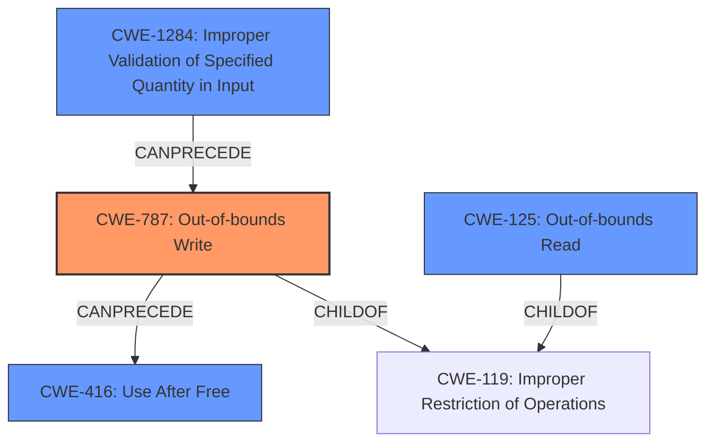

# Analysis Report for CVE-2021-34874

# Vulnerability Analysis Report: CVE-2021-34874

## Description

This vulnerability allows remote attackers to execute arbitrary code on affected installations of Bentley View 10.15.0.75. User interaction is required to exploit this vulnerability in that the target must visit a malicious page or open a malicious file. The specific flaw exists within the processing of 3DS files. The issue results from the lack of proper validation of user-supplied data, which can result in a memory corruption condition. An attacker can leverage this vulnerability to execute code in the context of the current process. Was ZDI-CAN-14736.

## Vulnerability Description Key Phrases

**Rootcause:** lack of proper validation of user-supplied data
**Weakness:** memory corruption
**Impact:** execute arbitrary code
**Vector:** malicious page or file
**Attacker:** remote attackers
**Product:** Bentley View
**Version:** 10.15.0.75
**Component:** processing of 3DS files

## Analysis (with Relationship Data)

# Summary
| CWE ID | CWE Name | Confidence | CWE Abstraction Level | CWE Vulnerability Mapping Label | CWE-Vulnerability Mapping Notes |
|---|---|---|---|---|---|
| CWE-787 | Out-of-bounds Write | 0.95 | Base | Primary | Allowed |
| CWE-125 | Out-of-bounds Read | 0.75 | Base | Secondary Candidate | Allowed |
| CWE-416 | Use After Free | 0.65 | Base | Secondary Candidate | Allowed |
| CWE-20 | Improper Input Validation | 0.50 | Class | Secondary Candidate | Discouraged |

## Evidence and Confidence

*   **Confidence Score:** 0.85
*   **Evidence Strength:** HIGH

- **Analysis and Justification:**  
  - *Explanation:* The vulnerability description explicitly states "lack of proper validation of user-supplied data, which can result in a **memory corruption** condition." The CVE Reference Links Content Summary further details this, pointing to "out-of-bounds read/write" errors when parsing maliciously crafted 3DS files. This directly corresponds to CWE-787 (Out-of-bounds Write), as the **lack of validation** leads to writing data beyond the intended buffer. The retriever results also list CWE-787 as the highest scoring CWE. MITRE mapping guidance for CWE-787 is ALLOWED and at the Base level of abstraction.
  
  - *Relationship Analysis:* CWE-787 is a child of CWE-119 (Improper Restriction of Operations within the Bounds of a Memory Buffer). While CWE-119 is a broader category, the specific description focuses on writing beyond buffer limits, thus CWE-787 is a more specific and appropriate choice. CWE-787 can precede CWE-825 (Expired Pointer Dereference) and CWE-824 (Access of Uninitialized Variable), as writing out of bounds can corrupt pointers leading to those issues.

- **Confidence Score:**  
  - Confidence: 0.95 (High confidence due to strong evidence from technical description and CVE reference materials.)

---
- **Analysis and Justification:**  
  - *Explanation:* The CVE Reference Links Content Summary indicates "Out-of-bounds read/write" errors. While CWE-787 covers the "write" aspect, CWE-125 (Out-of-bounds Read) is also applicable as the vulnerability also involves reading data past the buffer boundary. The retriever results also list CWE-125 as a candidate, but with a slightly lower score than CWE-787. MITRE mapping guidance for CWE-125 is ALLOWED and at the Base level of abstraction.

  - *Relationship Analysis:* CWE-125 is a child of CWE-119. Similar to the reasoning for CWE-787, CWE-125 is a more specific choice than the broader CWE-119 when combined with the write condition. CWE-125 can precede CWE-825 (Expired Pointer Dereference) and CWE-824 (Access of Uninitialized Variable) since reading out of bounds can lead to using garbage data as pointers.
- **Confidence Score:**  
  - Confidence: 0.75 (Medium confidence. Evidence exists but the primary issue appears to be out-of-bounds write)

---
- **Analysis and Justification:**  
  - *Explanation:* The CVE Reference Links Content Summary also mentions "Use-after-free" conditions during the parsing of 3DS files. This makes CWE-416 (Use After Free) a potential secondary candidate.

  - *Relationship Analysis:* CWE-416 is a variant-level CWE. It often results from memory corruption issues. It's a reasonable candidate because memory corruption via OOB write (CWE-787) could corrupt memory management structures, leading to UAF. However, the primary issue is the OOB write, so CWE-416 is secondary.
- **Confidence Score:**  
  - Confidence: 0.65 (Medium Confidence. The description doesn't explicitly focus on UAF as the root cause, but the reference links indicate its presence.)

---
- **Analysis and Justification:**  
  - *Explanation:* The vulnerability description indicates a **lack of proper validation of user-supplied data**. This aligns with CWE-20 (Improper Input Validation). However, CWE-20 is a very broad class-level CWE. The retriever results list CWE-20 but discourages its use when more specific CWEs are available. Given the more specific issues of out-of-bounds read/write, CWE-20 is less appropriate.

  - *Relationship Analysis:* CWE-20 is a parent of many input validation related CWEs. While the vulnerability stems from **lack of validation**, the more precise weaknesses are the resulting out-of-bounds access.

- **Confidence Score:**  
  - Confidence: 0.50 (Low Confidence. CWE-20 is too broad; the more specific CWE-787 and CWE-125 are more relevant).

## Criticism of Analysis

Okay, I've reviewed the provided analysis against the full CWE specifications you've provided. Here's my critique:

**Overall Assessment:**

The analysis is generally well-reasoned and demonstrates a good understanding of the CWE framework. The justification for the primary CWE (CWE-787) is strong. The secondary CWEs are reasonable candidates, but the justification and confidence levels appropriately reflect the relative strength of the evidence. The analysis also correctly identifies that CWE-20 is too broad to be a useful mapping. Overall Confidence Score: 0.88

**Detailed Review:**

**1. CWE-787 (Out-of-bounds Write) - Primary CWE**

*   **CWE Designation:** Appropriate and well-justified.
*   **Confidence:** 0.95 (Excellent) - This is justified. The description clearly states a "lack of proper validation... which can result in memory corruption," and the CVE summary mentions "out-of-bounds read/write" when processing 3DS files. The impact of arbitrary code execution also aligns with the consequences of successful OOB writes.
*   **CWE Abstraction Level:** Correct (Base). CWE-787 is a Base-level CWE, which is preferred for root cause mapping.
*   **CWE Mapping Guidance:** Followed correctly (Allowed).
*   **Relationship Analysis:** The analysis correctly positions CWE-787 as a child of CWE-119 and explains why CWE-787 is more specific and preferred. The can-follow relationships to CWE-825 and CWE-824 are also accurate.
*  **Mitigation Consideration:** The analysis does not explicitely mention possible mitigations, however, I believe it is implied in the input validation that a developer should restrict operations within the boundaries of memory buffers.
*   **Improvements:** None.

**2. CWE-125 (Out-of-bounds Read) - Secondary Candidate**

*   **CWE Designation:** Appropriate as a secondary candidate.
*   **Confidence:** 0.75 (Good) - This is also justified. The CVE summary explicitly mentions "out-of-bounds read/write."
*   **CWE Abstraction Level:** Correct (Base).
*   **CWE Mapping Guidance:** Followed correctly (Allowed).
*   **Relationship Analysis:**  Similar to CWE-787, the analysis correctly identifies CWE-125 as a child of CWE-119 and its possible relationships with CWE-825 and CWE-824.
*  **Mitigation Consideration:** The analysis does not explicitely mention possible mitigations, however, it does imply in the input validation that a developer should restrict operations within the boundaries of memory buffers.
*   **Improvements:** None.

**3. CWE-416 (Use After Free) - Secondary Candidate**

*   **CWE Designation:** Reasonable secondary candidate.
*   **Confidence:** 0.65 (Medium) - Justified. The CVE summary mentions "Use-after-free" conditions, even though the primary description doesn't highlight it. OOB write (CWE-787) could corrupt memory management, leading to UAF.
*   **CWE Abstraction Level:** Correct (Variant).
*   **CWE Mapping Guidance:** Followed correctly (Allowed).
*   **Relationship Analysis:** The analysis correctly points out that CWE-416 often *results* from memory corruption, solidifying its role as a secondary, downstream effect.
*  **Mitigation Consideration:** The analysis does not explicitely mention possible mitigations, however, I believe it is implied that code should prevent the usage of memory after being freed. 
*   **Improvements:** None.

**4. CWE-20 (Improper Input Validation) - Secondary Candidate (Discouraged)**

*   **CWE Designation:** Correct, but explicitly discouraged.
*   **Confidence:** 0.50 (Low) - Correctly notes the broad nature of CWE-20 and why it's less appropriate.
*   **CWE Abstraction Level:** Correct (Class).
*   **CWE Mapping Guidance:** Followed correctly (Discouraged).
*   **Relationship Analysis:** The analysis appropriately recognizes CWE-20 as the parent of more specific input validation CWEs.
*  **Mitigation Consideration:** The analysis does not explicitely mention possible mitigations, however, it is implied that code should implement "accept known good" input validation.
*   **Improvements:** None.

**5. Additional Considerations and Improvements**

*  While CWE-787, CWE-125, and CWE-416 are appropriate mappings, another CWE to consider as a possible chain is  **CWE-1284: Improper Validation of Specified Quantity in Input**. As a result of the lack of input validation, an attacker could control the size or quantity that is used in memory operations, allowing them to cause a memory corruption vulnerability.
*   **Completeness:** The analysis could be slightly improved by suggesting potential mitigations for the identified CWEs, although the analysis already focuses on the root cause, which inherently suggests the need for better input validation.
*   **Conciseness:** The explanations are thorough but could be more concise in places without losing key information.

**Recommendations:**

*   Add CWE-1284 as a potential CWE in the chain.

This is a strong analysis that effectively uses the CWE framework to describe the vulnerability. The justifications are clear, and the confidence levels are appropriately assigned. Minor additions as described above would improve the analysis.

## Final Resolution

# Summary
| CWE ID | CWE Name | Confidence | CWE Abstraction Level | CWE Vulnerability Mapping Label | CWE-Vulnerability Mapping Notes |
|---|---|---|---|---|---|
| CWE-787 | Out-of-bounds Write | 0.95 | Base | Primary | Allowed |
| CWE-1284 | Improper Validation of Specified Quantity in Input | 0.85 | Base | Secondary Candidate | Allowed |
| CWE-125 | Out-of-bounds Read | 0.75 | Base | Secondary Candidate | Allowed |
| CWE-416 | Use After Free | 0.65 | Variant | Secondary Candidate | Allowed |

## Evidence and Confidence

*   **Confidence Score:** 0.90
*   **Evidence Strength:** HIGH

## Relationship Analysis
The analysis considered parent-child relationships, particularly how CWE-787 and CWE-125 are children of CWE-119 (which was deemed too general). It also considered "can follow" relationships, noting that CWE-787 can precede issues like CWE-825 (Expired Pointer Dereference) and CWE-824 (Access of Uninitialized Variable). The addition of CWE-1284 strengthens the chain by highlighting the initial lack of size validation that leads to the out-of-bounds write. Abstraction levels were also considered, favoring Base-level CWEs for root cause analysis.

## Vulnerability Chain
The vulnerability chain starts with **CWE-1284: Improper Validation of Specified Quantity in Input**. Due to the lack of validation of user-supplied data, this can lead to **CWE-787: Out-of-bounds Write** when processing 3DS files, writing data beyond the intended buffer. The out-of-bounds write can then lead to **CWE-125: Out-of-bounds Read** and **CWE-416: Use After Free**. The ultimate impact is arbitrary code execution.

## Summary of Analysis
The initial analysis was well-reasoned, and the criticism provided a valuable suggestion to include **CWE-1284: Improper Validation of Specified Quantity in Input**. The vulnerability description explicitly states "lack of proper validation of user-supplied data, which can result in a memory corruption condition." This statement, combined with the CVE reference links, supports the selection of **CWE-787 (Out-of-bounds Write)** as the primary **WEAKNESS**. The reference links mentioning "out-of-bounds read/write" support the inclusion of **CWE-125 (Out-of-bounds Read)**. The mention of "use-after-free" conditions supports the inclusion of **CWE-416 (Use After Free)**.

The relationship analysis confirms that **CWE-787** and **CWE-125** are more specific than their parent **CWE-119**. Including **CWE-1284** provides more specificity about the root cause **WEAKNESS**, namely the missing validation of the size/quantity in the input, which then resulted in the **CWE-787**.

The selected CWEs are at the optimal level of specificity, as they directly address the root cause (**CWE-1284**) and the resulting memory corruption (**CWE-787**, **CWE-125**, **CWE-416**).

*Report generated on 2025-03-17 23:59:48*
