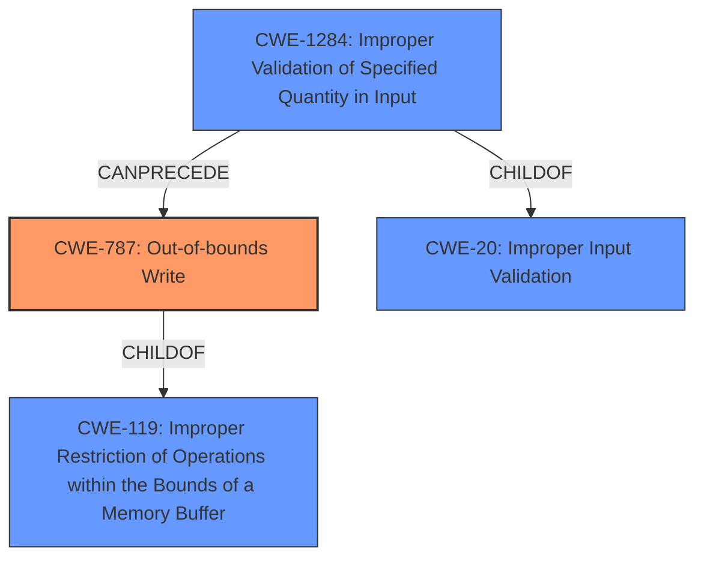

# Analysis Report for CVE-2021-34934

# Vulnerability Analysis Report: CVE-2021-34934

## Description

This vulnerability allows remote attackers to execute arbitrary code on affected installations of Bentley View 10.15.0.75. User interaction is required to exploit this vulnerability in that the target must visit a malicious page or open a malicious file. The specific flaw exists within the parsing of JT files. The issue results from the lack of proper validation of user-supplied data, which can result in a memory corruption condition. An attacker can leverage this vulnerability to execute code in the context of the current process. Was ZDI-CAN-14912.

## Vulnerability Description Key Phrases

**Rootcause:** lack of proper validation of user-supplied data
**Impact:** memory corruption
**Vector:** malicious page or file
**Attacker:** remote attackers
**Product:** Bentley View
**Version:** 10.15.0.75
**Component:** parsing of JT files

## Analysis (with Relationship Data)

# Summary
| CWE ID  | CWE Name  | Confidence | CWE Abstraction Level | CWE Vulnerability Mapping Label | CWE-Vulnerability Mapping Notes |
| ----------- | ----------- | ----------- | ----------- | ----------- | ----------- |
| CWE-787 | Out-of-bounds Write | 0.95 | Base | Allowed | Primary CWE |
| CWE-1284 | Improper Validation of Specified Quantity in Input | 0.75 | Base | Allowed | Secondary Candidate |

## Evidence and Confidence

*   **Confidence Score:** 0.85
*   **Evidence Strength:** HIGH

- **Analysis and Justification:**  
  - *Explanation:* The vulnerability description explicitly states "**lack of proper validation of user-supplied data**, which can result in a memory corruption condition." The CVE Reference Links Content Summary confirms that the root cause is the lack of proper validation leading to a memory corruption and potential out-of-bounds write within the parsing of JT files. CWE-787 (Out-of-bounds Write) is the most appropriate primary CWE because the vulnerability allows writing data past the end of the intended buffer. The "Retriever Results" list CWE-787 as the top candidate with a high score. The MITRE mapping guidance for CWE-787 indicates this is ALLOWED for this type of vulnerability. CWE-123 (Write-what-where Condition) is a child of CWE-787 but is less specific than CWE-787.

  - *Relationship Analysis:* CWE-787 is a child of CWE-119 (Improper Restriction of Operations within the Bounds of a Memory Buffer). The relationship analysis reveals that CWE-787 can precede CWE-825, CWE-824, CWE-823, and CWE-822.

- **Confidence Score:**  
  - Confidence: 0.95 (High confidence due to the clear description of the root cause and supporting evidence from CVE reference materials)

---

- **Analysis and Justification:**  
  - *Explanation:* CWE-1284 (Improper Validation of Specified Quantity in Input) is a plausible secondary CWE. The description mentions a **lack of proper validation of user-supplied data**, which aligns with CWE-1284's focus on input that specifies a quantity (such as size or length) being improperly validated. The "Retriever Results" list CWE-1284 as the second candidate. While the primary issue is the out-of-bounds write (CWE-787), the root cause is the improper validation, making CWE-1284 a contributing factor. MITRE mapping guidance for CWE-1284 indicates that it is ALLOWED.

  - *Relationship Analysis:* CWE-1284 is a child of CWE-20 (Improper Input Validation). It can precede CWE-789 (Uncontrolled Memory Allocation).

- **Confidence Score:**  
  - Confidence: 0.75 (Medium-High confidence as improper validation is mentioned, but the primary impact is the out-of-bounds write.)

## Criticism of Analysis

Okay, I've reviewed the provided analysis and the full CWE specifications for the suggested mappings. Here's my critique, focusing on the appropriateness of the CWE selections and the justification provided:

**Overall Assessment:**

The analysis is generally well-reasoned and demonstrates a good understanding of the vulnerability. The primary CWE mapping to `CWE-787: Out-of-bounds Write` is accurate and well-supported. The secondary consideration of `CWE-1284: Improper Validation of Specified Quantity in Input` is also valid, although its confidence is appropriately lower. The analysis clearly articulates the evidence and the relationship between the root cause (lack of input validation) and the resulting impact (memory corruption/out-of-bounds write).

**Detailed Review:**

**1. CWE-787: Out-of-bounds Write (Primary)**

*   **Confidence:** 0.95
*   **Justification:** The justification is strong. The description explicitly mentions "memory corruption condition," which directly aligns with the potential impact of CWE-787.  The description states that a *lack of proper validation* allows for *user-supplied data* to cause the condition, which suggests user-controlled sizes can affect the out-of-bounds write. The analysis also correctly notes that CWE-787 is a base-level CWE and is `ALLOWED` for this type of vulnerability according to MITRE's mapping guidance.
*   **Relationship Analysis:** The relationship analysis is accurate. `CWE-787` is indeed a child of `CWE-119`. It's also correct that `CWE-787` can precede `CWE-825`, `CWE-824`, `CWE-823`, and `CWE-822` depending on how the out-of-bounds write manifests as further pointer issues.
*   **Mitigation:** The suggested mitigations from the CWE specifications are relevant:
    *   Language Selection: Safer languages with memory management.
    *   Libraries/Frameworks: Safe string libraries.
    *   Environment Hardening: Compiler-based buffer overflow detection.
*   **Overall:** Excellent choice for the primary CWE.

**2. CWE-1284: Improper Validation of Specified Quantity in Input (Secondary)**

*   **Confidence:** 0.75
*   **Justification:** The analysis correctly identifies the "lack of proper validation of user-supplied data" as aligning with `CWE-1284`. Specifically, it explains the focus on input that specifies a quantity (size, length).
*   **Relationship Analysis:** Correctly identifies that `CWE-1284` is a child of `CWE-20`. The "can precede" relationship to `CWE-789` (Uncontrolled Memory Allocation) is also applicable, as improper quantity validation can lead to allocating too much or too little memory.
*   **Mitigation:**
    *   Input Validation: The suggestion to use an "accept known good" strategy aligns perfectly with the nature of this weakness. This is a key mitigation.
*   **Overall:** Justified as a secondary CWE, providing a more complete picture of the vulnerability's root cause. The confidence level is appropriate, as the main problem is the OOB write but the cause is improper validation.

**General Comments & Suggestions:**

*   **Evidence Strength:** Could be slightly enhanced by elaborating on *how* the user-supplied data controls the quantity.  For example, if the JT file format includes size fields that are not adequately checked, this should be explicitly stated.  This isn't a major issue, as the vulnerability description is already relatively clear, but it is worth keeping in mind.
*   **CWE-20 Consideration:** The analysis doesn't mention `CWE-20: Improper Input Validation` directly. While `CWE-20` is a *Class* and therefore discouraged for primary mappings, acknowledging it and explaining *why* more specific CWEs (like `CWE-1284`) are more appropriate could be helpful.  In this case, stating that CWE-1284 is preferred because it provides a more descriptive level of the specific type of input validation error (specifically, quantities) is a good defense of the decision not to use CWE-20.
* **Avoid Mentioning Write-What-Where:** While CWE-123 is a child of CWE-787 it's not very descriptive and can confuse the analysis. It adds very little value to mention that. It is too generic, and while technically accurate, the mapping to it is not very helpful.
*   **Retriever Results:** The Retriever Results section is useful context. I suggest briefly mentioning *why* some of the other top CWEs from the retriever were considered and rejected. For example, "CWE-416 (Use After Free) was considered but deemed less relevant because the vulnerability's description emphasizes the lack of input validation leading to memory corruption, rather than an explicit use-after-free condition."

**Revised Summary (Incorporating Suggestions):**

| CWE ID  | CWE Name  | Confidence | CWE Abstraction Level | CWE Vulnerability Mapping Label | CWE-Vulnerability Mapping Notes |
| ----------- | ----------- | ----------- | ----------- | ----------- | ----------- |
| CWE-787 | Out-of-bounds Write | 0.95 | Base | Allowed | Primary CWE |
| CWE-1284 | Improper Validation of Specified Quantity in Input | 0.75 | Base | Allowed | Secondary Candidate |

**Evidence and Confidence**
*   **Confidence Score:** 0.85
*   **Evidence Strength:** HIGH

- **Analysis and Justification:**  
  - *Explanation:* The vulnerability description explicitly states "**lack of proper validation of user-supplied data**, which can result in a memory corruption condition." The CVE Reference Links Content Summary confirms that the root cause is the lack of proper validation leading to a memory corruption and potential out-of-bounds write within the parsing of JT files. CWE-787 (Out-of-bounds Write) is the most appropriate primary CWE because the vulnerability allows writing data past the end of the intended buffer. The "Retriever Results" list CWE-787 as the top candidate with a high score. The MITRE mapping guidance for CWE-787 indicates this is ALLOWED for this type of vulnerability.

  - *Relationship Analysis:* CWE-787 is a child of CWE-119 (Improper Restriction of Operations within the Bounds of a Memory Buffer). The relationship analysis reveals that CWE-787 can precede CWE-825, CWE-824, CWE-823, and CWE-822.

- **Confidence Score:**  
  - Confidence: 0.95 (High confidence due to the clear description of the root cause and supporting evidence from CVE reference materials)

---

- **Analysis and Justification:**  
  - *Explanation:* CWE-1284 (Improper Validation of Specified Quantity in Input) is a plausible secondary CWE. The description mentions a **lack of proper validation of user-supplied data**, which aligns with CWE-1284's focus on input that specifies a quantity (such as size or length) being improperly validated. The "Retriever Results" list CWE-1284 as the second candidate.  `CWE-20 (Improper Input Validation) was considered as a broader cause, but CWE-1284 provides a more specific and descriptive view of the type of validation error. The improper validation of quantities contributes to the out-of-bounds write. MITRE mapping guidance for CWE-1284 indicates that it is ALLOWED.
  - *Relationship Analysis:* CWE-1284 is a child of CWE-20 (Improper Input Validation). It can precede CWE-789 (Uncontrolled Memory Allocation).

- **Confidence Score:**  
  - Confidence: 0.75 (Medium-High confidence as improper validation is mentioned, but the primary impact is the out-of-bounds write.)

In summary, the analysis is strong. The suggestions would just help refine it further and show more explicitly the reasoning behind the CWE choices.

## Final Resolution

# Summary
| CWE ID  | CWE Name  | Confidence | CWE Abstraction Level | CWE Vulnerability Mapping Label | CWE-Vulnerability Mapping Notes |
| ----------- | ----------- | ----------- | ----------- | ----------- | ----------- |
| CWE-787 | Out-of-bounds Write | 0.95 | Base | Allowed | Primary CWE |
| CWE-1284 | Improper Validation of Specified Quantity in Input | 0.75 | Base | Allowed | Secondary Candidate |

## Evidence and Confidence

*   **Confidence Score:** 0.85
*   **Evidence Strength:** HIGH

## Relationship Analysis
The primary relationship impacting the decision is the parent-child relationship between CWE-787 and CWE-119, where CWE-787 is a child of CWE-119. Selecting CWE-787 provides a more specific description of the vulnerability than CWE-119. Additionally, CWE-1284 is a child of CWE-20, representing improper input validation. The chain relationship shows that CWE-1284 can precede CWE-787, where improper validation of input quantities can lead to an out-of-bounds write. The abstraction levels influenced the decision to select Base level CWEs over Class or Pillar level CWEs for better specificity.

## Vulnerability Chain
The vulnerability chain starts with the **ROOTCAUSE** of **CWE-1284 (Improper Validation of Specified Quantity in Input)**. This leads to a condition where the program attempts to write data beyond the boundaries of the allocated buffer, resulting in **CWE-787 (Out-of-bounds Write)**. The ultimate impact is arbitrary code execution in the context of the current process. The chain highlights how a failure to validate input can directly lead to memory corruption and code execution.

## Summary of Analysis
The initial analysis and criticism both converge on the accurate assessment of **CWE-787 (Out-of-bounds Write)** as the primary issue. The vulnerability description clearly states "**lack of proper validation of user-supplied data**, which can result in a memory corruption condition," and the CVE details confirm that the root cause is a lack of proper validation leading to memory corruption, specifically an out-of-bounds write during the parsing of JT files.

The graph relationships support this decision, as CWE-787 is a child of CWE-119, allowing for a more specific classification than simply stating that there's a memory boundary issue. The inclusion of **CWE-1284 (Improper Validation of Specified Quantity in Input)** as a secondary CWE is justified because the vulnerability description highlights the lack of proper validation of user-supplied data as the root cause. The relationship analysis confirms that CWE-1284 is a child of CWE-20 (Improper Input Validation), but more specifically addresses the improper validation of quantities, such as size or length.

The selected CWEs are at the optimal level of specificity because they accurately describe both the root cause (improper validation) and the resulting impact (out-of-bounds write). While CWE-20 is a broader category, CWE-1284 provides a more precise understanding of what type of input validation is missing.

*Report generated on 2025-03-18 00:00:55*
