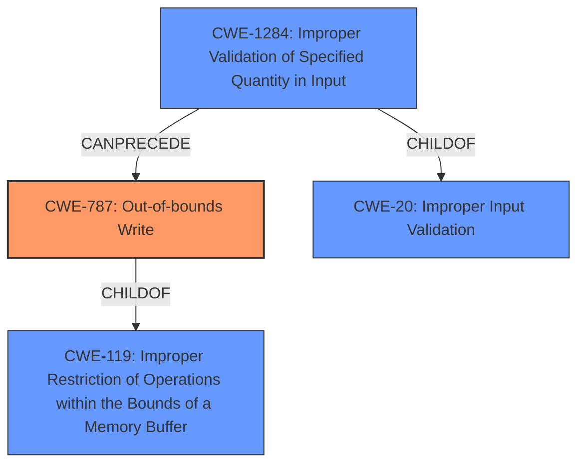

# Final Resolution for CVE-2021-34934

# Summary
| CWE ID  | CWE Name  | Confidence | CWE Abstraction Level | CWE Vulnerability Mapping Label | CWE-Vulnerability Mapping Notes |
| ----------- | ----------- | ----------- | ----------- | ----------- | ----------- |
| CWE-787 | Out-of-bounds Write | 0.95 | Base | Allowed | Primary CWE |
| CWE-1284 | Improper Validation of Specified Quantity in Input | 0.75 | Base | Allowed | Secondary Candidate |

## Evidence and Confidence

*   **Confidence Score:** 0.85
*   **Evidence Strength:** HIGH

## Relationship Analysis
The primary relationship impacting the decision is the parent-child relationship between CWE-787 and CWE-119, where CWE-787 is a child of CWE-119. Selecting CWE-787 provides a more specific description of the vulnerability than CWE-119. Additionally, CWE-1284 is a child of CWE-20, representing improper input validation. The chain relationship shows that CWE-1284 can precede CWE-787, where improper validation of input quantities can lead to an out-of-bounds write. The abstraction levels influenced the decision to select Base level CWEs over Class or Pillar level CWEs for better specificity.

## Vulnerability Chain
The vulnerability chain starts with the **ROOTCAUSE** of **CWE-1284 (Improper Validation of Specified Quantity in Input)**. This leads to a condition where the program attempts to write data beyond the boundaries of the allocated buffer, resulting in **CWE-787 (Out-of-bounds Write)**. The ultimate impact is arbitrary code execution in the context of the current process. The chain highlights how a failure to validate input can directly lead to memory corruption and code execution.

## Summary of Analysis
The initial analysis and criticism both converge on the accurate assessment of **CWE-787 (Out-of-bounds Write)** as the primary issue. The vulnerability description clearly states "**lack of proper validation of user-supplied data**, which can result in a memory corruption condition," and the CVE details confirm that the root cause is a lack of proper validation leading to memory corruption, specifically an out-of-bounds write during the parsing of JT files.

The graph relationships support this decision, as CWE-787 is a child of CWE-119, allowing for a more specific classification than simply stating that there's a memory boundary issue. The inclusion of **CWE-1284 (Improper Validation of Specified Quantity in Input)** as a secondary CWE is justified because the vulnerability description highlights the lack of proper validation of user-supplied data as the root cause. The relationship analysis confirms that CWE-1284 is a child of CWE-20 (Improper Input Validation), but more specifically addresses the improper validation of quantities, such as size or length.

The selected CWEs are at the optimal level of specificity because they accurately describe both the root cause (improper validation) and the resulting impact (out-of-bounds write). While CWE-20 is a broader category, CWE-1284 provides a more precise understanding of what type of input validation is missing.