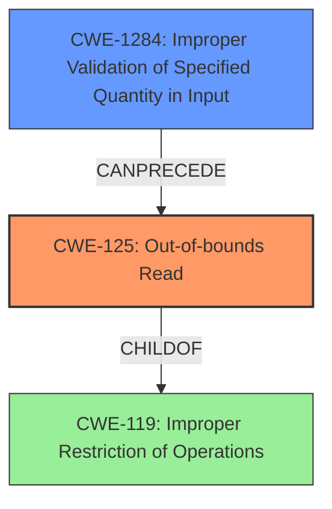

# Final Resolution for CVE-2021-35005

# Summary
| CWE ID | CWE Name | Confidence | CWE Abstraction Level | CWE Vulnerability Mapping Label | CWE-Vulnerability Mapping Notes |
|---|---|---|---|---|---|
| CWE-125 | Out-of-bounds Read | 0.95 | Base | Primary | Allowed |
| CWE-1284 | Improper Validation of Specified Quantity in Input | 0.85 | Base | Secondary Candidate | Allowed |

## Evidence and Confidence

*   **Confidence Score:** 0.90
*   **Evidence Strength:** HIGH

## Relationship Analysis
The primary weakness is **CWE-125 (Out-of-bounds Read)**, which is a child of **CWE-119 (Improper Restriction of Operations within the Bounds of a Memory Buffer)**. **CWE-1284 (Improper Validation of Specified Quantity in Input)** is identified as the secondary weakness that can precede the primary weakness. This means that the improper input validation can lead to an out-of-bounds read. The abstraction levels are considered, choosing the more specific base level CWEs where available.

## Vulnerability Chain
The vulnerability chain starts with **CWE-1284 (Improper Validation of Specified Quantity in Input)**, which results in **CWE-125 (Out-of-bounds Read)**. The lack of proper input validation (specifically the size/length of the data) allows an attacker to read data past the end of the allocated array. This can lead to information disclosure and potentially arbitrary code execution in the context of SYSTEM.

## Summary of Analysis
The initial analysis correctly identified **CWE-125 (Out-of-bounds Read)** as the primary weakness. The criticism suggests `CWE-129: Improper Validation of Array Index` could be an alternative to `CWE-1284`, however, the vulnerability description states "The issue results from the **lack of proper validation of user-supplied data**, which can result in a **read past the end of an allocated array**". This description leans more towards the size/length rather than the index itself, therefore **CWE-1284** is the better fit. The graph relationships show the proper hierarchy, and the chain shows how the weakness leads to the vulnerability. The selected CWEs are at the optimal level of specificity, accurately reflecting the **root cause** and the resulting vulnerability. Mitigation recommendations include assuming all input is malicious and applying accept known good input validation for **CWE-1284**, and ensuring that you validate and ensure correct calculations for any length argument, buffer size calculation, or offset for **CWE-125**.