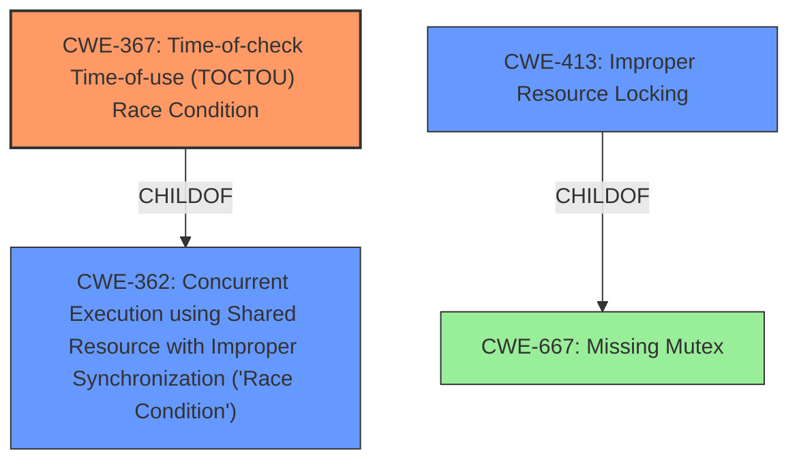

# Final Resolution for CVE-2021-35090

# Summary
| CWE ID | CWE Name | Confidence | CWE Abstraction Level | CWE Vulnerability Mapping Label | CWE-Vulnerability Mapping Notes |
|---|---|---|---|---|---|
| CWE-367 | Time-of-check Time-of-use (TOCTOU) Race Condition | 0.9 | Base | Allowed | Primary CWE. The vulnerability is directly caused by a TOCTOU race condition. Mitigations include limiting interleaving of operations. |
| CWE-413 | Improper Resource Locking | 0.3 | Base | Allowed | Secondary CWE. A race condition often stems from the lack of proper locking mechanisms, but the primary issue here is the TOCTOU condition. A relevant mitigation is using synchronization primitives. |
| CWE-362 | Concurrent Execution using Shared Resource with Improper Synchronization ('Race Condition') | 0.2 | Class | Allowed-with-Review | Secondary CWE. The description mentions a race condition, but doesn't elaborate on the concurrency aspect, and TOCTOU is more specific. A general mitigation is to use synchronization primitives. |

## Evidence and Confidence

*   **Confidence Score:** 0.9
*   **Evidence Strength:** HIGH

## Relationship Analysis
The primary CWE, CWE-367, is a child of CWE-362, indicating that it's a specific type of race condition. CWE-413 (Improper Resource Locking) is considered as a secondary CWE, as it can contribute to race conditions by not properly synchronizing access to shared resources. It's a child of CWE-667 (Missing Mutex), suggesting that the lack of proper locking mechanisms can lead to race conditions and TOCTOU vulnerabilities. The analysis focuses on direct relationships and abstraction levels to ensure specificity.

## Vulnerability Chain
The vulnerability chain starts with a **ROOTCAUSE** related to concurrent execution and shared resources.
1.  CWE-362 (Concurrent Execution using Shared Resource with Improper Synchronization ('Race Condition')) represents the general condition of a race.
2.  This leads to a more specific **WEAKNESS**: CWE-367 (Time-of-check Time-of-use (TOCTOU) Race Condition) where a check is made, but the resource changes before use.
3.  The lack of proper locking (CWE-413: Improper Resource Locking) exacerbates the race condition.
4.  The **IMPACT** is hypervisor memory corruption, as stated in the vulnerability description.

## Summary of Analysis
The initial analysis and criticism both agree that CWE-367 is the most appropriate primary CWE due to the explicit mention of "TOCTOU race condition" in the vulnerability description. The criticism provides additional details and suggested improvements, such as including potential mitigations and further exploring relationships between CWEs.

The graph relationships confirm that CWE-367 is a specific type of race condition (child of CWE-362) and that improper locking (CWE-413) can contribute to the vulnerability.

The selected CWEs are at the optimal level of specificity. CWE-367 is a Base-level CWE, which is preferred for root cause analysis. While CWE-362 is related, it is a Class-level CWE and too general. CWE-413 is included as a secondary CWE because it is also a Base-level CWE and can contribute to the vulnerability, but the description does not provide specific details about locking issues. The decision is based on the evidence provided in the vulnerability description, the CWE specifications, and the relationship analysis.