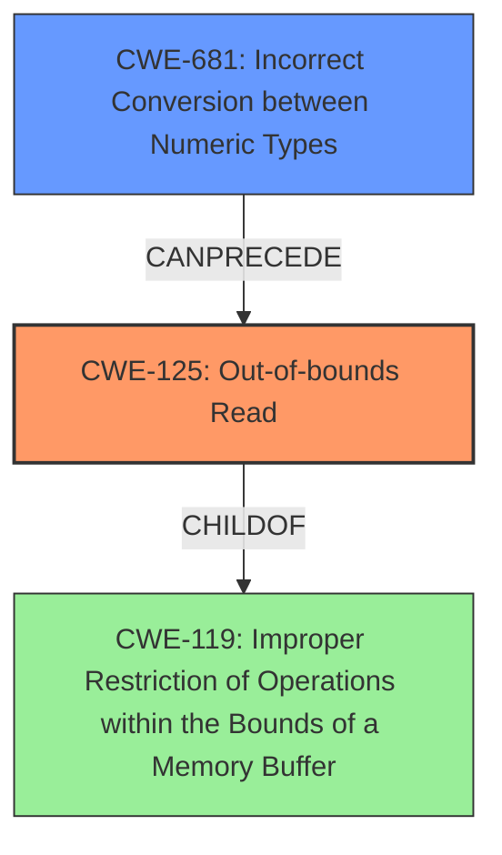

# Final Resolution for CVE-2021-35091

# Summary
| CWE ID | CWE Name | Confidence | CWE Abstraction Level | CWE Vulnerability Mapping Label | CWE-Vulnerability Mapping Notes |
|---|---|---|---|---|---|
| CWE-125 | Out-of-bounds Read | 0.9 | Base | Allowed | Primary CWE |
| CWE-681 | Incorrect Conversion between Numeric Types | 0.8 | Base | Allowed | Secondary Candidate |

## Evidence and Confidence

*   **Confidence Score:** 0.85
*   **Evidence Strength:** HIGH

## Relationship Analysis
The primary CWE is CWE-125 (**Out-of-bounds Read**). It is a child of CWE-119 (**Improper Restriction of Operations within the Bounds of a Memory Buffer**). The secondary CWE is CWE-681 (**Incorrect Conversion between Numeric Types**), which can lead to unexpected values. The type conversion error (CWE-681) can **precede** an out-of-bounds read (CWE-125), where the incorrect value from the type conversion is used as an offset. Both CWEs are at the Base level of abstraction, which is preferred.

## Vulnerability Chain
The vulnerability chain starts with **improper typecasting** (CWE-681), which results in an incorrect value being used as an offset. This leads to an **out-of-bounds read** (CWE-125), potentially causing a crash or information disclosure. The root cause is the type conversion, and the direct consequence is the out-of-bounds read.

## Summary of Analysis
The initial analysis correctly identified CWE-125 (**Out-of-bounds Read**) as the primary **weakness** due to the explicit mention of an out-of-bounds read in the vulnerability description: "Possible **out of bounds read** due to **improper typecasting** while handling page fault". The criticism suggested refining the secondary CWE, CWE-704 (**Incorrect Type Conversion or Cast**), to a more specific child CWE. Based on the available CWEs, CWE-681 (**Incorrect Conversion between Numeric Types**) is a better fit because the description states, "**improper typecasting** while handling page fault". The vulnerability description implies that a numeric type conversion error likely occurred during the page fault handling. This makes CWE-681 a more precise classification than the broader CWE-704. The selection of CWE-125 and CWE-681 is at the optimal level of specificity, and both are at the Base level.