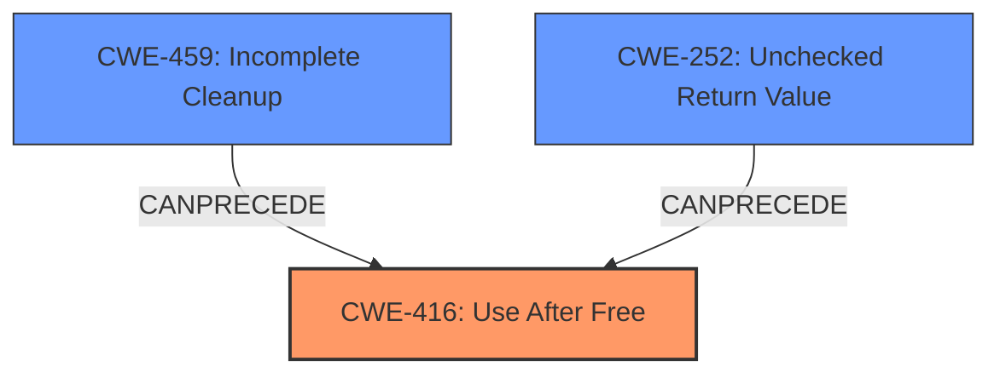

# Final Resolution for CVE-2021-35120

# Summary
| CWE ID | CWE Name | Confidence | CWE Abstraction Level | CWE Vulnerability Mapping Label | CWE-Vulnerability Mapping Notes |
|---|---|---|---|---|---|
| CWE-416 | Use After Free | 0.95 | Variant | Primary | Allowed |
| CWE-459 | Incomplete Cleanup | 0.6 | Base | Secondary | Allowed |
| CWE-252 | Unchecked Return Value | 0.5 | Base | Secondary | Allowed |

## Evidence and Confidence

*   **Confidence Score:** 0.90
*   **Evidence Strength:** MEDIUM

## Relationship Analysis
The primary relationship considered was the direct match of the vulnerability description to **CWE-416 (Use After Free)**. The criticism suggested considering contributing factors in a CWE chain. **CWE-459 (Incomplete Cleanup)** and **CWE-252 (Unchecked Return Value)** were considered as potential preceding weaknesses.

## Vulnerability Chain
The vulnerability chain starts with a potential **ROOTCAUSE** of **CWE-459 (Incomplete Cleanup)**, where resources are not properly cleaned up after use. This can lead to a dangling pointer. If return values from the export/release functions are not checked (**CWE-252 (Unchecked Return Value)**), failures in resource management may go unnoticed, exacerbating the **CWE-459 (Incomplete Cleanup)** condition. Finally, the dangling pointer is dereferenced, resulting in **CWE-416 (Use After Free)**.

## Summary of Analysis
The initial analysis correctly identified **CWE-416 (Use After Free)** as the primary weakness, directly supported by the vulnerability description "Improper handling between export and release functions on the same handle from client can lead to use after free." The criticism highlighted the possibility of contributing factors, which prompted a deeper consideration of related CWEs.

Based on the criticism's suggestions and the retriever results, **CWE-459 (Incomplete Cleanup)** and **CWE-252 (Unchecked Return Value)** were added as secondary CWEs to represent potential contributing factors. The evidence to support these is not explicit, but reasonably inferred from the description "Improper handling between export and release functions." This "improper handling" *could* involve failing to clear a pointer after releasing the resource (**CWE-459**) and failing to check return values from the export/release functions (**CWE-252**), leading to the **CWE-416**.

The selection of **CWE-416** as the primary CWE remains at the optimal level of specificity, as it directly reflects the stated impact. The addition of **CWE-459** and **CWE-252** provides a more comprehensive view of the potential vulnerability chain, though with a slightly lower confidence due to the inferential nature of their inclusion.