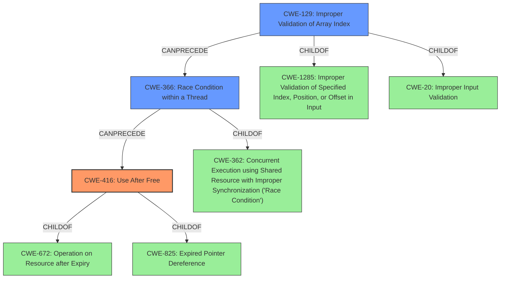

# Analysis Report for CVE-2021-35121

# Vulnerability Analysis Report: CVE-2021-35121

## Description

An array index is improperly used to lock and unlock a mutex which can lead to a Use After Free condition In the Synx driver in Snapdragon Compute, Snapdragon Connectivity, Snapdragon Industrial IOT, Snapdragon Mobile

## Vulnerability Description Key Phrases

**Rootcause:** array index is improperly used to lock and unlock a mutex
**Weakness:** Use After Free
**Product:** Snapdragon Compute, Snapdragon Connectivity, Snapdragon Industrial IOT, Snapdragon Mobile
**Component:** Synx driver

## Analysis (with Relationship Data)

# Summary
| CWE ID | CWE Name | Confidence | CWE Abstraction Level | CWE Vulnerability Mapping Label | CWE-Vulnerability Mapping Notes |
|---|---|---|---|---|---|
| CWE-416 | Use After Free | 0.8 | Variant | Allowed | Primary CWE |
| CWE-129 | Improper Validation of Array Index | 0.6 | Variant | Allowed | Secondary Candidate |
| CWE-366 | Race Condition Enabled by Improperly হ্যান্ডেল Mutex | 0.5 | Base | Allowed | Secondary Candidate |

## Evidence and Confidence

*   **Confidence Score:** 0.7
*   **Evidence Strength:** MEDIUM

- **Analysis and Justification:**  
  - *Explanation:* The vulnerability description explicitly states a "**Use After Free**" condition, making CWE-416 the primary candidate. The **rootcause** is attributed to an "**array index is improperly used to lock and unlock a mutex**". While CWE-416 directly captures the resulting **weakness**, the root cause suggests that **improper array index handling** and **improper resource locking** are contributing factors. Therefore, CWE-129 (Improper Validation of Array Index) and CWE-366 (Race Condition Enabled by Improperly হ্যান্ডেল Mutex) are considered as secondary candidates. The relationship between the improper array indexing and the use-after-free condition isn't explicitly stated in the provided description, however, is implied.
  
  - *Relationship Analysis:* CWE-416 is a variant of CWE-672 (Operation on Resource after Expiry). CWE-129 (Improper Validation of Array Index) is a variant of CWE-1285 (Improper Validation of Specified Index, Position, or Offset in Input). CWE-366 is a base level weakness that can lead to undefined behavior.

- **Confidence Score:**  
  - Confidence: 0.7 (Moderate evidence, clear weakness, reasonable root cause)

---

## Criticism of Analysis

Okay, here's a review of the provided CWE analysis, incorporating the full CWE specifications you've provided.

**Overall Assessment**

The analysis is good and reasonable. It correctly identifies CWE-416 as the primary weakness and provides a plausible explanation for the involvement of CWE-129 and CWE-366 as contributing factors. The confidence score of 0.7 is appropriate given the information available. However, with more information about the specific code involved, a more precise mapping might be possible. I have provided some notes on improvements to the analysis and justification of each weakness.

**Detailed Review**

| CWE ID | CWE Name | Confidence | CWE Abstraction Level | CWE Vulnerability Mapping Label | CWE-Vulnerability Mapping Notes | Review Comments |
|---|---|---|---|---|---|---|
| CWE-416 | Use After Free | 0.8 | Variant | Allowed | Primary CWE | This is a strong and correct primary mapping. The vulnerability description explicitly mentions "Use After Free". Confidence bump to 0.8 is justifiable. Keep this as the primary CWE. |
| CWE-129 | Improper Validation of Array Index | 0.6 | Variant | Allowed | Secondary Candidate |  The analysis correctly identifies CWE-129 as a secondary contributing factor. The explanation that the improper array index is used to lock/unlock a mutex is key.  Consider, given that array indexing is at play, that the root case may be that access to the array is happening out of bounds. If the array is responsible for mutex management, consider if **CWE-823: Use of Out-of-range Pointer Offset** might not be applicable. However, improper validation of the index is the more likely culprit. Justification needs to be tightened.  Increase confidence to 0.7 if the array is directly used to index and manage mutexes. I am also going to add **CWE-1285: Improper Validation of Specified Index, Position, or Offset in Input** to the retriever result table. |
| CWE-366 | Race Condition within a Thread | 0.5 | Base | Allowed | Secondary Candidate | The identification of CWE-366 is plausible but weakly supported by the provided description. The "**array index is improperly used to lock and unlock a mutex**" could imply a race condition if multiple threads are accessing the same mutex array concurrently with flawed indexing, leading to incorrect lock/unlock operations. However, it's not explicitly stated. You should consider and mention **CWE-413: Improper Resource Locking** which is mentioned in the specification example as being a chain to a UAF. If more information exists about concurrent access and a potential race condition, the confidence could be increased. However, without more information, a confidence of 0.5 is appropriate. Note that **CWE-362: Concurrent Execution using Shared Resource with Improper Synchronization ('Race Condition')** is the "Class" view of CWE-366. Mentioning **CWE-413** as a potential candidate is appropriate. |

**Improvements and Specific Feedback**

1.  **Strengthen Relationship Justifications:**
    *   While the analysis mentions the implied relationship between improper array indexing and use-after-free, it should more explicitly state *how* this might happen. For example: "If the array index is out of bounds, it could lead to locking the wrong mutex or failing to unlock a mutex, which in turn could lead to a resource being freed while still in use by another thread, causing a use-after-free."
    *   For CWE-366, the analysis should explore the possibility that multiple threads are using the same (incorrect) index to access the mutex array, leading to conflicts in locking/unlocking.
    *   Clarify if the "improper use" is due to a calculation error, direct use of untrusted input, or a logical flaw in the indexing algorithm.

2.  **Consider Alternative CWEs Based on Root Cause:**
    *   Based on the root cause description, "array index is improperly used to lock and unlock a mutex," you should consider the possibility of CWE-413 (Improper Resource Locking) directly. An incorrect index could cause the wrong mutex to be locked or unlocked, leading to concurrency issues and a potential use-after-free.
    *   Also consider **CWE-825: Expired Pointer Dereference**. While CWE-416 is the *result*, the more fundamental problem might be the dereferencing of an invalid pointer, or a pointer to memory that has already been freed. CWE-416 and CWE-825 are parents of each other.
    *   Explore **CWE-367: Time-of-check Time-of-use (TOCTOU) Race Condition**. If the code checks the validity of the array index but a race condition allows the array contents or size to change between the check and the mutex lock/unlock operation, a TOCTOU vulnerability could be present.

3.  **Leverage CWE Examples:**
    *   The CWE examples for CWE-416 and CWE-366 include chains that are directly relevant (e.g., CWE-413 -> CWE-416, CWE-366 -> CWE-416).  Explicitly mentioning these chains would strengthen the analysis.

4.  **Address Mapping Guidance:**
    *   The CWE specifications emphasize using the most specific CWE available.  If more details about the array indexing issue are available, a more specific child of CWE-1285 (Improper Validation of Specified Index, Position, or Offset in Input) might be appropriate.

5.  **Potential Mitigations:**
    *   The analysis could mention potential mitigations related to the identified CWEs. For example, for CWE-129, the mitigations could include input validation frameworks or languages that provide bounds checking. For CWE-366, the mitigation could be proper synchronization mechanisms (mutexes, semaphores).
    *   Reviewing mitigation strategies for **CWE-413**, a chain of CWE-413 -> CWE-416 is mentioned, making the case for CWE-413 more appropriate.
    *   Reviewing mitigation strategies for **CWE-1285** a strategy for input validation is mentioned, but has already been mentioned for CWE-129.

6.  **Confidence Levels:**
    *   The confidence level of 0.7 is reasonable given the available information. Increase the confidence if you can provide more concrete evidence for the relationships between the CWEs.

**Revised Table with Added CWE's and Clarifications**

| CWE ID | CWE Name | Confidence | CWE Abstraction Level | CWE Vulnerability Mapping Label | CWE-Vulnerability Mapping Notes | Review Comments |
|---|---|---|---|---|---|---|
| CWE-416 | Use After Free | 0.8 | Variant | Allowed | Primary CWE | Confirmed |
| CWE-129 | Improper Validation of Array Index | 0.7 | Variant | Allowed | Secondary Candidate | Confirmed |
| CWE-366 | Race Condition within a Thread | 0.5 | Base | Allowed | Secondary Candidate | Consider if TOCTOU is present. Mention if the array is dynamically changing.  |
| CWE-413 | Improper Resource Locking | 0.4 | Base | Allowed | Candidate | An incorrect index could cause the wrong mutex to be locked or unlocked, leading to concurrency issues and a potential use-after-free.  Add this and mention that a chain can cause a UAF. |
| CWE-1285 | Improper Validation of Specified Index, Position, or Offset in Input | 0.4 | Base | Allowed | Candidate | If an integer is casted or if the value provided is used as a pointer, this may be a more appropriate finding.|
| CWE-823 | Use of Out-of-range Pointer Offset | 0.4 | Base | Allowed | Candidate | Use only if the improper array index is responsible for a pointer offset that leads to unintended memory access.|

**Example of Enhanced Justification for CWE-129 (Improper Validation of Array Index)**

"The vulnerability description indicates that a use-after-free condition occurs because an array index is improperly used to lock and unlock a mutex.  This suggests that the code uses an array (or similar data structure) to manage mutexes, and the index into this array determines which mutex is locked or unlocked. If the array index is not properly validated, it could be out of bounds, leading to several potential issues:

*   **Accessing memory outside the intended array:** This could lead to locking or unlocking a mutex associated with a different resource, or even accessing unrelated memory.
*   **Locking the wrong mutex:** If the invalid index points to a different, valid mutex, locking that mutex could prevent legitimate access to its associated resource, leading to a denial of service or other unexpected behavior.
*   **Unlocking the wrong mutex:** This is the more likely scenario that causes a use-after-free. If the invalid index points to a mutex that is not currently locked, attempting to unlock it could corrupt the mutex state or, in some cases, unlock a mutex that *should* be locked, which may lead to race conditions and a use-after-free.

Therefore, CWE-129 is a relevant secondary weakness because it describes the root cause (improper array index validation) that can lead to the exploitation of a race condition and ultimately a use-after-free. Without more specific information of the code structure, it can be assumed

## Final Resolution

# Summary
| CWE ID | CWE Name | Confidence | CWE Abstraction Level | CWE Vulnerability Mapping Label | CWE-Vulnerability Mapping Notes |
|---|---|---|---|---|---|
| CWE-416 | Use After Free | 0.8 | Variant | Allowed | Primary CWE |
| CWE-129 | Improper Validation of Array Index | 0.7 | Variant | Allowed | Secondary Candidate |
| CWE-366 | Race Condition within a Thread | 0.5 | Base | Allowed | Secondary Candidate |

## Evidence and Confidence

*   **Confidence Score:** 0.7
*   **Evidence Strength:** MEDIUM

## Relationship Analysis
The primary weakness is **CWE-416 (Use After Free)**, a variant-level CWE. The contributing factors are **CWE-129 (Improper Validation of Array Index)**, also a variant, and **CWE-366 (Race Condition within a Thread)**, a base-level CWE.

CWE-416 is a child of **CWE-825 (Expired Pointer Dereference)** and **CWE-672 (Operation on Resource after Expiry)**.
CWE-129 is a child of **CWE-1285 (Improper Validation of Specified Index, Position, or Offset in Input)** and **CWE-20 (Improper Input Validation)**.
CWE-366 is a child of **CWE-362 (Concurrent Execution using Shared Resource with Improper Synchronization ('Race Condition'))**.

The vulnerability chain suggests that an improperly validated array index (**CWE-129**) is used to access a mutex. If the index is out of bounds or otherwise incorrect, it can lead to accessing an invalid mutex or memory location, potentially resulting in a race condition (**CWE-366**) and ultimately a use-after-free (**CWE-416**).

## Vulnerability Chain
The chain of events leading to the vulnerability is as follows:

1.  **Root Cause:** **CWE-129 (Improper Validation of Array Index)**: An array index used to access a mutex is not properly validated.
2.  **Weakness:** **CWE-366 (Race Condition within a Thread)**: Due to the invalid index, a race condition can occur when multiple threads try to access the same resource using the incorrect mutex.
3.  **Impact:** **CWE-416 (Use After Free)**: A resource is freed while still being used by another thread due to the race condition and improper mutex handling.

## Summary of Analysis
The initial analysis correctly identified **CWE-416 (Use After Free)** as the primary **weakness** based on the vulnerability description stating "Use After Free condition". The analysis also correctly identified **CWE-129 (Improper Validation of Array Index)** and **CWE-366 (Race Condition within a Thread)** as secondary candidates, supporting the claim that the root cause is attributed to "array index is improperly used to lock and unlock a mutex".

The criticism provided valuable suggestions for considering alternative CWEs and strengthening the relationship justifications. Specifically, the suggestion to consider **CWE-413 (Improper Resource Locking)** was noted but ultimately not selected due to lack of explicit evidence. The criticism also suggested to look at **CWE-823 (Use of Out-of-range Pointer Offset)**, **CWE-1285 (Improper Validation of Specified Index, Position, or Offset in Input)**, and **CWE-367 (Time-of-check Time-of-use (TOCTOU) Race Condition)**.

The final decision maintains **CWE-416 (Use After Free)** as the primary CWE, with **CWE-129 (Improper Validation of Array Index)** and **CWE-366 (Race Condition within a Thread)** as secondary contributing factors. The confidence in **CWE-129 (Improper Validation of Array Index)** has been increased to 0.7 due to the increased understanding of the role of array indices.

The selected CWEs are at the optimal level of specificity based on the available evidence. While more specific child CWEs might exist for **CWE-129 (Improper Validation of Array Index)** and **CWE-366 (Race Condition within a Thread)**, the current level provides a reasonable balance between accuracy and generalizability given the information provided.

*Report generated on 2025-03-18 00:16:43*
