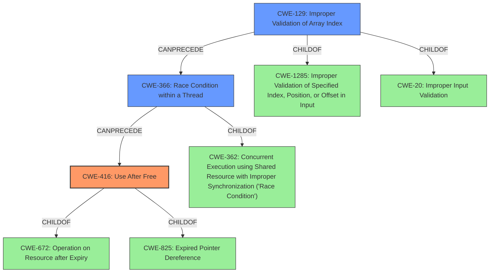

# Final Resolution for CVE-2021-35121

# Summary
| CWE ID | CWE Name | Confidence | CWE Abstraction Level | CWE Vulnerability Mapping Label | CWE-Vulnerability Mapping Notes |
|---|---|---|---|---|---|
| CWE-416 | Use After Free | 0.8 | Variant | Allowed | Primary CWE |
| CWE-129 | Improper Validation of Array Index | 0.7 | Variant | Allowed | Secondary Candidate |
| CWE-366 | Race Condition within a Thread | 0.5 | Base | Allowed | Secondary Candidate |

## Evidence and Confidence

*   **Confidence Score:** 0.7
*   **Evidence Strength:** MEDIUM

## Relationship Analysis
The primary weakness is **CWE-416 (Use After Free)**, a variant-level CWE. The contributing factors are **CWE-129 (Improper Validation of Array Index)**, also a variant, and **CWE-366 (Race Condition within a Thread)**, a base-level CWE.

CWE-416 is a child of **CWE-825 (Expired Pointer Dereference)** and **CWE-672 (Operation on Resource after Expiry)**.
CWE-129 is a child of **CWE-1285 (Improper Validation of Specified Index, Position, or Offset in Input)** and **CWE-20 (Improper Input Validation)**.
CWE-366 is a child of **CWE-362 (Concurrent Execution using Shared Resource with Improper Synchronization ('Race Condition'))**.

The vulnerability chain suggests that an improperly validated array index (**CWE-129**) is used to access a mutex. If the index is out of bounds or otherwise incorrect, it can lead to accessing an invalid mutex or memory location, potentially resulting in a race condition (**CWE-366**) and ultimately a use-after-free (**CWE-416**).

## Vulnerability Chain
The chain of events leading to the vulnerability is as follows:

1.  **Root Cause:** **CWE-129 (Improper Validation of Array Index)**: An array index used to access a mutex is not properly validated.
2.  **Weakness:** **CWE-366 (Race Condition within a Thread)**: Due to the invalid index, a race condition can occur when multiple threads try to access the same resource using the incorrect mutex.
3.  **Impact:** **CWE-416 (Use After Free)**: A resource is freed while still being used by another thread due to the race condition and improper mutex handling.

## Summary of Analysis
The initial analysis correctly identified **CWE-416 (Use After Free)** as the primary **weakness** based on the vulnerability description stating "Use After Free condition". The analysis also correctly identified **CWE-129 (Improper Validation of Array Index)** and **CWE-366 (Race Condition within a Thread)** as secondary candidates, supporting the claim that the root cause is attributed to "array index is improperly used to lock and unlock a mutex".

The criticism provided valuable suggestions for considering alternative CWEs and strengthening the relationship justifications. Specifically, the suggestion to consider **CWE-413 (Improper Resource Locking)** was noted but ultimately not selected due to lack of explicit evidence. The criticism also suggested to look at **CWE-823 (Use of Out-of-range Pointer Offset)**, **CWE-1285 (Improper Validation of Specified Index, Position, or Offset in Input)**, and **CWE-367 (Time-of-check Time-of-use (TOCTOU) Race Condition)**.

The final decision maintains **CWE-416 (Use After Free)** as the primary CWE, with **CWE-129 (Improper Validation of Array Index)** and **CWE-366 (Race Condition within a Thread)** as secondary contributing factors. The confidence in **CWE-129 (Improper Validation of Array Index)** has been increased to 0.7 due to the increased understanding of the role of array indices.

The selected CWEs are at the optimal level of specificity based on the available evidence. While more specific child CWEs might exist for **CWE-129 (Improper Validation of Array Index)** and **CWE-366 (Race Condition within a Thread)**, the current level provides a reasonable balance between accuracy and generalizability given the information provided.