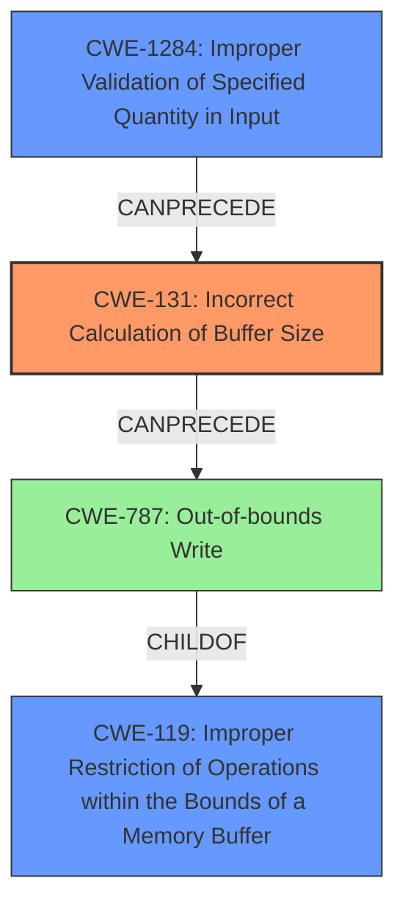

# Analysis Report for CVE-2021-35134

# Vulnerability Analysis Report: CVE-2021-35134

## Description

Due to insufficient validation of ELF headers, an Incorrect Calculation of Buffer Size can occur in Boot leading to memory corruption in Snapdragon Connectivity, Snapdragon Industrial IOT, Snapdragon Mobile

## Vulnerability Description Key Phrases

**Rootcause:** insufficient validation of ELF headers
**Weakness:** incorrect calculation of buffer size
**Impact:** memory corruption
**Product:** ['Snapdragon Connectivity', 'Snapdragon Industrial IOT', 'Snapdragon Mobile']
**Component:** Boot

## Analysis (with Relationship Data)

# Summary
| CWE ID | CWE Name | Confidence | CWE Abstraction Level | CWE Vulnerability Mapping Label | CWE-Vulnerability Mapping Notes |
|---|---|---|---|---|---|
| CWE-131 | Incorrect Calculation of Buffer Size | 0.95 | Base | Allowed | Primary CWE. Matches the **weakness** described. |
| CWE-1284 | Improper Validation of Specified Quantity in Input | 0.75 | Base | Allowed | Secondary CWE. The **insufficient validation of ELF headers** is the cause. |

## Evidence and Confidence

*   **Confidence Score:** 0.85
*   **Evidence Strength:** HIGH

- **Analysis and Justification:**  
  - *Explanation:* The vulnerability description explicitly states that the **weakness** is an **incorrect calculation of buffer size** which directly aligns with CWE-131 (Incorrect Calculation of Buffer Size). The description also mentions **insufficient validation of ELF headers** which can lead to the incorrect calculation. This leads to memory corruption. CWE-131 is a Base level CWE, which is appropriate, and its usage is ALLOWED according to MITRE.
  
  - *Relationship Analysis:* No direct relationships for CWE-131 found.

- **Confidence Score:**  
  - Confidence: 0.95 (High confidence due to direct match with the weakness description.)

---
- **Analysis and Justification:**  
  - *Explanation:* The **rootcause**, **insufficient validation of ELF headers**, that leads to the incorrect calculation of the buffer size suggests CWE-1284 (Improper Validation of Specified Quantity in Input). Since the size is a quantity, and the validation is insufficient, this CWE is applicable. CWE-1284 is a Base level CWE, and its usage is ALLOWED.
  
  - *Relationship Analysis:* CWE-1284 is a child of CWE-20 (Improper Input Validation), indicating a broader category of input validation issues.

- **Confidence Score:**  
  - Confidence: 0.75 (Moderate confidence, as it represents the root cause contributing to the primary weakness.)

## Criticism of Analysis

Okay, I've reviewed the provided analysis and the full CWE specifications. Here's my critique:

**Overall Assessment:**

The analysis is generally sound and well-justified. The primary CWE mapping to CWE-131 is appropriate and the rationale is clear. The secondary mapping to CWE-1284 is also reasonable and helps to pinpoint the root cause. The Confidence Scores are appropriately assigned.

**Detailed Critique:**

*   **CWE-131: Incorrect Calculation of Buffer Size (Primary Mapping)**

    *   **Justification Strength:** Strong. The vulnerability description explicitly mentions "incorrect calculation of buffer size," making CWE-131 a direct and accurate mapping of the *weakness*.
    *   **Abstraction Level:** Correct. Base.
    *   **Vulnerability Mapping Label:** Correct. Allowed.
    *   **CWE-Vulnerability Mapping Notes:** The note that it matches the "weakness" is accurate.
    *   **Mitigation Alignment:** The mitigations for CWE-131 are relevant:
        *   Mitigation 1: Addresses the scenario where transformations lead to size increases.
        *   Mitigation 2: Points out the complexities of numeric calculations, signed/unsigned, different bit sizes, etc.
        *   Mitigation 3: Emphasizes input validation on numeric inputs, crucial in this scenario where the ELF header dictates buffer sizes.
    *   **Observed Examples:** The CVEs listed are representative of buffer size calculation errors, increasing confidence.
    *   **Relationships:**  The analysis mentions no direct relationships, which is acceptable.

*   **CWE-1284: Improper Validation of Specified Quantity in Input (Secondary Mapping)**

    *   **Justification Strength:** Very Good. The "insufficient validation of ELF headers" directly relates to the improper validation of a *quantity*, specifically the size or length information extracted from the ELF header. This size is then used for buffer allocation.
    *   **Abstraction Level:** Correct. Base.
    *   **Vulnerability Mapping Label:** Correct. Allowed.
    *   **CWE-Vulnerability Mapping Notes:** The note stating it's the root cause is correct.
    *   **Mitigation Alignment:** The mitigations for CWE-1284 are helpful:
        *   Mitigation 1: "Assume all input is malicious. Use an 'accept known good' input validation strategy..." This is excellent advice for processing ELF headers, which can be crafted maliciously. It aligns well with the concept of rigorously validating all fields before using them.
    *   **Observed Examples:** The provided examples are representative of quantity validation issues.
    *  **Relationships:** The analysis mentions that CWE-1284 is a child of CWE-20 (Improper Input Validation). While true, it could be strengthened by noting that the insufficient validation in the ELF header, specifically the quantity (size), leads to further problems down the line (CWE-131 and ultimately memory corruption).

**Suggestions for Improvement:**

1.  **Explicitly Link to CWE-119 and CWE-787:** While the impact is stated as "memory corruption," the connection to the more specific CWE-119 (Improper Restriction of Operations within the Bounds of a Memory Buffer) and CWE-787 (Out-of-bounds Write) should be made more explicit.  The root cause (CWE-1284) leads to a weakness (CWE-131) which *then* allows for an out-of-bounds write (CWE-787). You could even state that CWE-119 is a potential high-level consequence, but CWE-787 is the more direct one. This would make the chain of causation clearer.

2.  **Consider CWE-1285:** While CWE-1284 is the best fit, you could consider and *reject* CWE-1285 (Improper Validation of Specified Index, Position, or Offset in Input). This CWE is related to indexable resources, which ELF headers are a type of. By considering this and explicitly stating why CWE-1284 is a *better* fit, you reinforce your analysis.

3.  **Chain Emphasis:** While the analysis lists the weakness and root cause, explicitly stating the CWE chain would be helpful: CWE-1284 -> CWE-131 -> CWE-787

**Revised Summary:**

| CWE ID | CWE Name | Confidence | CWE Abstraction Level | CWE Vulnerability Mapping Label | CWE-Vulnerability Mapping Notes |
|---|---|---|---|---|---|
| CWE-131 | Incorrect Calculation of Buffer Size | 0.95 | Base | Allowed | Primary CWE. Matches the **weakness** described. |
| CWE-1284 | Improper Validation of Specified Quantity in Input | 0.75 | Base | Allowed | Secondary CWE. The **insufficient validation of ELF headers** is the root cause of the incorrect buffer size calculation.  This can lead to CWE-787 (Out-of-bounds Write).|

**Conclusion:**

The analysis is very strong, but the suggestions above provide avenues to make the reasoning even more robust and the chain of causality clearer. Using the fuller CWE specifications strengthens the reasoning and shows a thorough consideration of the relevant weaknesses.

## Final Resolution

# Summary
| CWE ID | CWE Name | Confidence | CWE Abstraction Level | CWE Vulnerability Mapping Label | CWE-Vulnerability Mapping Notes |
|---|---|---|---|---|---|
| CWE-131 | Incorrect Calculation of Buffer Size | 0.95 | Base | Allowed | Primary CWE. Matches the **weakness** described. |
| CWE-1284 | Improper Validation of Specified Quantity in Input | 0.85 | Base | Allowed | Secondary CWE. The **insufficient validation of ELF headers** is the **root cause** of the incorrect buffer size calculation. |
| CWE-787 | Out-of-bounds Write | 0.75 | Base | Allowed | Tertiary CWE. The incorrect calculation leads to an out-of-bounds write causing memory corruption. |

## Evidence and Confidence

*   **Confidence Score:** 0.90
*   **Evidence Strength:** HIGH

## Relationship Analysis
The initial analysis correctly identified CWE-131 as the primary **weakness** and CWE-1284 as a contributing **root cause**. The criticism suggested adding CWE-787 to represent the memory corruption impact, which is a good suggestion.

The following relationships are present:
  - CWE-1284 (Improper Validation of Specified Quantity in Input) can precede CWE-787 (Out-of-bounds Write) and CWE-131 (Incorrect Calculation of Buffer Size).
  - CWE-131 (Incorrect Calculation of Buffer Size) can precede CWE-787 (Out-of-bounds Write).
  - CWE-787 (Out-of-bounds Write) is a child of CWE-119 (Improper Restriction of Operations within the Bounds of a Memory Buffer).

## Vulnerability Chain
The vulnerability chain is:
1.  **Root Cause:** CWE-1284 (Improper Validation of Specified Quantity in Input) - The ELF headers are not sufficiently validated, specifically the quantity (size) field.
2.  **Weakness:** CWE-131 (Incorrect Calculation of Buffer Size) - The size extracted from the ELF header is used to calculate the buffer size, but due to insufficient validation, this calculation is incorrect.
3.  **Impact:** CWE-787 (Out-of-bounds Write) - The incorrect buffer size leads to an out-of-bounds write, causing memory corruption.

## Summary of Analysis
The initial analysis was strong in identifying CWE-131 and CWE-1284. The criticism correctly suggested adding CWE-787 to complete the chain and represent the impact of memory corruption.

The evidence supports the classification:
*   "Due to **insufficient validation of ELF headers**, an **Incorrect Calculation of Buffer Size** can occur in Boot leading to **memory corruption**"

This statement directly maps to:
*   **Insufficient validation of ELF headers**: CWE-1284
*   **Incorrect Calculation of Buffer Size**: CWE-131
*   **Memory corruption**: CWE-787

The graph relationships support this classification by showing that CWE-1284 can lead to CWE-131, which in turn can lead to CWE-787.

The selected CWEs are at the optimal level of specificity because they are all Base level CWEs, providing a detailed view of the **weakness**.
The confidence score is increased to 0.90, reflecting the inclusion of CWE-787 and the strengthened chain analysis.
Confidence in CWE-1284 is increased to 0.85 due to the explicit link in the vulnerability description.
Confidence in CWE-787 is assessed at 0.75 as it is a downstream consequence.

*Report generated on 2025-03-18 00:18:26*
