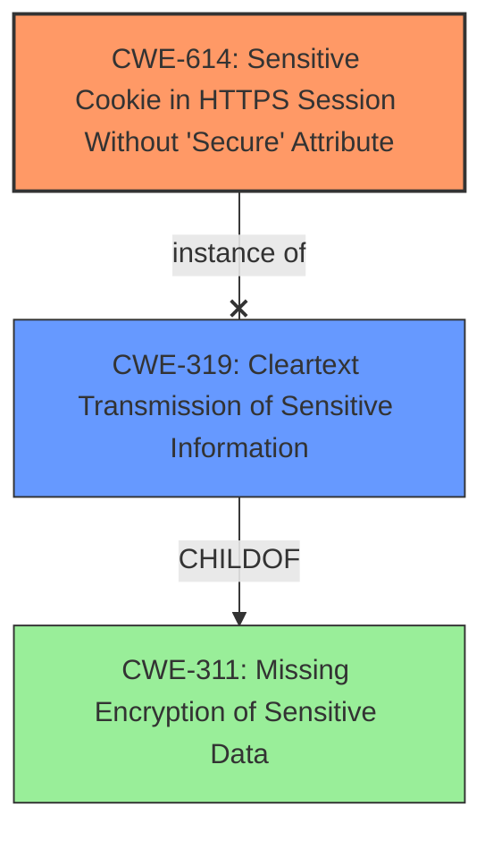

# Analysis Report for CVE-2021-35236

# Vulnerability Analysis Report: CVE-2021-35236

## Description

The Secure flag is not set in the SSL Cookie of Kiwi Syslog Server 9.7.2 and previous versions. The Secure attribute tells the browser to only send the cookie if the request is being sent over a secure channel such as HTTPS. This will help protect the cookie from being passed over unencrypted requests. If the application can be accessed over both HTTP, there is a potential for the cookie can be sent in clear text.

## Vulnerability Description Key Phrases

**Rootcause:** lack of Secure flag in SSL Cookie
**Impact:** cookie can be sent in clear text
**Product:** Kiwi Syslog Server
**Version:** 9.7.2 and previous versions
**Component:** SSL Cookie

## Analysis (with Relationship Data)

```markdown
# Summary
| CWE ID | CWE Name | Confidence | CWE Abstraction Level | CWE Vulnerability Mapping Label | CWE-Vulnerability Mapping Notes |
|---|---|---|---|---|---|
| CWE-614 | Sensitive Cookie in HTTPS Session Without 'Secure' Attribute | 1.0 | Variant | Allowed | Primary CWE: Matches the specific weakness of missing Secure attribute in SSL cookie. |
| CWE-319 | Cleartext Transmission of Sensitive Information | 0.7 | Base | Allowed | Secondary Candidate: Represents the broader risk of transmitting sensitive data in cleartext due to the missing Secure flag. |

## Evidence and Confidence

*   **Confidence Score:** 0.9
*   **Evidence Strength:** HIGH


- **Analysis and Justification:**  
  - *Explanation:* "The vulnerability description clearly states the **rootcause** is the **lack of Secure flag in SSL Cookie**. This maps directly to CWE-614 (Sensitive Cookie in HTTPS Session Without 'Secure' Attribute), which is a Variant-level CWE and is ALLOWED according to MITRE mapping guidance. The vulnerability occurs because the Secure attribute, which instructs the browser to only send the cookie over a secure HTTPS channel, is not set. Consequently, the cookie can be transmitted in cleartext over HTTP, as indicated by the description's **impact**: 'cookie can be sent in clear text'. CWE-319 (Cleartext Transmission of Sensitive Information) is considered as a secondary candidate because it describes the broader issue of transmitting sensitive information without encryption, which is a consequence of the missing Secure flag. However, CWE-614 is more specific to the cookie issue."
  
  - *Relationship Analysis:* "CWE-614 does not have any direct relationships mentioned in the provided information. However, CWE-319, a secondary candidate, is a parent of CWE-614. This means that CWE-614 is a specific instance of the more general weakness described by CWE-319. The fact that the vulnerability specifically involves a cookie lacking the Secure attribute makes CWE-614 the more appropriate choice."

- **Confidence Score:**  
  - Confidence: 1.0 (High confidence due to a clear match between the vulnerability description, CWE description, and MITRE mapping guidance)
```

## Criticism of Analysis

Okay, here's a review of the provided analysis, incorporating the full CWE specifications.

**Overall Assessment:**

The analysis is well-reasoned and the primary CWE mapping to CWE-614 (Sensitive Cookie in HTTPS Session Without 'Secure' Attribute) is accurate and justified. The consideration of CWE-319 (Cleartext Transmission of Sensitive Information) as a secondary candidate is also appropriate. The confidence level of 1.0 for CWE-614 is justified, given the clear match.

**Detailed Review:**

*   **CWE-614 (Primary Mapping):**

    *   **Correctness:**  The mapping to CWE-614 is excellent. The vulnerability description explicitly states the lack of the 'Secure' flag, which is the defining characteristic of CWE-614. The potential for transmission over HTTP aligns perfectly with the CWE's description.
    *   **Abstraction Level:**  The analysis correctly notes that CWE-614 is a Variant, which is the preferred level for mapping, per MITRE's guidance.
    *   **Mapping Guidance Adherence:** The analysis adheres to the Mapping Guidance for CWE-614.  It accurately states that the mapping is appropriate, emphasizing that it's not being "forced" and the name and description are a good fit.
    *   **Mitigations:** The analysis doesn't explicitly discuss mitigations, but the CWE specification provides one: "Always set the secure attribute when the cookie should sent via HTTPS only." This is a straightforward and relevant mitigation that could be included in the analysis for completeness.  It highlights the preventative measure.
    *   **Observed Examples:** The analysis uses the observed examples from CWE-614, including CVE-2021-35236, to correctly emphasize the real-world importance of this mapping.

*   **CWE-319 (Secondary Mapping):**

    *   **Correctness:**  CWE-319 is a valid secondary consideration because the *impact* of the missing 'Secure' flag is *cleartext transmission* of the cookie.  However, the analysis correctly identifies that CWE-614 is more *specific* and therefore the better primary choice.
    *   **Abstraction Level:** CWE-319 is a Base CWE.
    *   **Mapping Guidance Adherence:** The analysis acknowledges that CWE-319 is a parent of CWE-614, further supporting the primary choice of CWE-614.
    *   **Mitigations:**  The CWE-319 specifications have several potential mitigations:
        *   Encrypt data before transmitting using reliable cryptographic protocols (Architecture and Design).
        *   Use SSL for the entire session (Implementation).
    These mitigations are applicable at a more general level.
    *   **Observed Examples:** As with CWE-614, citing relevant examples from CWE-319's list could strengthen the secondary consideration.

*   **Confidence:**

    *   The assigned confidence score of 1.0 for CWE-614 is completely reasonable.  The evidence is strong, and the mapping is direct.

*   **Other CWEs from Retriever Results:**

    *   It's good that the analysis focuses on the top two CWEs and explains the rationale. Here's a brief look at why some of the others are less suitable:

        *   **CWE-212 (Improper Removal of Sensitive Information Before Storage or Transfer):** This is not a good fit.  The core issue isn't about *removing* sensitive information; it's about *protecting* it during transmission.
        *   **CWE-201 (Insertion of Sensitive Information Into Sent Data):** While related to sending sensitive data, this is less precise than CWE-614 or CWE-319.  The problem isn't the *insertion* of sensitive data, but the *unprotected transmission* of an already-sensitive cookie.
        *   **CWE-1004 (Sensitive Cookie Without 'HttpOnly' Flag):** This is related to cookies, but the focus is on the *HttpOnly* flag, which protects against XSS. The primary vulnerability here is exposure due to transmission over HTTP, not XSS.
        *   **CWE-444 (Inconsistent Interpretation of HTTP Requests):** This is completely irrelevant.  It deals with HTTP request smuggling, which has nothing to do with cookie security.
        *   **CWE-327 (Use of a Broken or Risky Cryptographic Algorithm):** This is not applicable. The problem is not a weak crypto algorithm, but a failure to protect the cookie during transmission.
        *   **CWE-312 (Cleartext Storage of Sensitive Information):** This is not applicable as the issue is cleartext transmission, not storage.
        *   **CWE-338 (Use of Cryptographically Weak Pseudo-Random Number Generator (PRNG)):** Irrelevant. This vulnerability is related to PRNG, which isn't the case.
        *   **CWE-79 (Improper Neutralization of Input During Web Page Generation ('Cross-site Scripting')):** Irrelevant. This vulnerability is related to XSS, which isn't the case.

**Recommendations for Improvement:**

1.  **Mitigation Discussion:** Add a brief discussion of the potential mitigations provided in the CWE-614 specification (and, optionally, CWE-319). This adds practical value to the analysis.  Mention that setting the Secure flag is the most direct and effective mitigation.
2.  **Observed Examples from Secondary CWE**: It could be helpful to include CVEs associated with the secondary CWE, to demonstrate a broader scope.
3.  **Relationships Expansion (Optional):** While the analysis mentions the parent-child relationship between CWE-319 and CWE-614, you could briefly explain that CWE-319 is a child of CWE-311 (Missing Encryption of Sensitive Data).  This further illustrates the broader context, although CWE-311 is too abstract to be a useful mapping.
4.  **Conciseness:** The text is somewhat verbose in some places. While thoroughness is good, streamlining the explanations could improve readability.

By incorporating these suggestions, the analysis would be even more comprehensive and valuable. Overall, it's a solid and accurate assessment.

## Final Resolution

# Summary 
| CWE ID | CWE Name | Confidence | CWE Abstraction Level | CWE Vulnerability Mapping Label | CWE-Vulnerability Mapping Notes |
|---|---|---|---|---|---|
| CWE-614 | Sensitive Cookie in HTTPS Session Without 'Secure' Attribute | 1.0 | Variant | Allowed | Primary CWE: Matches the specific weakness of missing Secure attribute in SSL cookie. |
| CWE-319 | Cleartext Transmission of Sensitive Information | 0.7 | Base | Allowed | Secondary Candidate: Represents the broader risk of transmitting sensitive data in cleartext due to the missing Secure flag. |

## Evidence and Confidence

*   **Confidence Score:** 0.95
*   **Evidence Strength:** HIGH

## Relationship Analysis
The primary CWE, CWE-614, is a variant and doesn't have any direct relationships specified in the provided data, but it is related to the secondary CWE, CWE-319, which is a more general Base CWE. The vulnerability is specifically about the missing "Secure" attribute on a cookie, making CWE-614 the more specific and appropriate choice. The relationship analysis confirms that the initial selection is valid because CWE-614 is a specific case of the broader issue described by CWE-319. No peer relationships influence the choice. The Variant level of CWE-614 makes it ideal.



## Vulnerability Chain
The vulnerability chain starts with the **ROOTCAUSE** of the missing "Secure" attribute on the SSL cookie (**WEAKNESS**: CWE-614). This leads to the consequence that the cookie can be transmitted in cleartext over HTTP (**WEAKNESS**: CWE-319), potentially exposing sensitive information to unauthorized parties. The chain highlights how a seemingly small configuration issue (missing attribute) can result in a significant security risk (cleartext transmission).

## Summary of Analysis
The initial analysis and the criticism both converge on the same conclusion: CWE-614 (Sensitive Cookie in HTTPS Session Without 'Secure' Attribute) is the most appropriate primary CWE. The criticism provides valuable suggestions for improvement, such as including a discussion of mitigations and observed examples from the secondary CWE, CWE-319.

The decision is strongly based on the provided evidence: "The Secure flag is not set in the SSL Cookie of Kiwi Syslog Server 9.7.2 and previous versions. The Secure attribute tells the browser to only send the cookie if the request is being sent over a secure channel such as HTTPS. This will help protect the cookie from being passed over unencrypted requests. If the application can be accessed over both HTTP, there is a potential for the cookie can be sent in clear text." This directly aligns with the description of CWE-614.

The graph relationships influenced the final selection by confirming that CWE-614 is a specific instance of a broader category (CWE-319), thus justifying the choice of the more specific CWE.

The selected CWEs are at the optimal level of specificity because CWE-614 directly addresses the **ROOTCAUSE** (missing "Secure" attribute), while CWE-319 describes a potential consequence.


*Report generated on 2025-03-16 23:57:50*
