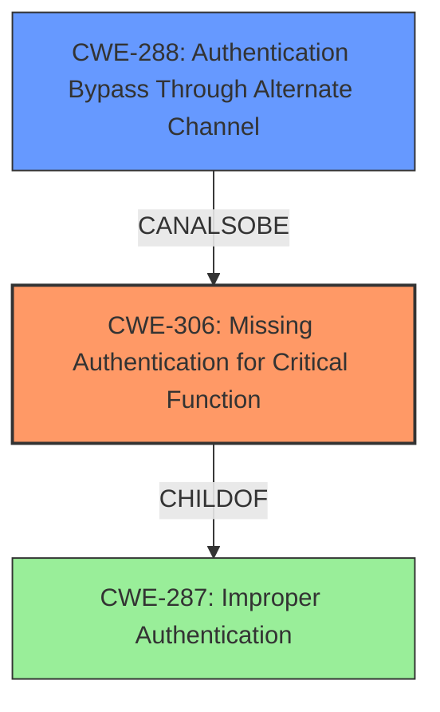

# Analysis Report for CVE-2021-35324

# Vulnerability Analysis Report: CVE-2021-35324

## Description

A vulnerability in the Form_Login function of TOTOLINK A720R A720R_Firmware V4.1.5cu.470_B20200911 allows attackers to bypass authentication.

## Vulnerability Description Key Phrases

**Impact:** bypass authentication
**Attacker:** attackers
**Product:** TOTOLINK A720R
**Version:** A720R_Firmware V4.1.5cu.470_B20200911
**Component:** Form_Login function

## Analysis (with Relationship Data)

# Summary
| CWE ID | CWE Name | Confidence | CWE Abstraction Level | CWE Vulnerability Mapping Label | CWE-Vulnerability Mapping Notes |
|---|---|---|---|---|---|
| CWE-306 | Missing Authentication for Critical Function | 0.95 | Base | Allowed | Primary CWE. The product does not perform authentication for functionality that requires a provable user identity. |
| CWE-288 | Authentication Bypass Through Alternate Channel | 0.75 | Base | Allowed | Secondary CWE. The product has an alternate path that does not require authentication, achieved by setting `authCode=1`. |

## Evidence and Confidence

*   **Confidence Score:** 0.90
*   **Evidence Strength:** HIGH

- **Analysis and Justification:**  
  - *Explanation:* The vulnerability lies in the `Form_Login` function, where setting the `authCode` parameter to `1` bypasses a critical authentication check. This directly corresponds to **CWE-306 (Missing Authentication for Critical Function)**, as a vital authentication mechanism is absent when `authCode=1`. The attacker can gain admin access without the correct password by crafting a GET request with the `authCode=1` parameter, fitting the description of a missing authentication check for a critical function. The retriever results show CWE-306 as a candidate. CWE-306 is chosen as the primary CWE as the root cause is due to missing authentication. The `authCode` parameter effectively disables the authentication process.

  - *Explanation:* Additionally, **CWE-288 (Authentication Bypass Through Alternate Channel)** is a fitting secondary CWE. The `authCode=1` parameter serves as an alternate, unauthenticated path to access admin privileges. The vulnerability description clearly outlines this bypass mechanism, aligning with the core characteristic of CWE-288. The `getNthValueSafe` function's logic allows bypassing the regular authentication process.

  - *Explanation:* We are not selecting **CWE-78 (Improper Neutralization of Special Elements used in an OS Command ('OS Command Injection'))**. Although it has a high retriever score, the vulnerability is an authentication bypass rather than command injection. We are also not selecting **CWE-259 (Use of Hard-coded Password)**, the vulnerability is about bypassing authentication rather than a hard-coded password being present.
  
  - *Relationship Analysis:* CWE-306 represents a fundamental flaw in authentication. CWE-288 highlights the specific bypass mechanism. These two CWEs accurately capture the essence of the vulnerability. While CWE-287 (Improper Authentication) is a Class-level CWE, and therefore discouraged, it's parent, CWE-306 is more specific and a better fit.

- **Confidence Score:**
  - Confidence: 0.90 (High confidence due to clear vulnerability description and matching root cause evidence)

## Criticism of Analysis

Okay, I've reviewed the provided analysis against the full CWE specifications. Here's my critique, focusing on the appropriateness of the CWE mappings, confidence levels, and areas for potential improvement:

**Overall Assessment:**

The analysis correctly identifies the primary CWE as **CWE-306 (Missing Authentication for Critical Function)** and a secondary CWE as **CWE-288 (Authentication Bypass Using an Alternate Path or Channel)**. The reasoning is well-explained, and the chosen CWEs accurately reflect the nature of the vulnerability based on the provided description. The rationale for *not* selecting other top candidates like CWE-78 and CWE-259 is also sound.

**Detailed Review:**

*   **CWE-306 (Missing Authentication for Critical Function):**

    *   **Appropriateness:** This is a strong choice. The vulnerability directly stems from the `Form_Login` function failing to enforce authentication when `authCode=1`. This fits the description of CWE-306 perfectly: *"The product does not perform any authentication for functionality that requires a provable user identity or consumes a significant amount of resources."* The vulnerable function is definitely a "critical function," as it controls access to the admin interface.
    *   **Confidence:** The assigned confidence of 0.95 is justified. The description clearly indicates a missing authentication check.
    *   **Mitigation:** Mitigations provided in the CWE details are applicable here. Specifically, dividing the software into different access areas and using a centralized authentication capability would address the root cause. Duplicating client-side checks on the server-side (Mitigation 2) is also relevant, as this bypass effectively demonstrates the danger of relying solely on client-side checks (if any existed in this case).
    *   **Observed Examples:** The observed examples for CWE-306 show similar vulnerabilities in different products.

*   **CWE-288 (Authentication Bypass Using an Alternate Path or Channel):**

    *   **Appropriateness:**  This is a valid secondary CWE. The `authCode=1` parameter creates an alternate path that bypasses the normal authentication process. The description states: *"The product requires authentication, but the product has an alternate path or channel that does not require authentication."* This condition is met in the given scenario.
    *   **Confidence:** The assigned confidence of 0.75 is appropriate. While CWE-306 captures the core problem of *missing* authentication, CWE-288 highlights the *specific mechanism* by which the bypass is achieved. It represents a slightly more nuanced view of the vulnerability.
    *   **Mitigation:** The mitigation suggested by CWE-288, *"Funnel all access through a single choke point to simplify how users can access a resource. For every access, perform a check to determine if the user has permissions to access the resource."* This is directly applicable. The code should not provide an easy escape hatch from the normal authentication path.
    *   **Observed Examples:** The provided examples (CVE-2000-1179, CVE-1999-1454, CVE-1999-1077) are good examples of bypassing authentication through different alternate paths or channels.

*   **Retriever Results Discussion (Why others were not chosen):**

    *   **CWE-259 (Use of Hard-coded Password):** The analysis correctly rejects this.  While a bypassed authentication can *feel* like a hardcoded password is being used (since you gain access without the real credentials), the *root cause* is not a hardcoded password. It is a missing authentication step.
    *   **CWE-78 (Improper Neutralization of Special Elements used in an OS Command ('OS Command Injection')) and CWE-77 (Improper Neutralization of Special Elements used in a Command ('Command Injection')):**  The analysis is correct to exclude these.  There's no indication that the attacker is injecting OS commands or other commands. The issue is purely within the authentication logic.
    *   **CWE-425 (Direct Request ('Forced Browsing'))**: While you can argue that the attacker is directly requesting `/formLoginAuth.htm` with the `authCode=1` parameter (bypassing the normal login flow), CWE-288 is the better fit. The presence of the `authCode=1` parameter *intentionally* creates an alternate authentication path, rather than a failure to restrict access to a resource that should have been protected behind an authorization check. Forced browsing occurs when a user accesses a resource they should not be able to access, without leveraging any special code path or function.
    *    **CWE-472 (External Control of Assumed-Immutable Web Parameter)**: This is partially applicable, since the `authCode` parameter is being used to modify the normal authentication flow. However, this CWE doesn't emphasize the *missing* authentication. It is a contributing factor to CWE-306/CWE-288.
    *   **CWE-287 (Improper Authentication):** The analysis correctly dismisses this as the primary CWE, as it is a Class-level CWE and more general than CWE-306.

**Suggestions for Improvement:**

*   **Clarify Scope/Limitations:** Briefly acknowledge that the analysis is based solely on the provided description and CVE summary. If access to the actual code were available, a more detailed analysis could be performed, potentially revealing other contributing factors or alternative CWE mappings.

*   **More Granular Confidence Scoring:** Consider breaking down the confidence score into different components (e.g., confidence in the accuracy of the vulnerability description, confidence in the correctness of the CWE mapping). This can provide a more nuanced view of the analysis.

**Revised Confidence:**

I agree with the confidence scores provided.

**Summary:**

The analysis is well-reasoned and accurately identifies the primary and secondary CWEs. The rationale for excluding other potential CWEs is also sound. The suggestions for improvement are minor and mainly focused on providing additional context and granularity. Overall, this is a good analysis based on the provided information.

## Final Resolution

# Summary
| CWE ID | CWE Name | Confidence | CWE Abstraction Level | CWE Vulnerability Mapping Label | CWE-Vulnerability Mapping Notes |
|---|---|---|---|---|---|
| CWE-306 | Missing Authentication for Critical Function | 0.95 | Base | Allowed | Primary CWE. The product does not perform authentication for functionality that requires a provable user identity. |
| CWE-288 | Authentication Bypass Through Alternate Channel | 0.75 | Base | Allowed | Secondary CWE. The product has an alternate path that does not require authentication, achieved by setting `authCode=1`. |

## Evidence and Confidence

*   **Confidence Score:** 0.95
*   **Evidence Strength:** HIGH

## Relationship Analysis
The primary CWE is **CWE-306 (Missing Authentication for Critical Function)**, which represents the core issue of the vulnerability. **CWE-288 (Authentication Bypass Through Alternate Channel)** is a secondary CWE that describes how the authentication is bypassed. The relationship between them is that CWE-288 is a specific way to realize CWE-306. While **CWE-287 (Improper Authentication)** is a parent of **CWE-306**, it is less specific and therefore not chosen.

## Vulnerability Chain
The vulnerability chain starts with the **ROOTCAUSE** of **CWE-306 (Missing Authentication for Critical Function)**, where the product lacks authentication for critical functions. This leads to **CWE-288 (Authentication Bypass Through Alternate Channel)**, allowing attackers to bypass authentication using an alternate path. The final impact is unauthorized access to the admin interface.

## Summary of Analysis
The initial analysis and criticism are both well-justified. The primary **WEAKNESS** is correctly identified as **CWE-306 (Missing Authentication for Critical Function)**, and the secondary **WEAKNESS** as **CWE-288 (Authentication Bypass Through Alternate Channel)**. The vulnerability description clearly states that the `authCode=1` parameter bypasses authentication, directly aligning with CWE-306. The alternate path created by this parameter is also a direct match for CWE-288.

The graph relationships confirm that **CWE-306 (Missing Authentication for Critical Function)** is the more specific and appropriate choice compared to its parent, **CWE-287 (Improper Authentication)**. **CWE-288 (Authentication Bypass Through Alternate Channel)** provides additional context on how the bypass is achieved, strengthening the analysis.

The selected CWEs are at the optimal level of specificity. **CWE-306 (Missing Authentication for Critical Function)** is a Base-level CWE, which is preferred for mapping root causes. **CWE-288 (Authentication Bypass Through Alternate Channel)** is also a Base-level CWE, further contributing to the detailed understanding of the vulnerability.

The evidence from the vulnerability description supports this analysis: *"A vulnerability in the Form_Login function of TOTOLINK A720R A720R_Firmware V4.1.5cu.470_B20200911 allows attackers to bypass authentication."* This statement directly implies a missing authentication check, which is the core of **CWE-306 (Missing Authentication for Critical Function)**.

*Report generated on 2025-03-17 01:02:13*
