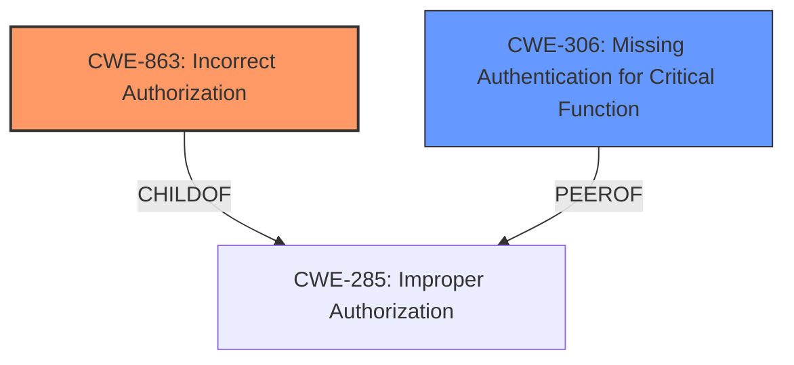

# Final Resolution for CVE-2021-35534

# Summary
| CWE ID | CWE Name | Confidence | CWE Abstraction Level | CWE Vulnerability Mapping Label | CWE-Vulnerability Mapping Notes |
|---|---|---|---|---|---|
| CWE-863 | Incorrect Authorization | 0.90 | Class | Primary CWE | The primary weakness is an existing authorization check failing to properly restrict access to the internal database. |
| CWE-306 | Missing Authentication for Critical Function | 0.40 | Base | Secondary Candidate | Authentication may be missing for certain database functions, exacerbating the authorization issue. |
  
## Evidence and Confidence

*   **Confidence Score:** 0.80
*   **Evidence Strength:** MEDIUM

## Relationship Analysis
The decision was influenced by the hierarchical relationships of the CWEs. Specifically, CWE-863 "Incorrect Authorization" is a child of the broader CWE-285 "Improper Authorization". Using the more specific CWE-863 provides a more accurate representation of the vulnerability. CWE-306 "Missing Authentication for Critical Function" is kept as a secondary candidate because the description implies some database functions might lack authentication. The relationships between CWE-285, CWE-863, and CWE-306 helped refine the classification, opting for the more specific CWE-863 while acknowledging the potential contribution of CWE-306.

## Vulnerability Chain
The vulnerability chain starts with **insufficient security control** in the internal database access mechanism. This leads to **incorrect authorization** (CWE-863), where existing authorization checks fail to properly restrict access. This may be further exacerbated by **missing authentication** for certain database functions (CWE-306). The exploitation of these weaknesses leads to unauthorized modifications of data/firmware, and potentially disabling the product.

## Summary of Analysis
The initial analysis correctly identified the core issue as related to authorization but used a broader Class-level CWE. The criticism correctly pointed out that CWE-863 "Incorrect Authorization" is a more specific and appropriate classification. The vulnerability description states "product does not sufficiently restrict access to an internal database tables, could allow anybody with user credentials to bypass security controls that is enforced by the product," which directly supports the claim of incorrect authorization, as the product is attempting to restrict access but failing. The initial selection of CWE-668 was deemed inappropriate because it is too broad and represents a consequence rather than a root cause. The choice of CWE-306 as a secondary factor is retained with reduced confidence, as the vulnerability description implies a possible lack of authentication for some database functions, though this is not explicitly stated.

The final decision is based on both the initial analysis and the criticism, opting for CWE-863 as the primary CWE due to its higher specificity and direct relevance to the vulnerability description, while retaining CWE-306 as a secondary concern. This classification reflects the optimal level of specificity based on the available evidence.