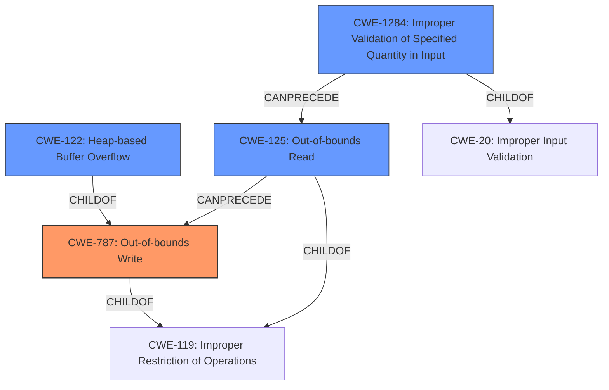

# Analysis Report for CVE-2021-3575

# Vulnerability Analysis Report: CVE-2021-3575

## Description

A heap-based buffer overflow was found in openjpeg in color.c37942 in sycc420_to_rgb when decompressing a crafted .j2k file. An attacker could use this to execute arbitrary code with the permissions of the application compiled against openjpeg.

## Vulnerability Description Key Phrases

**Rootcause:** heap-based buffer overflow
**Impact:** arbitrary code execution
**Vector:** crafted .j2k file
**Attacker:** attacker
**Product:** openjpeg
**Component:** sycc420_to_rgb in color.c37942

## Analysis (with Relationship Data)

# Summary
| CWE ID | CWE Name | Confidence | CWE Abstraction Level | CWE Vulnerability Mapping Label | CWE-Vulnerability Mapping Notes |
|---|---|---|---|---|---|
| CWE-122 | Heap-based Buffer Overflow | 0.95 | Variant | Allowed | Acceptable-Use |
| CWE-125 | Out-of-bounds Read | 0.75 | Base | Allowed | Acceptable-Use |
  - The Primary CWE should be first and noted as the Primary CWEs
  - The secondary candidate CWEs should be next and noted as secondary candidates.
  - The confidence is a confidence score 0 to 1 to rate your confidence in your overall assessment for that CWE.
  - The CWE Abstraction Level as one of these values: Base, Variant, Pillar, Class, Compound
  - The Mapping Notes Usage as one of these values: Allowed, Allowed-with-Review, Prohibited, Discouraged

## Evidence and Confidence

*   **Confidence Score:** 0.90
*   **Evidence Strength:** HIGH

- **Analysis and Justification:**  
  - *Explanation:* The vulnerability is described as a **heap-based buffer overflow** in the `sycc420_to_rgb` function of the OpenJPEG library. This aligns directly with CWE-122 (Heap-based Buffer Overflow). The CVE reference confirms that the root cause is insufficient validation leading to an out-of-bounds write on the heap. The impact is arbitrary code execution, a typical consequence of heap overflows. The Retriever Results also highlight CWE-122 as a relevant candidate. The CWE entry is at the Variant level of abstraction, which is a preferred level for mapping.
  
  - *Relationship Analysis:* CWE-122 is a variant of CWE-119 (Improper Restriction of Operations within the Bounds of a Memory Buffer). Overflowing a heap buffer can lead to overwriting adjacent data structures or function pointers, potentially leading to arbitrary code execution.

- **Confidence Score:**  
  - Confidence: 0.95 (Strong evidence from the vulnerability description and CVE reference materials clearly points to a heap-based buffer overflow.)

---
- **Analysis and Justification:**  
  - *Explanation:* The CVE Reference states "insufficient validation of the `*cb` value, which leads to out-of-bounds read when decompressing a crafted J2K file, this occurs when x0 and y0 values are odd." This aligns with CWE-125 (Out-of-bounds Read). Although a **heap-based buffer overflow** is mentioned, the description specifies the root cause as an **out-of-bounds read**. The `sycc420_to_rgb` function, when processing a crafted J2K file with specific parameters, reads data beyond the allocated buffer. This out-of-bounds read could trigger the overflow (CWE-122).
  
  - *Relationship Analysis:* CWE-125 is a child of CWE-119 (Improper Restriction of Operations within the Bounds of a Memory Buffer). The vulnerability involves reading data past the end of the intended buffer, which is a clear case of out-of-bounds access. CWE-125 can precede CWE-787 (Out-of-bounds Write) because reading out-of-bounds can lead to writing out-of-bounds. In this case the out-of-bounds read leads to the heap overflow.

- **Confidence Score:**  
  - Confidence: 0.75 (The out-of-bounds read is a contributing factor which leads to the overflow)

## Criticism of Analysis

Okay, I've reviewed the provided CWE analysis with the full CWE specifications. Here's my critique:

**Overall Assessment:**

The analysis is generally good and provides reasonable CWE mappings. The confidence scores are justified, and the explanations are well-written. The use of relationship analysis to explain the connection between the identified CWEs is excellent.

**Primary CWEs**
*   **CWE-122: Heap-based Buffer Overflow (Confidence: 0.95, Variant, Allowed)** -This is an accurate mapping, given the vulnerability description explicitly mentioning a heap-based buffer overflow.

*   **CWE-125: Out-of-bounds Read (Confidence: 0.75, Base, Allowed)** -This is an accurate mapping, given the CVE reference materials confirming that root cause is an out-of-bounds read.

**Detailed Review and Suggestions:**

1.  **CWE-122: Heap-based Buffer Overflow:**

    *   **Strengths:**
        *   Correctly identifies the heap-based nature of the overflow.
        *   Connects the overflow to the potential for arbitrary code execution.
        *   Acknowledges the Variant level of abstraction.
        *   The confidence score is adequately high.
    *   **Suggestions:**
        *   Consider mentioning CWE-787 (Out-of-bounds Write) in the relationship analysis as a direct consequence/mechanism of the overflow. CWE-122 is a child of CWE-787, and specifying the type of out-of-bounds operation would be more precise. Out of bounds write occurs when `*cb` is improperly validated.
        *   The mitigation suggestions are appropriate, focusing on language selection, safe libraries, and compiler-based overflow detection.

2.  **CWE-125: Out-of-bounds Read:**

    *   **Strengths:**
        *   Correctly identifies the out-of-bounds read as a contributing factor to the vulnerability.
        *   Relationship analysis accurately depicts CWE-125 as a child of CWE-119 and its potential link to CWE-787
    *   **Suggestions:**
        *   The confidence score of 0.75 is appropriate, considering the read is a pre-cursor to the overflow, but the overflow is the more direct vulnerability. Consider adjusting the confidence after addressing the concern listed below.
        *   The description says "the out-of-bounds read *could* trigger the overflow (CWE-122). You might consider stating that the read *does* trigger the overflow.
        *   Consider adding CWE-1284 (Improper Validation of Specified Quantity in Input) to the analysis. The `*cb` value that's read is used to determine how many bytes should be read from the input J2K file. The vulnerability analysis specifically calls out that there is "insufficient validation of the `*cb` value." If that value is improperly validated, then it can lead to the out-of-bounds read.
        *   Regarding the mitigations, emphasize input validation, specifically validating length arguments, buffer size calculations, and offsets. Mention using "accept known good" strategies.

**Additional Considerations (Based on Retriever Results):**

*   **CWE-193 (Off-by-one Error):**  While not as direct, it's plausible that an off-by-one error during calculation of the buffer size or index could contribute to the overflow.  However, without more specific information, it's best to leave this out or mention it as a very low-confidence potential contributing factor.
*   **CWE-190 (Integer Overflow or Wraparound):**  Similarly, integer overflow could *potentially* play a role if the code uses integer arithmetic to calculate buffer sizes or offsets.  Again, without more information, it's a weak candidate.
*   **CWE-787 (Out-of-bounds Write):** A stronger mapping could be made. A heap-based buffer overflow is ultimately an out-of-bounds write. The CWE-122 description says "the buffer that *can be overwritten* is allocated in the heap," implying the write is the more direct cause. It could be helpful to add this in the relationship analysis.

**Updated Summary Table (Including potential suggestions):**

| CWE ID    | CWE Name                        | Confidence | CWE Abstraction Level | CWE Vulnerability Mapping Label | CWE-Vulnerability Mapping Notes                                                                                                                                                                                             |
| --------- | ------------------------------- | ---------- | --------------------- | ------------------------------- | ----------------------------------------------------------------------------------------------------------------------------------------------------------------------------------------------------------------------------------- |
| CWE-122   | Heap-based Buffer Overflow      | 0.95       | Variant               | Allowed                         | Acceptable-Use (Primary CWE)                                                                                                                                                                                                      |
| CWE-125   | Out-of-bounds Read              | 0.75       | Base                  | Allowed                         | Acceptable-Use (Secondary Candidate)                                                                                                                                                                                            |
| CWE-1284  | Improper Validation of Specified Quantity in Input | 0.50      | Base                | Allowed                         | Acceptable-Use (Contributing Factor)                                                                                                                                                                                             |
| CWE-787   | Out-of-bounds Write             | 0.40       | Base                  | Allowed                         | Acceptable-Use (Direct Consequence); Add to Relationship Analysis of CWE-122                                                                                                                                                                                                        |

**Key Takeaways:**

*   The core analysis is solid.
*   Adding CWE-1284 and CWE-787 improves the accuracy and completeness of the analysis.
*   Leverage the CWE specifications to strengthen your justifications and mitigation suggestions.
*   When in doubt, err on the side of being specific with your CWE mappings, even if it means including multiple CWEs with varying confidence levels.

I hope this comprehensive review is helpful! Let me know if you have any other questions.

## Final Resolution

# Summary
| CWE ID | CWE Name | Confidence | CWE Abstraction Level | CWE Vulnerability Mapping Label | CWE-Vulnerability Mapping Notes |
|---|---|---|---|---|---|
| CWE-787 | Out-of-bounds Write | 0.95 | Base | Allowed | Acceptable-Use (Primary CWE) |
| CWE-122 | Heap-based Buffer Overflow | 0.85 | Variant | Allowed | Acceptable-Use (Secondary Candidate) |
| CWE-125 | Out-of-bounds Read | 0.75 | Base | Allowed | Acceptable-Use (Contributing Factor) |
| CWE-1284 | Improper Validation of Specified Quantity in Input | 0.60 | Base | Allowed | Acceptable-Use (Root Cause) |

## Evidence and Confidence

*   **Confidence Score:** 0.90
*   **Evidence Strength:** HIGH

## Relationship Analysis
The analysis considers the hierarchical relationships between CWEs to select the most specific and accurate classifications. CWE-787 (Out-of-bounds Write) is selected as the primary CWE because the vulnerability ultimately results in writing data outside the intended buffer, which is a direct consequence of the vulnerability. CWE-122 (Heap-based Buffer Overflow) is a variant of CWE-119 (Improper Restriction of Operations within the Bounds of a Memory Buffer), and the provided description specifically mentions a heap overflow. CWE-125 (Out-of-bounds Read) is included because the CVE reference states that the root cause is an out-of-bounds read. CWE-1284 (Improper Validation of Specified Quantity in Input) is included because the analysis calls out that there is "insufficient validation of the `*cb` value."

## Vulnerability Chain
The vulnerability chain starts with **CWE-1284: Improper Validation of Specified Quantity in Input**, where the size `*cb` is not properly validated. This leads to **CWE-125: Out-of-bounds Read** when the `sycc420_to_rgb` function attempts to read data beyond the allocated buffer. This out-of-bounds read then causes **CWE-787: Out-of-bounds Write**, specifically a **CWE-122: Heap-based Buffer Overflow**, which allows an attacker to overwrite heap memory and potentially execute arbitrary code.

## Summary of Analysis
The initial analysis and criticism provided a solid foundation. The vulnerability is a **heap-based buffer overflow**, but after reviewing the additional data it is clear that the root cause starts with the improper validation of the specified quantity in input and results in an out-of-bounds write.

*   **CWE-787: Out-of-bounds Write** is the primary issue because the vulnerability leads to writing data past the end of the buffer. This is supported by the initial vulnerability description which states, "A **heap-based buffer overflow** was found in openjpeg in color.c37942 in sycc420_to_rgb when decompressing a crafted .j2k file."
*   **CWE-122: Heap-based Buffer Overflow** is also included because the buffer being overwritten is in the heap.
*   **CWE-125: Out-of-bounds Read** is a contributing factor that leads to the overflow as the CVE reference states "insufficient validation of the `*cb` value, which leads to **out-of-bounds read** when decompressing a crafted J2K file, this occurs when x0 and y0 values are odd."
*   **CWE-1284: Improper Validation of Specified Quantity in Input** is added as a root cause since, as the review points out, the analysis calls out that there is "insufficient validation of the `*cb` value."

The graph relationships influenced the selection by highlighting how the **out-of-bounds read** and **improper input validation** contribute to the **out-of-bounds write** and **heap overflow**. The selected CWEs are at the optimal level of specificity, providing a clear and accurate representation of the vulnerability.

*Report generated on 2025-03-18 00:19:15*
