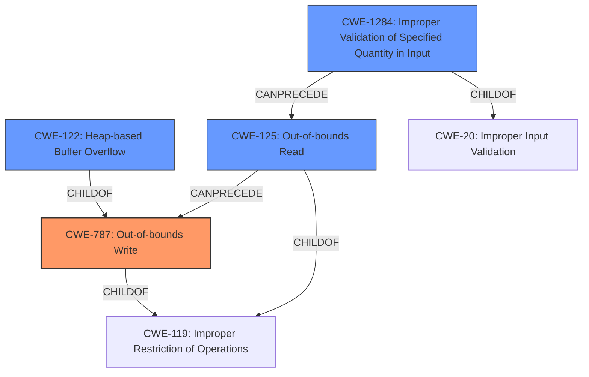

# Final Resolution for CVE-2021-3575

# Summary
| CWE ID | CWE Name | Confidence | CWE Abstraction Level | CWE Vulnerability Mapping Label | CWE-Vulnerability Mapping Notes |
|---|---|---|---|---|---|
| CWE-787 | Out-of-bounds Write | 0.95 | Base | Allowed | Acceptable-Use (Primary CWE) |
| CWE-122 | Heap-based Buffer Overflow | 0.85 | Variant | Allowed | Acceptable-Use (Secondary Candidate) |
| CWE-125 | Out-of-bounds Read | 0.75 | Base | Allowed | Acceptable-Use (Contributing Factor) |
| CWE-1284 | Improper Validation of Specified Quantity in Input | 0.60 | Base | Allowed | Acceptable-Use (Root Cause) |

## Evidence and Confidence

*   **Confidence Score:** 0.90
*   **Evidence Strength:** HIGH

## Relationship Analysis
The analysis considers the hierarchical relationships between CWEs to select the most specific and accurate classifications. CWE-787 (Out-of-bounds Write) is selected as the primary CWE because the vulnerability ultimately results in writing data outside the intended buffer, which is a direct consequence of the vulnerability. CWE-122 (Heap-based Buffer Overflow) is a variant of CWE-119 (Improper Restriction of Operations within the Bounds of a Memory Buffer), and the provided description specifically mentions a heap overflow. CWE-125 (Out-of-bounds Read) is included because the CVE reference states that the root cause is an out-of-bounds read. CWE-1284 (Improper Validation of Specified Quantity in Input) is included because the analysis calls out that there is "insufficient validation of the `*cb` value."

## Vulnerability Chain
The vulnerability chain starts with **CWE-1284: Improper Validation of Specified Quantity in Input**, where the size `*cb` is not properly validated. This leads to **CWE-125: Out-of-bounds Read** when the `sycc420_to_rgb` function attempts to read data beyond the allocated buffer. This out-of-bounds read then causes **CWE-787: Out-of-bounds Write**, specifically a **CWE-122: Heap-based Buffer Overflow**, which allows an attacker to overwrite heap memory and potentially execute arbitrary code.

## Summary of Analysis
The initial analysis and criticism provided a solid foundation. The vulnerability is a **heap-based buffer overflow**, but after reviewing the additional data it is clear that the root cause starts with the improper validation of the specified quantity in input and results in an out-of-bounds write.

*   **CWE-787: Out-of-bounds Write** is the primary issue because the vulnerability leads to writing data past the end of the buffer. This is supported by the initial vulnerability description which states, "A **heap-based buffer overflow** was found in openjpeg in color.c37942 in sycc420_to_rgb when decompressing a crafted .j2k file."
*   **CWE-122: Heap-based Buffer Overflow** is also included because the buffer being overwritten is in the heap.
*   **CWE-125: Out-of-bounds Read** is a contributing factor that leads to the overflow as the CVE reference states "insufficient validation of the `*cb` value, which leads to **out-of-bounds read** when decompressing a crafted J2K file, this occurs when x0 and y0 values are odd."
*   **CWE-1284: Improper Validation of Specified Quantity in Input** is added as a root cause since, as the review points out, the analysis calls out that there is "insufficient validation of the `*cb` value."

The graph relationships influenced the selection by highlighting how the **out-of-bounds read** and **improper input validation** contribute to the **out-of-bounds write** and **heap overflow**. The selected CWEs are at the optimal level of specificity, providing a clear and accurate representation of the vulnerability.