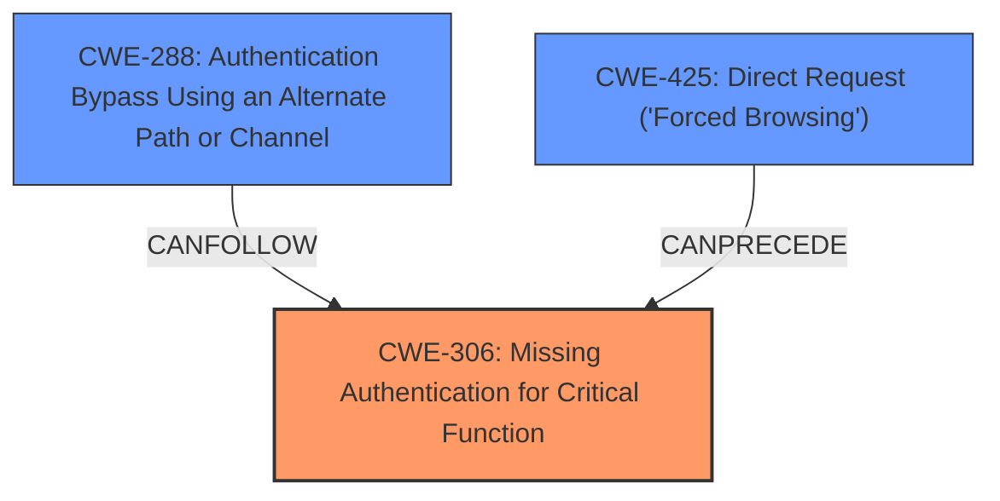

# Final Resolution for CVE-2021-35973

# Summary
| CWE ID | CWE Name | Confidence | CWE Abstraction Level | CWE Vulnerability Mapping Label | CWE-Vulnerability Mapping Notes |
|---|---|---|---|---|---|
| CWE-306 | Missing Authentication for Critical Function | 0.95 | Base | Allowed | Primary CWE |
| CWE-288 | Authentication Bypass Using an Alternate Path or Channel | 0.80 | Base | Allowed | Secondary Candidate |
| CWE-425 | Direct Request ('Forced Browsing') | 0.60 | Base | Allowed | Secondary Candidate |

## Evidence and Confidence

*   **Confidence Score:** 0.92
*   **Evidence Strength:** HIGH

## Relationship Analysis
The primary **weakness** is **CWE-306 (Missing Authentication for Critical Function)**, as the device uses a flag to skip authentication checks based on conditions in the HTTP request, bypassing authentication and granting access to CGI scripts. **CWE-288 (Authentication Bypass Using an Alternate Path or Channel)** is related, as the bypass leads to missing authentication. The vulnerability utilizes a specific alternate path ("&currentsetting.htm" substring) to bypass authentication. **CWE-425 (Direct Request ('Forced Browsing'))** is considered as an alternate mapping, as the &currentsetting.htm parameter is directly requested by the attacker and causes the authentication bypass.

## Vulnerability Chain
The vulnerability chain starts with the **ROOTCAUSE** of **CWE-306 (Missing Authentication for Critical Function)**. This leads to **CWE-288 (Authentication Bypass Using an Alternate Path or Channel)** via the "&currentsetting.htm" substring. The attacker uses **CWE-425 (Direct Request ('Forced Browsing'))** to directly request the vulnerable parameter. This allows the attacker to change the web UI password, enable debug mode (telnetd), and gain a shell on the device. Finally, weak permissions on the `/etc/` directory (while not directly classified) allow for simple escalation to root.

## Summary of Analysis
The initial analysis correctly identified **CWE-306 (Missing Authentication for Critical Function)** as the primary **weakness**. The criticism suggested replacing **CWE-798 (Use of Hard-coded Credentials)** with **CWE-732 (Incorrect Permission Assignment for Critical Resource)** or **CWE-269 (Improper Privilege Management)**. However, the connection between weak permissions and the initial **authentication bypass** is too indirect to justify either of those. Instead, **CWE-425 (Direct Request ('Forced Browsing'))** more accurately reflects the attacker's method of exploiting the missing authentication by directly requesting the vulnerable parameter. The evidence supporting **CWE-306** is strong: "NETGEAR WAC104 devices before 1.0.4.15 are affected by an **authentication bypass vulnerability**... allowing an unauthenticated attacker to invoke any action by adding the &currentsetting.htm substring to the HTTP query". This bypass is the **root cause** that leads to further exploitation. The suggested change to **CWE-425** is based on the fact that the attacker is directly requesting a specific parameter to trigger the bypass. All selected CWEs are at the Base level of abstraction, providing optimal specificity.