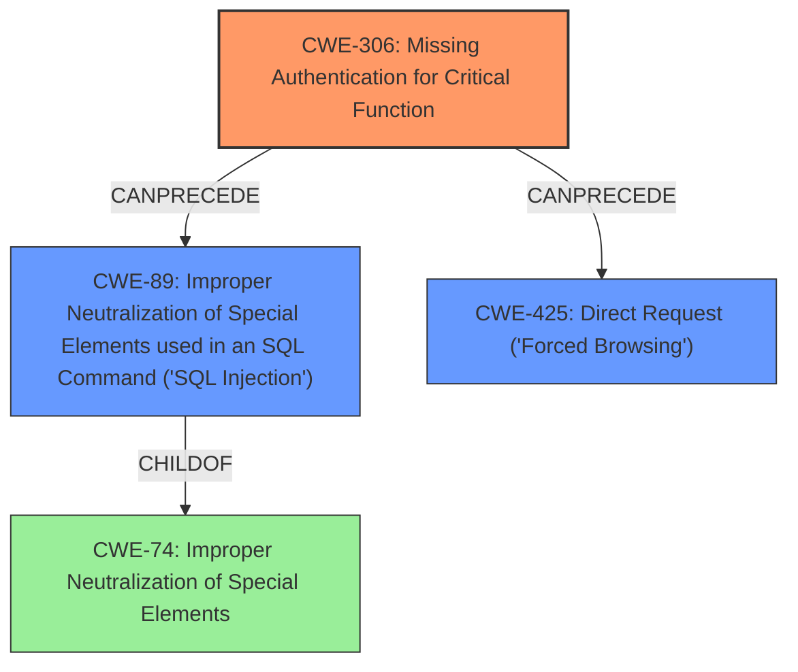

# Final Resolution for CVE-2021-36124

# Summary
| CWE ID | CWE Name | Confidence | CWE Abstraction Level | CWE Vulnerability Mapping Label | CWE-Vulnerability Mapping Notes |
|---|---|---|---|---|---|
| CWE-306 | Missing Authentication for Critical Function | 0.95 | Base | Allowed | Primary CWE: The product does not perform any authentication for functionality that requires a provable user identity. |
| CWE-89 | Improper Neutralization of Special Elements used in an SQL Command ('SQL Injection') | 0.75 | Base | Allowed | Secondary CWE: The product constructs all or part of an SQL command using externally-influenced input, but it does not neutralize or incorrectly neutralizes special elements. |
| CWE-425 | Direct Request ('Forced Browsing') | 0.50 | Base | Allowed | Tertiary CWE: The application does not adequately enforce appropriate authorization on all restricted URLs, allowing direct access to sensitive pages. |
  
## Evidence and Confidence

*   **Confidence Score:** 0.85
*   **Evidence Strength:** HIGH

## Relationship Analysis
The primary relationship influencing the CWE selection is the chain relationship where **CWE-306 (Missing Authentication)** can precede **CWE-89 (SQL Injection)** and **CWE-425 (Direct Request)**. **CWE-89** is a child of **CWE-74 (Improper Neutralization of Special Elements)**. While the initial focus was on the direct consequence of **CWE-306** leading to **CWE-89**, considering the lack of authorization led to the inclusion of **CWE-425**. The abstraction levels (all Base CWEs) provided the required specificity.

## Vulnerability Chain
The vulnerability chain starts with **CWE-306 (Missing Authentication)**. Because there is no authentication, an attacker can directly access sensitive resources. This leads to **CWE-89 (SQL Injection)** if the application doesn't neutralize special elements in SQL commands constructed using externally-influenced input. Additionally, the lack of authorization (in addition to missing authentication) exposes the application to **CWE-425 (Direct Request)**, as unauthenticated users can directly request sensitive URLs.

## Summary of Analysis
The initial analysis correctly identified **CWE-306 (Missing Authentication)** and **CWE-89 (SQL Injection)**. The criticism highlighted the importance of considering authorization-related CWEs, leading to the inclusion of **CWE-425 (Direct Request)**. The vulnerability description mentions the lack of authentication and authorization checks, stating that "It does not perform authentication or authorization checks when accessing a subset of sensitive resources, leading to the ability for unauthenticated users to access pages that are vulnerable to attacks such as SQL injection." The inclusion of **CWE-425** is justified because the lack of authentication and authorization allows direct access to sensitive resources through forced browsing. The selected CWEs are at the optimal level of specificity (Base level) according to the MITRE mapping guidance. The final classification provides a more comprehensive understanding of the vulnerability by addressing both authentication and authorization aspects.