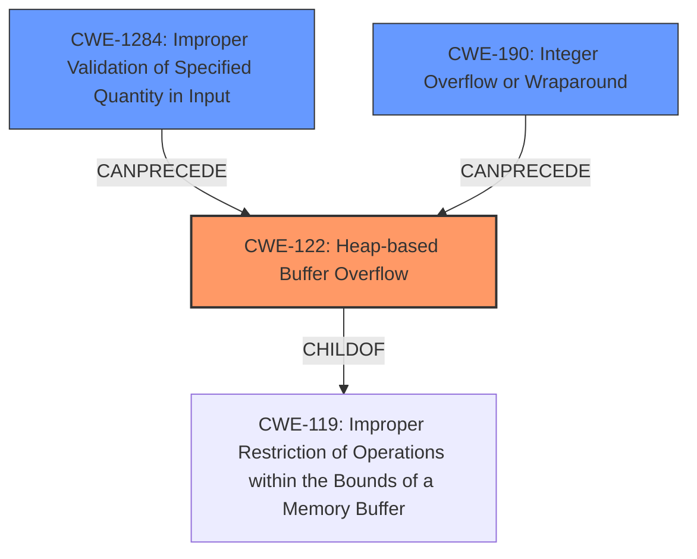

# Analysis Report for CVE-2021-36173

# Vulnerability Analysis Report: CVE-2021-36173

## Description

A heap-based buffer overflow in the firmware signature verification function of FortiOS versions 7.0.1, 7.0.0, 6.4.0 through 6.4.6, 6.2.0 through 6.2.9, and 6.0.0 through 6.0.13 may allow an attacker to execute arbitrary code via specially crafted installation images.

## Vulnerability Description Key Phrases

**Weakness:** heap-based buffer overflow
**Impact:** execute arbitrary code
**Vector:** specially crafted installation images
**Attacker:** attacker
**Product:** FortiOS
**Version:** 7.0.1, 7.0.0, 6.4.0 through 6.4.6, 6.2.0 through 6.2.9, and 6.0.0 through 6.0.13
**Component:** firmware signature verification function

## Analysis (with Relationship Data)

# Summary
| CWE ID | CWE Name | Confidence | CWE Abstraction Level | CWE Vulnerability Mapping Label | CWE-Vulnerability Mapping Notes |
|---|---|---|---|---|---|
| CWE-122 | Heap-based Buffer Overflow | 0.95 | Variant | Allowed | Primary CWE |
| CWE-1284 | Improper Validation of Specified Quantity in Input | 0.60 | Base | Allowed | Secondary Candidate |
| CWE-131 | Incorrect Calculation of Buffer Size | 0.50 | Base | Allowed | Secondary Candidate |

## Evidence and Confidence

*   **Confidence Score:** 0.85
*   **Evidence Strength:** HIGH

- **Analysis and Justification:**  
  - *Explanation:* The vulnerability description explicitly states a "**heap-based buffer overflow**" exists in the firmware signature verification function. The CVE Reference Links Content Summary also confirms "**heap-based buffer overflow** (CWE-122)" as the weakness. This aligns directly with CWE-122, which is a Variant of buffer overflow that occurs in the heap portion of memory. The impact is the ability to "execute arbitrary code".

  - *Relationship Analysis:* CWE-122 is a variant of a buffer overflow. While CWE-119 (Improper Restriction of Operations within the Bounds of a Memory Buffer) is a parent Class, CWE-122 provides more specific information about the location of the overflow (heap). The high similarity score and explicit mention of heap-based overflow makes CWE-122 the most appropriate choice.

- **Confidence Score:**  
  - Confidence: 0.95 (Direct evidence from the vulnerability description and CVE reference)

- **Analysis and Justification:**  
  - *Explanation:* The vulnerability is triggered by "**specially crafted installation images**," suggesting an issue with how the system handles the size or format of data within these images. This could indicate a failure to properly validate the size or quantity of input as it relates to buffer allocation. CWE-1284 (Improper Validation of Specified Quantity in Input) is a plausible secondary weakness. If the system doesn't validate the size of the image, or data within the image, before allocating memory, it could lead to the heap overflow.

  - *Relationship Analysis:* CWE-1284 is at the Base level and is related to input validation issues. It can precede buffer overflows if an invalid size leads to improper allocation. Its high retriever score and connection to the attack vector support its inclusion as a secondary CWE.

- **Confidence Score:**  
  - Confidence: 0.60 (Inferred from the attack vector and potential underlying cause)

- **Analysis and Justification:**  
  - *Explanation:* CWE-131 (Incorrect Calculation of Buffer Size) might be another contributing factor. If the size calculation is incorrect, it could directly result in a smaller buffer than needed, leading to an overflow when data is written. This is possible given the description focuses on a "**heap-based buffer overflow**". The specially crafted image may exploit this incorrect size calculation.

  - *Relationship Analysis:* CWE-131 is a Base level weakness. While it could contribute to the overflow, the evidence is not as strong as CWE-1284 since we don't have explicit information about size calculation.

- **Confidence Score:**  
  - Confidence: 0.50 (Possible, but not definitively supported by the provided evidence)

## Criticism of Analysis

Okay, I've reviewed the provided analysis with the complete CWE specifications, focusing on the mapping guidance, relationships, and potential mitigations. Here's my critique:

**Overall Assessment:**

The analysis is generally good, especially in identifying the primary CWE. The justification for the secondary CWEs is reasonable, although the confidence levels could be refined with more specific details. Let's break it down:

**1. CWE-122: Heap-based Buffer Overflow (Confidence: 0.95)**

*   **Assessment:** Excellent. This is the correct primary CWE. The analysis accurately reflects the vulnerability description and CVE summary.
*   **Justification:** The explicit mention of "heap-based buffer overflow" makes this a direct mapping. The "execute arbitrary code" impact aligns with the consequences of successful exploitation of this vulnerability.
*   **Mapping Guidance:** The analysis correctly notes that CWE-122 is a "Variant" level CWE, which is a preferred level of abstraction.
*   **Mitigations:** The identified mitigations in the specification are relevant: using languages with automatic bounds checking, using abstraction libraries, and employing compiler-based buffer overflow detection.
*   **Relationships:** Correctly identifies the parent classes as CWE-788 and CWE-787.

**2. CWE-1284: Improper Validation of Specified Quantity in Input (Confidence: 0.60)**

*   **Assessment:** Good candidate for a secondary CWE, but the confidence score seems a bit high given the lack of explicit evidence.
*   **Justification:** The connection to "specially crafted installation images" is logical. An attacker is likely exploiting the fact that the system is not properly validating the size or a quantity within the installation image before processing it. This lack of validation *could* directly lead to the heap overflow.
*   **Mapping Guidance:** The analysis correctly identifies CWE-1284 as a "Base" level CWE, which is also a preferred level of abstraction.
*   **Mitigations:** The mitigations of "accept known good" input validation are highly relevant.
*   **Relationships:** Correctly states CWE-1284 as a child of CWE-20 (Improper Input Validation) and that it *can precede* CWE-789 (Memory Allocation with Excessive Size Value) which could then lead to CWE-122.
*   **Critique and Recommendation:** The confidence score could be reduced slightly (e.g., 0.55) unless more specific evidence is found. While the connection is logical, it remains an *inference*. It would be beneficial to determine if the system allocates buffer sizes directly based on size data within the image. Consider if a different *type* of input validation error is more appropriate.

**3. CWE-131: Incorrect Calculation of Buffer Size (Confidence: 0.50)**

*   **Assessment:** A plausible secondary CWE, but weakest of the three. The current confidence level reflects this uncertainty well.
*   **Justification:** The reasoning is sound: an incorrect buffer size calculation *could* directly lead to the overflow. However, there's no direct indication in the provided information that the root cause is specifically a *calculation error*.
*   **Mapping Guidance:** Correctly identified as a "Base" level CWE.
*   **Mitigations:** The mitigations related to understanding language representations and performing input validation are relevant.
*   **Relationships:** Correctly identifies a parent as CWE-682.
*   **Critique and Recommendation:** The confidence score is appropriate. If more evidence *doesn't* surface, keep it at this level or consider removing it. Consider what could cause the system to allocate the wrong amount of memory.

**Additional Considerations and Potential Alternative CWEs**

*   **CWE-347: Improper Verification of Cryptographic Signature:** Given the involvement of "firmware signature verification," it might be relevant to consider CWE-347. It's possible the signature verification process itself is flawed, allowing a specially crafted image with an invalid signature (but a size that triggers the overflow) to be processed. This is contingent on the signature verification failing, though.
*   **CWE-190: Integer Overflow or Wraparound:** The Retriever results show CWE-190 as the top combined result. While not explicitly mentioned, it's possible that an integer overflow could occur during the size calculation, resulting in a smaller-than-expected buffer allocation. This would fit well with CWE-131. If an integer overflow occurs, then CWE-190 is a better fit than CWE-131.
*   **CWE-120: Buffer Copy without Checking Size of Input ('Classic Buffer Overflow'):** While less likely, if the code uses a `memcpy` or similar function *without* any size checks, this could be the more direct cause. However, modern codebases rarely exhibit this "classic" error.

**Recommendations for Improvement:**

1.  **Strengthen Justifications:** Provide more specific details about *how* the "specially crafted installation images" lead to the overflow. What specific fields or data within the image are being manipulated? How does this manipulation affect the size validation or allocation process? The stronger the justification, the higher the confidence score.
2.  **Refine Confidence Scores:** Adjust confidence scores based on the strength of the evidence. If something is inferred, keep the confidence lower. If it's directly stated, raise the confidence.
3.  **Consider Alternative CWEs:** Explore the possibility of other contributing CWEs, especially CWE-347, CWE-190 and CWE-120.
4.  **Chain Analysis:** More clearly articulate the potential chains of causation. For example: "The attacker crafts a malicious installation image (CWE-xxx) that provides an oversized length to a buffer (CWE-1284). The system uses that length to allocate a buffer in the heap (CWE-789). The system copies data from the installation image into the buffer without regard for the actual size of the data leading to CWE-122"
5.  **Mitigation Focus:** Tailor the discussion of mitigations to the specific CWEs identified. Don't just list them; explain how they would prevent the vulnerability in *this specific context*.

By addressing these points, the analysis can become even more comprehensive and accurate, leading to a better understanding of the vulnerability and more effective mitigation strategies.

## Final Resolution

# Summary
| CWE ID | CWE Name | Confidence | CWE Abstraction Level | CWE Vulnerability Mapping Label | CWE-Vulnerability Mapping Notes |
|---|---|---|---|---|---|
| CWE-122 | Heap-based Buffer Overflow | 0.95 | Variant | Allowed | Primary CWE |
| CWE-1284 | Improper Validation of Specified Quantity in Input | 0.55 | Base | Allowed | Secondary Candidate |
| CWE-190 | **Integer Overflow or Wraparound** | 0.40 | Base | Allowed | Secondary Candidate |

## Evidence and Confidence

*   **Confidence Score:** 0.85
*   **Evidence Strength:** MEDIUM

## Relationship Analysis
The primary CWE is CWE-122, a variant of buffer overflow that specifically occurs in the heap. This is supported by the vulnerability description. The secondary CWEs are CWE-1284, which could precede the overflow by providing an invalid size, and CWE-190, an integer overflow that could lead to a smaller than expected buffer.

## Vulnerability Chain
The vulnerability chain starts with a specially crafted installation image. This image contains a quantity (size) that is not properly validated (CWE-1284). This invalid size could lead to an integer overflow (CWE-190) during memory allocation, resulting in a heap-based buffer overflow (CWE-122). The consequence is the ability to execute arbitrary code.

## Summary of Analysis
The initial analysis correctly identified CWE-122 as the primary weakness due to the explicit mention of a "heap-based buffer overflow". The criticism correctly pointed out that the confidence in CWE-1284 was a bit high, and recommended lowering the confidence if no specific evidence was found. I agree with lowering the confidence of CWE-1284 to 0.55 since its connection is inferred.

The retriever results indicated CWE-190 as a potential candidate. Given the possibility of an integer overflow during size calculation, I'm adding CWE-190 as a secondary candidate with a confidence of 0.40 and removing CWE-131 entirely.

The vulnerability description provided sufficient evidence for CWE-122. The "specially crafted installation images" indicate an input validation issue, which is why CWE-1284 remains a secondary candidate. The possibility of an integer overflow during size calculation makes CWE-190 another possible contributing factor.

The selected CWEs are at the optimal level of specificity. CWE-122 is a Variant, which is preferred. CWE-1284 and CWE-190 are Base level CWEs, which are also preferred.

*Report generated on 2025-03-18 00:22:33*
