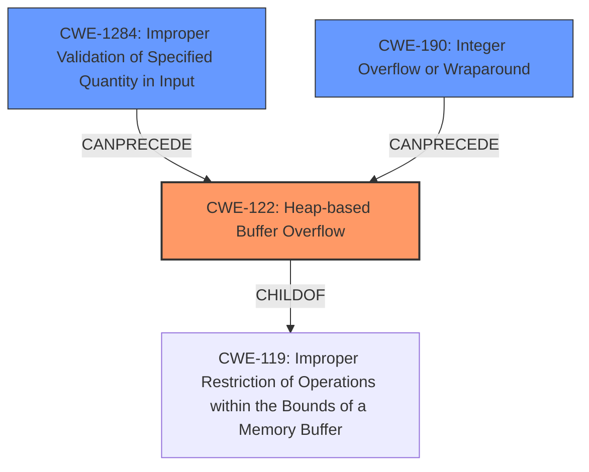

# Final Resolution for CVE-2021-36173

# Summary
| CWE ID | CWE Name | Confidence | CWE Abstraction Level | CWE Vulnerability Mapping Label | CWE-Vulnerability Mapping Notes |
|---|---|---|---|---|---|
| CWE-122 | Heap-based Buffer Overflow | 0.95 | Variant | Allowed | Primary CWE |
| CWE-1284 | Improper Validation of Specified Quantity in Input | 0.55 | Base | Allowed | Secondary Candidate |
| CWE-190 | **Integer Overflow or Wraparound** | 0.40 | Base | Allowed | Secondary Candidate |

## Evidence and Confidence

*   **Confidence Score:** 0.85
*   **Evidence Strength:** MEDIUM

## Relationship Analysis
The primary CWE is CWE-122, a variant of buffer overflow that specifically occurs in the heap. This is supported by the vulnerability description. The secondary CWEs are CWE-1284, which could precede the overflow by providing an invalid size, and CWE-190, an integer overflow that could lead to a smaller than expected buffer.

## Vulnerability Chain
The vulnerability chain starts with a specially crafted installation image. This image contains a quantity (size) that is not properly validated (CWE-1284). This invalid size could lead to an integer overflow (CWE-190) during memory allocation, resulting in a heap-based buffer overflow (CWE-122). The consequence is the ability to execute arbitrary code.

## Summary of Analysis
The initial analysis correctly identified CWE-122 as the primary weakness due to the explicit mention of a "heap-based buffer overflow". The criticism correctly pointed out that the confidence in CWE-1284 was a bit high, and recommended lowering the confidence if no specific evidence was found. I agree with lowering the confidence of CWE-1284 to 0.55 since its connection is inferred.

The retriever results indicated CWE-190 as a potential candidate. Given the possibility of an integer overflow during size calculation, I'm adding CWE-190 as a secondary candidate with a confidence of 0.40 and removing CWE-131 entirely.

The vulnerability description provided sufficient evidence for CWE-122. The "specially crafted installation images" indicate an input validation issue, which is why CWE-1284 remains a secondary candidate. The possibility of an integer overflow during size calculation makes CWE-190 another possible contributing factor.

The selected CWEs are at the optimal level of specificity. CWE-122 is a Variant, which is preferred. CWE-1284 and CWE-190 are Base level CWEs, which are also preferred.