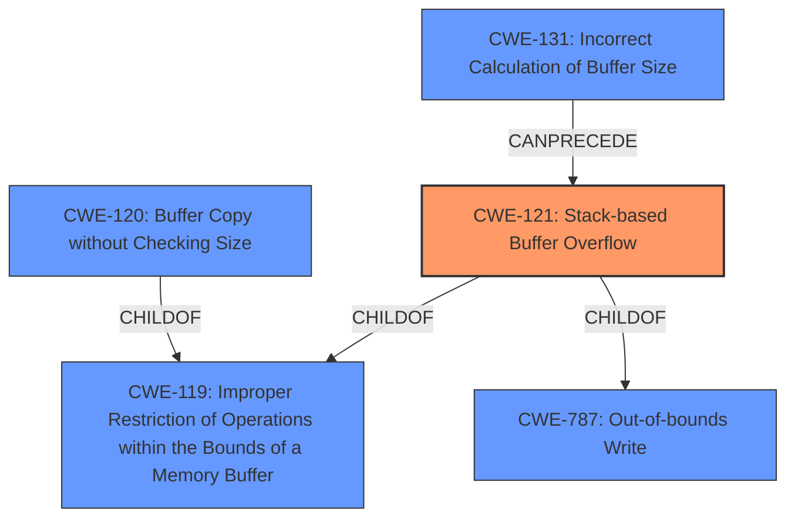

# Final Resolution for CVE-2021-36193

# Summary
| CWE ID | CWE Name | Confidence | CWE Abstraction Level | CWE Vulnerability Mapping Label | CWE-Vulnerability Mapping Notes |
|---|---|---|---|---|---|
| CWE-121 | Stack-based Buffer Overflow | 1.0 | Variant | Allowed | Primary CWE |
| CWE-120 | Buffer Copy without Checking Size of Input ('Classic Buffer Overflow') | 0.6 | Base | Allowed-with-Review | Secondary Candidate |
| CWE-131 | Incorrect Calculation of Buffer Size | 0.5 | Base | Allowed | Secondary Candidate |
| CWE-787 | Out-of-bounds Write | 0.9 | Base | Allowed | Secondary Candidate |

## Evidence and Confidence

*   **Confidence Score:** 0.95
*   **Evidence Strength:** HIGH

## Relationship Analysis
The primary CWE is CWE-121 (**CWE-121: Stack-based Buffer Overflow**), which is a variant of **CWE-787 (Out-of-bounds Write)** and **CWE-119 (Improper Restriction of Operations within the Bounds of a Memory Buffer)**. The vulnerability could also involve **CWE-120 (Buffer Copy without Checking Size of Input)** if a buffer copy operation without bounds checking is the mechanism causing the overflow, and **CWE-131 (Incorrect Calculation of Buffer Size)** if the allocated buffer on the stack is too small due to an incorrect size calculation.

## Vulnerability Chain
The vulnerability chain starts with a specially crafted command being sent to the command line interpreter. If the interpreter does not properly validate the input (potentially **CWE-20: Improper Input Validation**), and if the calculation of the buffer size is incorrect (**CWE-131**), or if a buffer copy operation is performed without checking the size of the input (**CWE-120**), then a stack-based buffer overflow occurs (**CWE-121**), leading to out-of-bounds write (**CWE-787**) and potentially arbitrary code execution.

## Summary of Analysis
The initial analysis and criticism both converge on **CWE-121 (Stack-based Buffer Overflow)** as the primary **WEAKNESS**. The explicit mention of "stack-based buffer overflow" in the vulnerability description serves as strong evidence: "Multiple stack-based buffer overflows in the command line interpreter of FortiWeb before 6.4.2 may allow an authenticated attacker to achieve arbitrary code execution via specially crafted commands."

The secondary candidates (**CWE-120, CWE-131**, and **CWE-787**) represent potential contributing factors or consequences of the **ROOTCAUSE**. **CWE-120** could be involved if a buffer copy operation without bounds checking is the specific mechanism triggering the overflow. **CWE-131** could contribute if the buffer size is incorrectly calculated, leading to a smaller-than-expected stack buffer. **CWE-787** is the result of a buffer overflow.

The graph relationships confirm that **CWE-121** is a variant of **CWE-119** and **CWE-787**, indicating that it is at an appropriate level of specificity. The chain analysis highlights how these weaknesses can interact. The retriever scores were taken into account, however, the explicit mention of "stack-based buffer overflow" makes **CWE-121** the most appropriate primary mapping. The confidence is high due to the direct evidence and corroborating relationship analysis. The selected CWEs are at the optimal level of specificity because **CWE-121** directly reflects the vulnerability described, while the secondary CWEs capture potential contributing factors and outcomes.