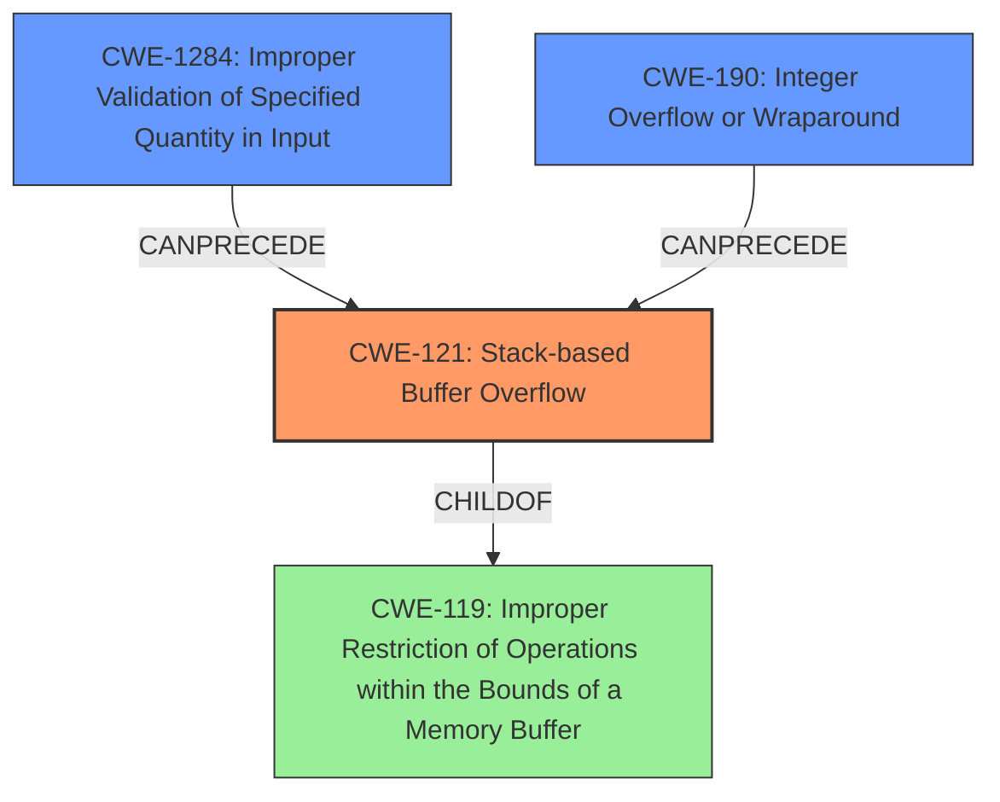

# Analysis Report for CVE-2021-36194

# Vulnerability Analysis Report: CVE-2021-36194

## Description

Multiple stack-based buffer overflows in the API controllers of FortiWeb 6.4.1, 6.4.0, and 6.3.0 through 6.3.15 may allow an authenticated attacker to achieve arbitrary code execution via specially crafted requests.

## Vulnerability Description Key Phrases

**Weakness:** stack-based buffer overflows
**Impact:** arbitrary code execution
**Vector:** specially crafted requests
**Attacker:** authenticated attacker
**Product:** FortiWeb
**Version:** 6.4.1, 6.4.0, and 6.3.0 through 6.3.15
**Component:** API controllers

## Analysis (with Relationship Data)

# Summary
| CWE ID | CWE Name | Confidence | CWE Abstraction Level | CWE Vulnerability Mapping Label | CWE-Vulnerability Mapping Notes |
|---|---|---|---|---|---|
| CWE-121 | Stack-based Buffer Overflow | 1.0 | Variant | Allowed | Primary CWE |

## Evidence and Confidence

*   **Confidence Score:** 1.0
*   **Evidence Strength:** HIGH

- **Analysis and Justification:**
  - *Explanation:* The vulnerability description explicitly states "**stack-based buffer overflows**" in the API controllers of FortiWeb. The CVE Reference Links Content Summary confirms that **stack-based buffer overflows** [CWE-121] are the **weaknesses/vulnerabilities present**. The vulnerability allows an authenticated attacker to achieve arbitrary code execution, which is a typical impact of buffer overflow vulnerabilities. CWE-121 (Stack-based Buffer Overflow) is a Variant level CWE, which is a preferred level of abstraction. The Retriever Results also lists CWE-121 as the second highest match. The description directly matches the CWE definition, and the impact aligns with the expected consequences of the weakness.
  
  - *Relationship Analysis:* CWE-121 is a variant of a buffer overflow. It is a child of CWE-119 (Improper Restriction of Operations within the Bounds of a Memory Buffer). Buffer overflows can lead to other vulnerabilities such as arbitrary code execution.

- **Confidence Score:**
  - Confidence: 1.0 (Explicit mention of stack-based buffer overflow in both the vulnerability description and CVE reference materials)

## Criticism of Analysis

Okay, let's review the provided analysis of the FortiWeb vulnerability, focusing on the CWE mapping and the relevance of the associated specifications.

**Overall Assessment:**

The primary CWE mapping to `CWE-121: Stack-based Buffer Overflow` is accurate and well-justified. The provided analysis and evidence strongly support this classification.  The confidence score of 1.0 is appropriate, given the explicit mention of stack-based buffer overflows in the original vulnerability description and CVE reference data.

**Detailed Critique:**

Here's a breakdown of the different sections of your analysis and how they align with the full CWE specifications:

**1. Summary Table:**

| CWE ID | CWE Name | Confidence | CWE Abstraction Level | CWE Vulnerability Mapping Label | CWE-Vulnerability Mapping Notes |
|---|---|---|---|---|---|
| CWE-121 | Stack-based Buffer Overflow | 1.0 | Variant | Allowed | Primary CWE |

*   **Critique:** This table is well-formatted and accurately summarizes the assessment. The `Abstraction Level` and `CWE Vulnerability Mapping Label` are correctly populated.

**2. Evidence and Confidence:**

*   **Confidence Score:** 1.0
*   **Evidence Strength:** HIGH

    *   **Analysis and Justification:** This section provides strong justification for the `CWE-121` mapping.
    *   **Critique:**
        *   The explanation is thorough and effectively links the vulnerability description to the CWE definition and the potential impact.
        *   The Relationship Analysis is also accurate, highlighting the parent-child relationship between `CWE-121` and `CWE-119`.
        *   Mentioning how the retriever results also lists CWE-121 high on the list is good.

**3. CWE Examples from Database:**

*   **Critique:** The provided examples from the CWE database are for `CWE-119` and *not* `CWE-121`. This is somewhat misleading. It would be better to include examples specifically for `CWE-121` if available, or at least *explain why* `CWE-119` examples are being used (e.g., because `CWE-121` is a *variant* of `CWE-119`, and examples are limited for the former).  Providing an example for `CWE-121` would be helpful.
*   For example, since the specification for `CWE-121` offers `CVE-2021-35395` that would be a perfect example.

**4. Relevant CWE Specifications:**

*   **Critique:** Including the full CWE specifications is excellent as it allows for an independent review of the mapping.

**5. Retriever Results Analysis:**

While not part of your analysis, it's important to consider why the retriever results include other CWEs and whether any of them warrant further investigation.

*   **CWE-78 (OS Command Injection):** This is a common false positive in buffer overflow scenarios. It could be triggered if the attacker-controlled input is used to construct a command that is then executed. However, without more information about the specific code involved, it's likely a misidentification.
*   **CWE-1284 (Improper Validation of Specified Quantity in Input) / CWE-190 (Integer Overflow or Wraparound):** These CWEs could be relevant if the size of the buffer being overflowed is determined by user-supplied data that isn't properly validated or if integer overflows occur during size calculations. These could be *contributing factors* to the `CWE-121`.
*   **CWE-120 (Buffer Copy without Checking Size of Input):**  While `CWE-121` is more specific, `CWE-120` could be considered a valid, albeit less precise, mapping if the exact cause of the overflow is simply a missing size check in a buffer copy operation. `CWE-121` is the more specific location on the stack so is preferred.
*   **CWE-306 (Missing Authentication for Critical Function):** The text mentions the attacker is authenticated, so this is not applicable and the retriever likely did not properly interpret the text.
*   **CWE-113 (Improper Neutralization of CRLF Sequences in HTTP Headers):** This is unlikely to be related unless the overflow is occurring when constructing HTTP headers, but this does not appear to be the case.
*   **CWE-122 (Heap-based Buffer Overflow):** Incorrect since the description explicitly mentions Stack-based
*   **CWE-126 (Buffer Over-read):** Not the primary weakness, as this is a buffer overflow
*   **CWE-789 (Memory Allocation with Excessive Size Value):** If a quantity that causes an excessive memory allocation is involved, then this may be applicable, but that is not indicated here.

**Recommendations:**

1.  **Add a Mitigation Section:** Even though the focus is on CWE mapping, briefly including potential mitigations based on the CWE specifications (e.g., using compiler flags like `/GS`, implementing bounds checking, using safer string handling functions) would add value.  You can lift these directly from the "Potential Mitigations" section of the CWE specification.
2.  **Consider Adding a Chain:** Although `CWE-121` is the primary weakness, discuss the *potential* for a chain involving `CWE-1284` or `CWE-190` if the buffer size calculation is influenced by untrusted input. This should be presented as a possibility requiring further investigation, *not* as a definitive claim. It would look something like: "Further analysis should be performed to determine if `CWE-1284` (Improper Validation of Specified Quantity in Input) or `CWE-190` (Integer Overflow or Wraparound) contributes to this vulnerability. If the size of the buffer being overflowed is determined by user-supplied data, improper validation of that data or integer overflows during size calculations could be contributing factors."
3.  **Address the CWE-119 Examples:** Replace the `CWE-119` examples with `CWE-121` examples, or explain the relationship explicitly (e.g., "Since `CWE-121` is a variant of `CWE-119`, and because specific `CWE-121` examples are limited, the following `CWE-119` examples are provided to illustrate the general nature of buffer overflow vulnerabilities."). Then include `CVE-2021-35395` under the `CWE-121` specification, as it is listed as an example.
4. **Clearly distinguish primary weakness from contributing factors:** Make it clear that `CWE-121` is the *direct* cause of the vulnerability, while other CWEs might be contributing *factors* that lead to the overflow.
5. **Justify why other retriever results were rejected:** Mention why the other retriever results such as `CWE-78` and `CWE-306` are unlikely to be correct.

By incorporating these suggestions, you can make your analysis even more robust and informative, demonstrating a deeper understanding of the CWE specifications and their application to real-world vulnerabilities.

## Final Resolution

# Summary
| CWE ID | CWE Name | Confidence | CWE Abstraction Level | CWE Vulnerability Mapping Label | CWE-Vulnerability Mapping Notes |
|---|---|---|---|---|---|
| CWE-121 | Stack-based Buffer Overflow | 1.0 | Variant | Allowed | Primary CWE |
| CWE-1284 | Improper Validation of Specified Quantity in Input | 0.4 | Base | Allowed | Secondary Candidate |
| CWE-190 | Integer Overflow or Wraparound | 0.3 | Base | Allowed | Secondary Candidate |

## Evidence and Confidence

*   **Confidence Score:** 0.9
*   **Evidence Strength:** MEDIUM

## Relationship Analysis
The primary relationship impacting the decision is the parent-child relationship between CWE-119 (Improper Restriction of Operations within the Bounds of a Memory Buffer) and CWE-121 (**Stack-based Buffer Overflow**). CWE-121 is a variant of CWE-119, providing a more specific classification. CWE-1284 (Improper Validation of Specified Quantity in Input) and CWE-190 (Integer Overflow or Wraparound) are considered as potential contributing factors, forming a chain where improper input validation or integer handling can precede a buffer overflow. The abstraction levels influenced the selection by favoring the more specific Variant (CWE-121) over the broader Class (CWE-119), while considering Base-level CWEs (CWE-1284, CWE-190) as potential contributing factors.

## Vulnerability Chain
The vulnerability chain starts with potential **Improper Input Validation** [CWE-1284] or **Integer Overflow** [CWE-190] when calculating buffer sizes. This leads to a **Stack-based Buffer Overflow** [CWE-121] when data is written to the buffer without proper bounds checking. The ultimate impact is **Arbitrary Code Execution**. The missing link in the chain is whether the size of the buffer is derived from an external input or calculation, which would implicate CWE-1284 or CWE-190.

## Summary of Analysis
The initial analysis correctly identified **CWE-121 (Stack-based Buffer Overflow)** as the primary weakness based on the explicit mention in the vulnerability description: "Multiple **stack-based buffer overflows** in the API controllers...". The criticism highlighted the importance of considering contributing factors and providing more specific examples.

The graph relationships influenced the final selection by emphasizing the hierarchical relationship between CWE-119 and CWE-121, justifying the choice of the more specific CWE-121. Additionally, the potential chain relationships with CWE-1284 and CWE-190 were considered, although the evidence is not strong enough to classify them as definite contributing factors.

The selected CWEs are at the optimal level of specificity because CWE-121 directly reflects the described vulnerability (stack-based buffer overflow). While CWE-119 is a parent, it's too general. CWE-1284 and CWE-190 are potential contributing factors but require further investigation to confirm their role.

The retriever results included other CWEs that were considered but ultimately rejected:

*   CWE-78 (OS Command Injection): Considered a false positive as there is no direct evidence of command injection.
*   CWE-306 (Missing Authentication for Critical Function): Rejected because the attacker is authenticated, as per the vulnerability description.

The confidence score is slightly reduced to 0.9 due to the uncertainty regarding the contributing factors (CWE-1284, CWE-190).
The evidence strength is MEDIUM because the stack-based buffer overflow is explictly stated in the description.

*Report generated on 2025-03-18 00:24:02*
