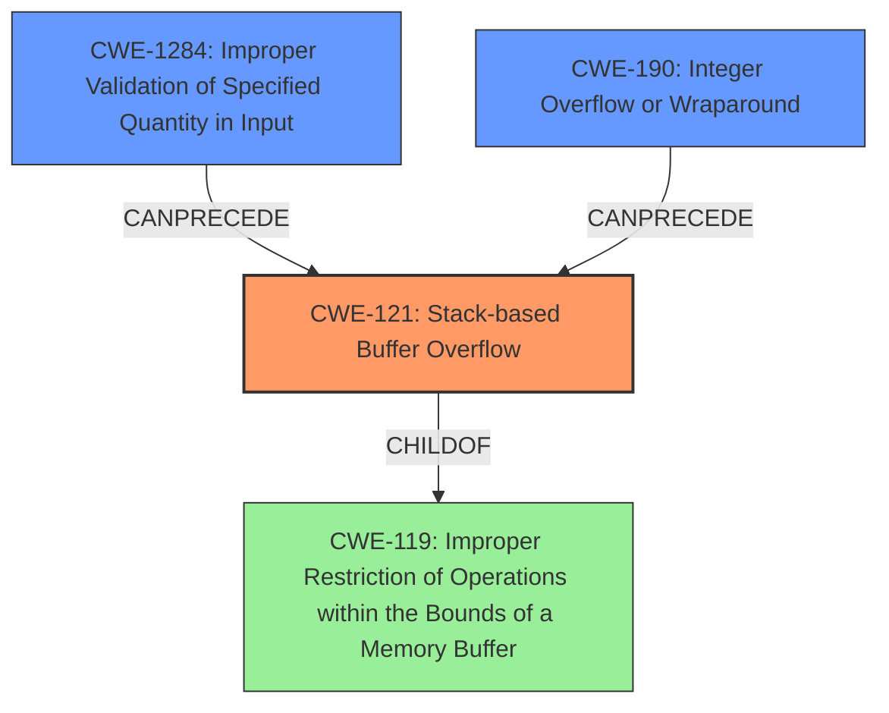

# Final Resolution for CVE-2021-36194

# Summary
| CWE ID | CWE Name | Confidence | CWE Abstraction Level | CWE Vulnerability Mapping Label | CWE-Vulnerability Mapping Notes |
|---|---|---|---|---|---|
| CWE-121 | Stack-based Buffer Overflow | 1.0 | Variant | Allowed | Primary CWE |
| CWE-1284 | Improper Validation of Specified Quantity in Input | 0.4 | Base | Allowed | Secondary Candidate |
| CWE-190 | Integer Overflow or Wraparound | 0.3 | Base | Allowed | Secondary Candidate |

## Evidence and Confidence

*   **Confidence Score:** 0.9
*   **Evidence Strength:** MEDIUM

## Relationship Analysis
The primary relationship impacting the decision is the parent-child relationship between CWE-119 (Improper Restriction of Operations within the Bounds of a Memory Buffer) and CWE-121 (**Stack-based Buffer Overflow**). CWE-121 is a variant of CWE-119, providing a more specific classification. CWE-1284 (Improper Validation of Specified Quantity in Input) and CWE-190 (Integer Overflow or Wraparound) are considered as potential contributing factors, forming a chain where improper input validation or integer handling can precede a buffer overflow. The abstraction levels influenced the selection by favoring the more specific Variant (CWE-121) over the broader Class (CWE-119), while considering Base-level CWEs (CWE-1284, CWE-190) as potential contributing factors.

## Vulnerability Chain
The vulnerability chain starts with potential **Improper Input Validation** [CWE-1284] or **Integer Overflow** [CWE-190] when calculating buffer sizes. This leads to a **Stack-based Buffer Overflow** [CWE-121] when data is written to the buffer without proper bounds checking. The ultimate impact is **Arbitrary Code Execution**. The missing link in the chain is whether the size of the buffer is derived from an external input or calculation, which would implicate CWE-1284 or CWE-190.

## Summary of Analysis
The initial analysis correctly identified **CWE-121 (Stack-based Buffer Overflow)** as the primary weakness based on the explicit mention in the vulnerability description: "Multiple **stack-based buffer overflows** in the API controllers...". The criticism highlighted the importance of considering contributing factors and providing more specific examples.

The graph relationships influenced the final selection by emphasizing the hierarchical relationship between CWE-119 and CWE-121, justifying the choice of the more specific CWE-121. Additionally, the potential chain relationships with CWE-1284 and CWE-190 were considered, although the evidence is not strong enough to classify them as definite contributing factors.

The selected CWEs are at the optimal level of specificity because CWE-121 directly reflects the described vulnerability (stack-based buffer overflow). While CWE-119 is a parent, it's too general. CWE-1284 and CWE-190 are potential contributing factors but require further investigation to confirm their role.

The retriever results included other CWEs that were considered but ultimately rejected:

*   CWE-78 (OS Command Injection): Considered a false positive as there is no direct evidence of command injection.
*   CWE-306 (Missing Authentication for Critical Function): Rejected because the attacker is authenticated, as per the vulnerability description.

The confidence score is slightly reduced to 0.9 due to the uncertainty regarding the contributing factors (CWE-1284, CWE-190).
The evidence strength is MEDIUM because the stack-based buffer overflow is explictly stated in the description.