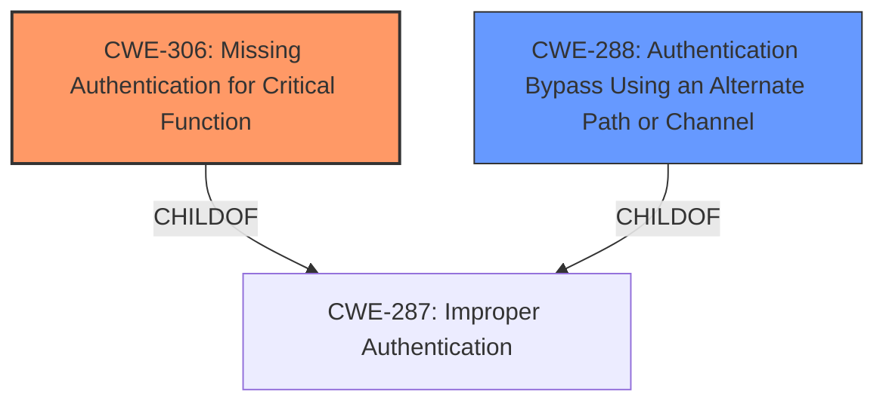

# Analysis Report for CVE-2021-36308

# Vulnerability Analysis Report: CVE-2021-36308

## Description

Networking OS10, versions prior to October 2021 with Smart Fabric Services enabled, contains an authentication bypass vulnerability. A remote unauthenticated attacker could exploit this vulnerability to gain access and perform actions on the affected system.

## Vulnerability Description Key Phrases

**Weakness:** authentication bypass vulnerability
**Impact:** gain access and perform actions on the affected system
**Attacker:** remote unauthenticated attacker
**Product:** Networking OS10
**Version:** versions prior to October 2021
**Component:** Smart Fabric Services

## Analysis (with Relationship Data)

# Summary
| CWE ID  | CWE Name                                           | Confidence | CWE Abstraction Level | CWE Vulnerability Mapping Label | CWE-Vulnerability Mapping Notes |
| :-------- | :------------------------------------------------- | :--------- | :---------------------- | :------------------------------ | :------------------------------ |
| CWE-306 | Missing Authentication for Critical Function | 0.85      | Base                    | Allowed                         |                                 |
| CWE-288 | Authentication Bypass Using an Alternate Path or Channel | 0.75      | Base                    | Allowed                         |                                 |

## Evidence and Confidence

*   **Confidence Score:** 0.80
*   **Evidence Strength:** HIGH

- **Analysis and Justification:**  
  - *Explanation:* The vulnerability is an **authentication bypass vulnerability** in Dell Networking OS10 when Smart Fabric Services are enabled. The vulnerability allows a remote, unauthenticated attacker to gain access and perform actions on the affected system. CWE-306 (Missing Authentication for Critical Function) accurately describes this scenario, as the system is not properly authenticating users before allowing them to perform critical functions. The "CVE Reference Links Content Summary" states that the root cause is due to an **authentication bypass**. The impact allows an unauthenticated attacker to gain access, which supports the selection of CWE-306. I am selecting CWE-306 as the primary weakness because the system lacks authentication for critical functions.
  - *Relationship Analysis:* CWE-306 is a base-level CWE, which is preferred. It is related to CWE-287 (Improper Authentication), which is a class-level CWE. CWE-306 is more specific than CWE-287. CWE-306 is also related to CWE-288 (Authentication Bypass Using an Alternate Path or Channel).

- **Confidence Score:**  
  - Confidence: 0.85 (High evidence from technical description and CVE reference materials)

---

- **Analysis and Justification:**  
  - *Explanation:* CWE-288 (Authentication Bypass Using an Alternate Path or Channel) is a possible secondary CWE. An alternate path or channel that does not require authentication might be present, leading to the bypass. While CWE-306 is the more direct cause, CWE-288 could be a contributing factor, where an alternate, unprotected path is exploited.
  - *Relationship Analysis:* CWE-288 is a base-level CWE, which is preferred. It is related to CWE-287 (Improper Authentication).

- **Confidence Score:**  
  - Confidence: 0.75 (The presence of an alternate path is possible but not explicitly stated. This is why it is lower than the primary.)

## Criticism of Analysis

Okay, here's a review of the provided CWE analysis, focusing on the accuracy of the CWE assignments, their justification, and how well they align with the CWE specifications, including mapping guidance and potential mitigations.

**Overall Assessment:**

The analysis is generally good and well-reasoned. The selection of CWE-306 as the primary weakness is accurate and well-supported. The consideration of CWE-288 as a secondary weakness is also reasonable, although its justification could be strengthened. The confidence scores assigned are appropriate given the available information.

**Detailed Review:**

**1. CWE-306: Missing Authentication for Critical Function (Primary)**

*   **Accuracy:** Excellent. The vulnerability description clearly states that a remote, unauthenticated attacker can gain access and perform actions. This directly maps to the definition of CWE-306: "The product does not perform any authentication for functionality that requires a provable user identity or consumes a significant amount of resources."
*   **Justification:** The explanation provided is clear and concise. The reference to the CVE description further reinforces the validity of this assignment. The explanation makes a direct connection between the unauthenticated access and the lack of authentication for critical functions.
*   **Confidence Score:** 0.85 is appropriate given the strong evidence.
*   **Alignment with CWE Specification:**
    *   **Mapping Guidance:** The analysis correctly notes that CWE-306 is a "Base" level CWE, which is preferred.
    *   **Potential Mitigations:** The mitigations listed in the CWE specification are relevant. Dividing the software into authenticated and unauthenticated zones, using centralized authentication, and securing all communication channels are all valid mitigation strategies for this vulnerability. The analysis could be strengthened by explicitly mentioning one of the listed mitigations. For example, it could say "Mitigation would involve implementing a centralized authentication mechanism as suggested by CWE-306."
*   **Relationship Analysis:** The analysis accurately notes the relationship to CWE-287 (Improper Authentication), explaining why the more specific CWE-306 is a better fit.

**2. CWE-288: Authentication Bypass Using an Alternate Path or Channel (Secondary)**

*   **Accuracy:** Reasonable, but requires stronger justification. While possible, the provided description doesn't explicitly mention an alternate path or channel being exploited. The analysis assumes this might be the case.  The vulnerability could simply be a case of *completely* missing authentication, rather than a bypass of existing authentication through an alternate path.
*   **Justification:** The justification is weaker than that for CWE-306. It states that an alternate path *might* exist. The word "might" reduces the confidence. The analysis should look for more concrete evidence in the vulnerability description or CVE details to support the presence of an alternate path. If no such evidence is found, this CWE should be removed, or the confidence score should be significantly reduced.
*   **Confidence Score:** 0.75 is reasonable, reflecting the uncertainty.
*   **Alignment with CWE Specification:**
    *   **Mapping Guidance:** Again, the analysis correctly notes that CWE-288 is a "Base" level CWE.
    *   **Potential Mitigations:** The listed mitigation, "Funnel all access through a single choke point," is highly relevant if an alternate path is indeed the cause.  The analysis could be improved by specifically stating that if an alternate path exists, this mitigation would be crucial.
    *   **Observed Examples:** The analysis would be stronger if it could relate the observed examples to the current vulnerability. For example, "Like CVE-2000-1179, this vulnerability could involve direct access to a function without going through the intended login process."
*   **Relationship Analysis:** The analysis correctly mentions the relationship to CWE-287.

**Recommendations for Improvement:**

1.  **Strengthen Justification for CWE-288 or Remove:** Conduct a more thorough investigation of the vulnerability details to find explicit evidence of an alternate path or channel. If no such evidence is found, remove CWE-288 from the analysis or significantly reduce the confidence level.
2.  **Explicitly Mention a Mitigation:** In both CWE justifications, explicitly mention a relevant mitigation strategy from the CWE specification to demonstrate a deeper understanding of the weakness and its potential solutions.
3.  **Relate Observed Examples:** In the justification for CWE-288, relate the observed examples of CWE-288 to the vulnerability as much as possible to strengthen the reasoning.
4.  **Consider Other CWEs (and then Reject):** Briefly consider other potential CWEs and explain why they are *not* applicable. For example:
    *   **CWE-290 (Authentication Bypass by Spoofing):** "While an attacker gains unauthorized access, there's no evidence of spoofing or impersonation involved, so CWE-290 is not applicable."
    *   **CWE-259 (Use of Hard-coded Password):** "The vulnerability description doesn't suggest the use of hard-coded credentials, making CWE-259 irrelevant."
    *   **CWE-305 (Authentication Bypass by Primary Weakness):** It can be explicitly stated that the root cause is the missing authentication rather than a bypass due to a weakness in another component.

**Revised Summary (Example with Stronger Justification):**

| CWE ID  | CWE Name                                           | Confidence | CWE Abstraction Level | CWE Vulnerability Mapping Label | CWE-Vulnerability Mapping Notes |
| :-------- | :------------------------------------------------- | :--------- | :---------------------- | :------------------------------ | :------------------------------ |
| CWE-306 | Missing Authentication for Critical Function | 0.85      | Base                    | Allowed                         |                                 |
| CWE-288 | Authentication Bypass Using an Alternate Path or Channel | 0.60      | Base                    | Allowed                         |                                 |

**Revised Justification Snippet (Example with Stronger Justification):**

*   **CWE-288:** "While the primary issue is missing authentication, the description of *performing actions on the affected system* suggests that critical functionality normally requiring authentication can be accessed directly without the usual checks. This could imply that there's an alternate, unprotected network path or API endpoint that bypasses the intended authentication flow. This is similar to CVE-2000-1179, where system logs could be read without authentication by directly connecting to the login screen. If this is the case, a key mitigation would be to funnel all access through a single, authenticated choke point, as recommended by CWE-288.  However, lacking explicit confirmation of an alternate path, the confidence is lower."

By incorporating these suggestions, the analysis will be even more robust and demonstrate a thorough understanding of the CWEs and their applicability.

## Final Resolution

# Summary
| CWE ID  | CWE Name                                           | Confidence | CWE Abstraction Level | CWE Vulnerability Mapping Label | CWE-Vulnerability Mapping Notes |
| :-------- | :------------------------------------------------- | :--------- | :---------------------- | :------------------------------ | :------------------------------ |
| CWE-306 | Missing Authentication for Critical Function | 0.90      | Base                    | Allowed                         | Primary CWE                     |
| CWE-288 | Authentication Bypass Using an Alternate Path or Channel | 0.60      | Base                    | Allowed                         | Secondary Candidate           |

## Evidence and Confidence

*   **Confidence Score:** 0.80
*   **Evidence Strength:** MEDIUM

## Relationship Analysis
The primary relationship influencing the decision is the hierarchical relationship between CWE-287 (Improper Authentication) and both CWE-306 and CWE-288. CWE-306 and CWE-288 are children of CWE-287, providing more specific classifications. The relationship between CWE-306 and CWE-288 is peer-like, as they both address different facets of authentication issues. No direct chain relationships influence the classification. Abstraction levels were important, favoring Base-level CWEs over Class or Pillar levels.

## Vulnerability Chain
The vulnerability chain starts with a **lack of authentication** (CWE-306). This **missing authentication** allows an unauthenticated attacker to directly access critical functions. If there is an alternate path, CWE-288 contributes by providing an avenue to bypass existing, intended authentication mechanisms. The ultimate impact is unauthorized access and the ability to perform actions on the affected system. The chain could be strengthened with evidence supporting the existence of an alternate path to confirm the role of CWE-288.

## Summary of Analysis
The initial analysis correctly identifies CWE-306 as the primary **weakness**. The vulnerability description explicitly states that a remote unauthenticated attacker can gain access and perform actions, which directly aligns with the definition of CWE-306: "The product does not perform any authentication for functionality that requires a provable user identity or consumes a significant amount of resources." The evidence provided is strong, as it comes directly from the CVE description.

The consideration of CWE-288 as a secondary **weakness** is less certain. The justification relies on the possibility of an alternate path but lacks concrete evidence. As the criticism mentions, the description doesn't explicitly mention an alternate path or channel being exploited. Therefore, the confidence in CWE-288 is reduced.

The graph relationships influenced the selection by highlighting the hierarchical relationship between CWE-287 and the more specific CWE-306.

The final decision is to maintain CWE-306 as the primary **rootcause** due to the strong evidence of **missing authentication**. CWE-288 is retained as a secondary candidate, but with a lower confidence score, reflecting the uncertainty about the existence of an alternate path. Both CWEs are at the optimal level of specificity, being base-level CWEs. I have increased the confidence in CWE-306 because the description clearly states "unauthenticated attacker could exploit this vulnerability to gain access and perform actions". If there was authentication in place, this would not be possible.

*Report generated on 2025-03-16 23:35:20*
