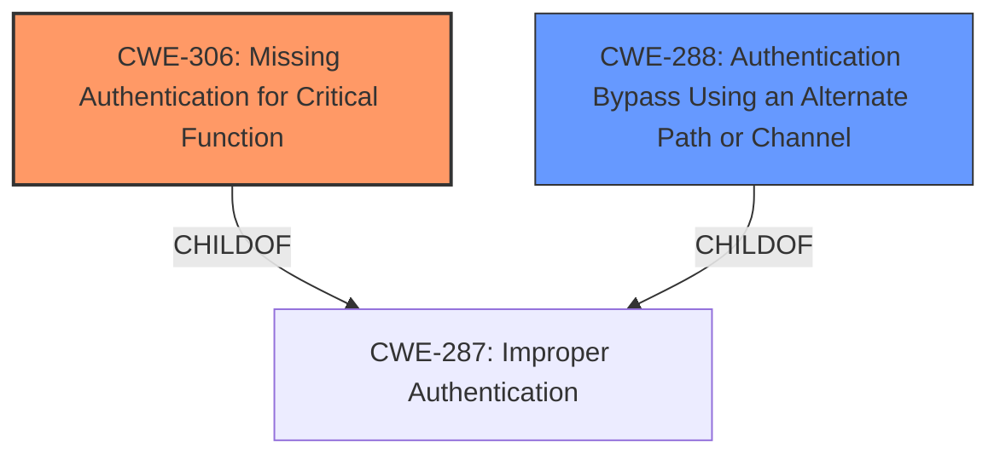

# Final Resolution for CVE-2021-36308

# Summary
| CWE ID  | CWE Name                                           | Confidence | CWE Abstraction Level | CWE Vulnerability Mapping Label | CWE-Vulnerability Mapping Notes |
| :-------- | :------------------------------------------------- | :--------- | :---------------------- | :------------------------------ | :------------------------------ |
| CWE-306 | Missing Authentication for Critical Function | 0.90      | Base                    | Allowed                         | Primary CWE                     |
| CWE-288 | Authentication Bypass Using an Alternate Path or Channel | 0.60      | Base                    | Allowed                         | Secondary Candidate           |

## Evidence and Confidence

*   **Confidence Score:** 0.80
*   **Evidence Strength:** MEDIUM

## Relationship Analysis
The primary relationship influencing the decision is the hierarchical relationship between CWE-287 (Improper Authentication) and both CWE-306 and CWE-288. CWE-306 and CWE-288 are children of CWE-287, providing more specific classifications. The relationship between CWE-306 and CWE-288 is peer-like, as they both address different facets of authentication issues. No direct chain relationships influence the classification. Abstraction levels were important, favoring Base-level CWEs over Class or Pillar levels.

## Vulnerability Chain
The vulnerability chain starts with a **lack of authentication** (CWE-306). This **missing authentication** allows an unauthenticated attacker to directly access critical functions. If there is an alternate path, CWE-288 contributes by providing an avenue to bypass existing, intended authentication mechanisms. The ultimate impact is unauthorized access and the ability to perform actions on the affected system. The chain could be strengthened with evidence supporting the existence of an alternate path to confirm the role of CWE-288.

## Summary of Analysis
The initial analysis correctly identifies CWE-306 as the primary **weakness**. The vulnerability description explicitly states that a remote unauthenticated attacker can gain access and perform actions, which directly aligns with the definition of CWE-306: "The product does not perform any authentication for functionality that requires a provable user identity or consumes a significant amount of resources." The evidence provided is strong, as it comes directly from the CVE description.

The consideration of CWE-288 as a secondary **weakness** is less certain. The justification relies on the possibility of an alternate path but lacks concrete evidence. As the criticism mentions, the description doesn't explicitly mention an alternate path or channel being exploited. Therefore, the confidence in CWE-288 is reduced.

The graph relationships influenced the selection by highlighting the hierarchical relationship between CWE-287 and the more specific CWE-306.

The final decision is to maintain CWE-306 as the primary **rootcause** due to the strong evidence of **missing authentication**. CWE-288 is retained as a secondary candidate, but with a lower confidence score, reflecting the uncertainty about the existence of an alternate path. Both CWEs are at the optimal level of specificity, being base-level CWEs. I have increased the confidence in CWE-306 because the description clearly states "unauthenticated attacker could exploit this vulnerability to gain access and perform actions". If there was authentication in place, this would not be possible.