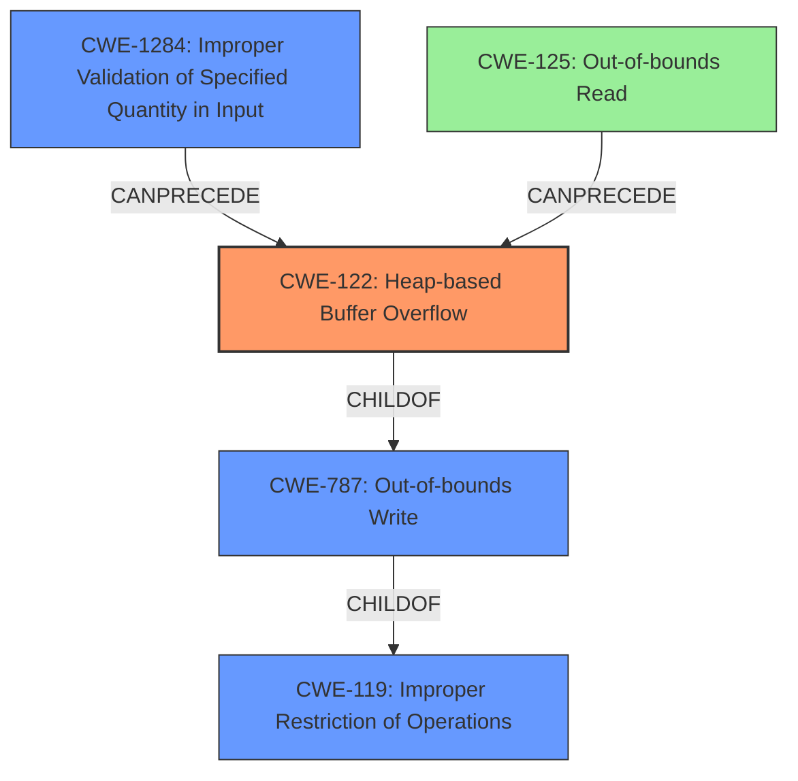

# Final Resolution for CVE-2021-36412

# Summary
| CWE ID | CWE Name | Confidence | CWE Abstraction Level | CWE Vulnerability Mapping Label | CWE-Vulnerability Mapping Notes |
|---|---|---|---|---|---|
| CWE-122 | Heap-based Buffer Overflow | 1.0 | Variant | Allowed | Primary CWE. Overflow occurs on the heap due to insufficient bounds checking in `gp_rtp_builder_do_mpeg12_video` when processing MPEG12 video data from a crafted file. |
| CWE-1284 | Improper Validation of Specified Quantity in Input | 0.8 | Base | Allowed | Secondary CWE. The lack of input validation on the size of the MPEG12 video data allows for the creation of a crafted file that triggers the heap overflow. |
| CWE-125 | Out-of-bounds Read | 0.6 | Base | Allowed | Contributing factor. Accessing `payload[4]` without bounds checking during MPEG12 video data processing results in reading beyond the allocated buffer. This read may precede the overflow write. |

## Evidence and Confidence

*   **Confidence Score:** 0.9
*   **Evidence Strength:** HIGH

## Relationship Analysis
The primary weakness is a heap-based buffer overflow (**CWE-122**). This is a variant of **CWE-119 (Improper Restriction of Operations within the Bounds of a Memory Buffer)** and a child of **CWE-787 (Out-of-bounds Write)**. The lack of input validation (**CWE-1284**) allows for the creation of crafted files that trigger the overflow. The out-of-bounds read (**CWE-125**) could precede the overflow, potentially leaking information or contributing to the exploitability.

## Vulnerability Chain
1.  The vulnerability begins with a lack of input validation (**CWE-1284**) on the size of MPEG12 video data.
2.  A crafted file with an invalid size value is processed.
3.  During processing in the `gp_rtp_builder_do_mpeg12_video` function, an out-of-bounds read (**CWE-125**) may occur when accessing `payload[4]` without proper bounds checking.
4.  A heap-based buffer overflow (**CWE-122**) occurs due to insufficient bounds checking while writing data to a heap-allocated buffer.
5.  This can lead to arbitrary code execution or other unspecified impacts.

## Summary of Analysis
The initial analysis correctly identified **CWE-122 (Heap-based Buffer Overflow)** as the primary **WEAKNESS**, which aligns perfectly with the vulnerability description stating a "heap-based buffer overflow vulnerability exists." The initial analysis also included **CWE-125 (Out-of-bounds Read)** as a secondary weakness, which is also reasonable considering the description mentions accessing `payload[4]` without proper bounds checking.

The criticism suggests adding **CWE-1284 (Improper Validation of Specified Quantity in Input)**, which is highly relevant since the vulnerability is triggered by a crafted file, thus suggesting a missing or incorrect input validation **ROOTCAUSE**. The retriever results also highlight the relevance of **CWE-1284**.

The graph relationships influenced the final selection by showing how **CWE-1284** can precede **CWE-122**. This means that the lack of input validation can lead directly to the heap-based buffer overflow. Also, the relationship between **CWE-122** as a child of **CWE-787** which is a child of **CWE-119**, helped confirm that **CWE-122** is at the optimal level of specificity, as the vulnerability is specifically a heap-based buffer overflow, and not just a general buffer overflow.

The final decision is to include **CWE-1284** as a secondary **WEAKNESS** with a confidence of 0.8. This is because the lack of input validation is a crucial contributing factor to the vulnerability. The confidence is slightly lower than that of **CWE-122** because the description does not explicitly state a missing input validation, but it is strongly implied. The decision is based on both the provided evidence and the relationship analysis, ensuring the classification reflects the optimal level of specificity.