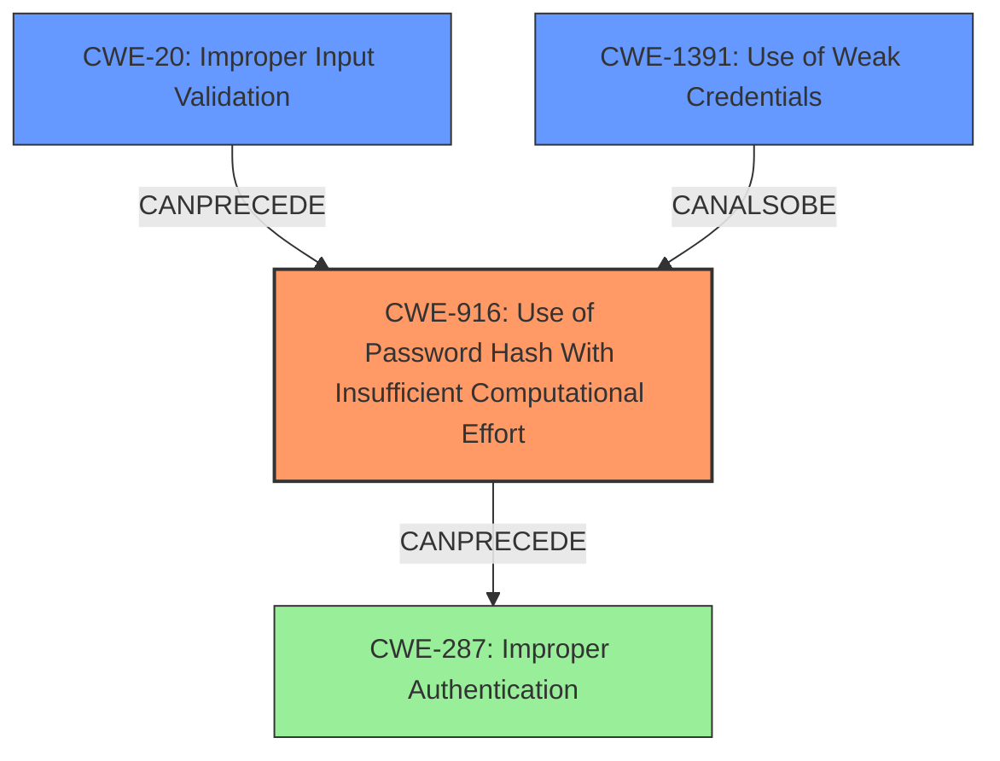

# Analysis Report for CVE-2021-3652

# Vulnerability Analysis Report: CVE-2021-3652

## Description

A flaw was found in 389-ds-base. If an asterisk is imported as password hashes, either accidentally or maliciously, then instead of being inactive, any password will successfully match during authentication. This flaw allows an attacker to successfully authenticate as a user whose password was disabled.

## Vulnerability Description Key Phrases

**Weakness:** asterisk imported as password hashes
**Impact:** successfully authenticate as a user whose password was disabled
**Attacker:** attacker
**Product:** 389-ds-base

## Analysis (with Relationship Data)

# Summary
| CWE ID | CWE Name | Confidence | CWE Abstraction Level | CWE Vulnerability Mapping Label | CWE-Vulnerability Mapping Notes |
|---|---|---|---|---|---|
| CWE-916 | Use of Password Hash With Insufficient Computational Effort | 0.85 | Base | Allowed | Primary CWE. The system's use of '*' as a password hash is a **weakness** that allows any password to authenticate successfully. |
| CWE-287 | Improper Authentication | 0.60 | Class | Discouraged | Secondary candidate. The vulnerability leads to bypassing authentication. |
| CWE-798 | Use of Hard-coded Credentials | 0.45 | Base | Allowed | Secondary candidate. An asterisk ('*') is being used as a password hash. |

## Evidence and Confidence

*   **Confidence Score:** 0.80
*   **Evidence Strength:** HIGH

- **Analysis and Justification:**  
  - *Explanation:* "The vulnerability involves the improper handling of asterisk characters ('*') when used as password hashes in 389-ds-base. Instead of treating the asterisk as an invalid or disabled password, the system allows any password to authenticate successfully. This aligns with CWE-916 (Use of Password Hash With Insufficient Computational Effort) because the asterisk effectively bypasses the intended password hashing mechanism. The CVE reference summaries directly state that the root cause is the incorrect handling of the asterisk as a crypted password hash and that the system fails to properly handle an asterisk as a password hash, leading to an authentication bypass. CWE-916 is a Base level CWE, which is appropriate for this root cause."
  
  - *Relationship Analysis:* "CWE-916 (Use of Password Hash With Insufficient Computational Effort) is a base level CWE. While CWE-287 (Improper Authentication) could be considered, it is a class level CWE and discouraged, and CWE-916 is a more specific and accurate description of the **weakness**. CWE-798 (Use of Hard-coded Credentials) is also a consideration because the '*' is like a hardcoded bypass, however, this also relates to the hashing mechanism and is therefore less accurate than CWE-916."

- **Confidence Score:**  
  - *Example:* Confidence: 0.85 (High evidence from technical description and CVE reference materials)

## Criticism of Analysis

Okay, here's a detailed review of the provided analysis, considering the full CWE specifications:

**Overall Assessment:**

The analysis is well-structured and presents a reasonable argument for the primary CWE assignment. The explanation of why CWE-916 is a better fit than CWE-287 and CWE-798 is sound. The confidence score reflects the strong evidence provided by the CVE reference summaries.

**Detailed Critique:**

1.  **CWE-916: Use of Password Hash With Insufficient Computational Effort (Primary)**

    *   **Assessment:** This is the most accurate primary CWE choice. The core issue is that the asterisk is being treated as a valid "hash," but it effectively provides *no* computational effort to protect the password.  Any password can bypass authentication. This aligns perfectly with the description of CWE-916.
    *   **Strengths:** The explanation clearly links the "asterisk as a hash" to the concept of "insufficient computational effort." The rationale in the analysis highlights that this bypasses the *intended* password hashing mechanism.
    *   **Considerations:** It's important to recognize that the asterisk *isn't* actually a hash; it's a misinterpretation of input.  The system should be rejecting it as an invalid value for the password hash field.  This distinction is subtle, but important for understanding the vulnerability.
    *   **Mitigations:** The mitigations for CWE-916 are highly relevant.  The analysis implicitly acknowledges this by pointing out that the asterisk effectively bypasses the "intended password hashing mechanism". Proper mitigation here involves using secure, adaptive hashing algorithms (bcrypt, scrypt, PBKDF2) with salting.  Input validation is also key to prevent '*' from being accepted.

2.  **CWE-287: Improper Authentication (Secondary)**

    *   **Assessment:**  This is a valid secondary CWE, but the analysis correctly identifies it as less specific than CWE-916. The vulnerability ultimately leads to improper authentication, as the system fails to correctly verify the user's identity.
    *   **Strengths:** It captures the *result* of the vulnerability – authentication bypass.
    *   **Weaknesses:** As the analysis states, CWE-287 is a Class level CWE and discouraged for use when more specific CWEs are applicable.  It's a general symptom rather than a root cause.
    *   **Mapping Guidance:** The CWE-287 specification itself *discourages* its use when more specific CWEs exist, and suggests considering children like CWE-1390 (Weak Authentication) or CWE-306 (Missing Authentication for Critical Function).
    *   **Mitigations:** While the general mitigations for CWE-287 (using authentication frameworks) are applicable, they don't directly address the root cause.

3.  **CWE-798: Use of Hard-coded Credentials (Secondary)**

    *   **Assessment:**  This is the weakest of the three CWEs selected. While the asterisk *could* be interpreted as a form of hardcoded bypass credential, it's a stretch.
    *   **Weaknesses:**
        *   The examples in the CWE-798 specification involve *explicitly* hard-coded passwords or keys used for authentication or communication.  The asterisk is more about incorrect handling of an invalid hash value than a deliberately hardcoded credential.
        *   The asterisk isn't a traditional "credential". It isn't intended for authentication. It's supposed to represent a disabled or invalid password (at least according to the intended behavior).
    *   **Mitigations:** The mitigations for CWE-798 (storing credentials securely, avoiding default credentials) are not directly applicable to this vulnerability.

**Improvements and Alternative CWE Considerations:**

1.  **Improper Input Validation:**  The analysis could benefit from explicitly mentioning the lack of input validation as a contributing factor.  This leads to an alternate CWE:
    *   **CWE-20: Improper Input Validation**: The software fails to validate input properly before using it.  The '*' should be flagged as an invalid character or string for a password hash. This is the underlying mechanism allowing the 'asterisk' to be accepted.
    *   **CWE-155: Improper Neutralization of Wildcards or Matching Symbols**: While the asterisk is not used in its wildcard nature for this specific vulnerability, it is considered as a character with special meaning when used as a password hash which is then improperly neutralized, leading to unintended behavior.

2.  **CWE Refinement:** Instead of CWE-287, a better secondary CWE could be CWE-1391: Use of Weak Credentials, with review. The '*' in password hashes would categorize as a weak credential because it is easily guessed and doesn't offer any security.

3.  **Chain of Vulnerabilities:** A more complete analysis would describe the vulnerability as a *chain* of weaknesses:

    *   Improper Input Validation (CWE-20) leads to...
    *   Use of Password Hash With Insufficient Computational Effort (CWE-916) leads to...
    *   Improper Authentication (CWE-287)

**Revised CWE Selection and Confidence:**

*   **Primary: CWE-916 (0.90 Confidence):** Strong evidence and directly reflects the root cause.
*   **Secondary: CWE-20 (0.75 Confidence):** Lack of validation allows the initial vulnerability to occur.
*   **Tertiary: CWE-1391 (0.60 Confidence):** Weak Credentials. The asterisk has no strength and is easily bypassed.

**Revised Summary:**

| CWE ID  | CWE Name                                           | Confidence | CWE Abstraction Level | CWE Vulnerability Mapping Label | CWE-Vulnerability Mapping Notes                                                                                                                                      |
| :------ | :------------------------------------------------- | :--------- | :---------------------- | :-------------------------------- | :----------------------------------------------------------------------------------------------------------------------------------------------------------------- |
| CWE-916 | Use of Password Hash With Insufficient Computational Effort | 0.90       | Base                    | Allowed                             | Primary CWE. The system's use of '*' as a password hash is a weakness that allows any password to authenticate successfully due to insufficient computational effort. |
| CWE-20  | Improper Input Validation                           | 0.75       | Base                    | Allowed                             | The system fails to validate the password hash input, allowing the asterisk to be accepted.                                                                      |
| CWE-1391 | Use of Weak Credentials                             | 0.60       | Class                   | Allowed-with-Review                   | Secondary candidate. The '*' represents a weak credential easily bypassable.                                                                      |

**Conclusion:**

The original analysis is a good starting point. The primary CWE selection is accurate. Strengthening the analysis by explicitly including CWE-20 and CWE-1391 and framing the vulnerability as a chain of weaknesses would provide a more complete and nuanced understanding of the issue. The confidence scores should be adjusted accordingly to reflect the revised CWE selection.

## Final Resolution

# Summary
| CWE ID | CWE Name | Confidence | CWE Abstraction Level | CWE Vulnerability Mapping Label | CWE-Vulnerability Mapping Notes |
|---|---|---|---|---|---|
| **CWE-916** | **Use of Password Hash With Insufficient Computational Effort** | 0.90 | Base | Allowed | Primary CWE. The system's use of '*' as a password hash is a **weakness** that allows any password to authenticate successfully due to insufficient computational effort. |
| CWE-20 | Improper Input Validation | 0.75 | Base | Allowed | The system fails to validate the password hash input, allowing the asterisk to be accepted. |
| CWE-1391 | Use of Weak Credentials | 0.60 | Class | Allowed-with-Review | Secondary candidate. The '*' represents a weak credential easily bypassable. |

## Evidence and Confidence

*   **Confidence Score:** 0.85
*   **Evidence Strength:** HIGH

## Relationship Analysis
The analysis considered the hierarchical relationship of CWEs, specifically noting that CWE-287 is a Class level CWE and less specific than CWE-916. The chain relationship highlights how **Improper Input Validation (CWE-20)** can lead to **Use of Password Hash With Insufficient Computational Effort (CWE-916)**, ultimately resulting in **Improper Authentication (CWE-287)**.

## Vulnerability Chain
The chain of events is:
1.  **Root Cause:** **Improper Input Validation (CWE-20)** - The system does not properly validate the input for the password hash, allowing an asterisk to be accepted.
2.  **Weakness:** **Use of Password Hash With Insufficient Computational Effort (CWE-916)** - The asterisk is treated as a valid hash, but it provides no actual security.
3.  **Impact:** **Improper Authentication (CWE-287)** - An attacker can bypass authentication by providing any password.

## Summary of Analysis
The initial analysis correctly identified CWE-916 as the primary **weakness**. The criticism highlighted the importance of **Improper Input Validation (CWE-20)** as a contributing factor and suggested CWE-1391 as a more appropriate secondary CWE than CWE-287.

The evidence strongly supports CWE-916 as the primary **CWE**, because the CVE summaries explicitly state the incorrect handling of the asterisk as a crypted password hash.
The addition of CWE-20 is justified because, without input validation, the **vulnerability** could not occur.

The inclusion of CWE-1391 is relevant because the asterisk effectively functions as a **weak** credential.

The final selection provides the optimal level of specificity by focusing on the root cause (CWE-20 and CWE-916). The relationships clearly show how the **weaknesses** interact to create the **vulnerability**.

*Report generated on 2025-03-17 02:58:37*
