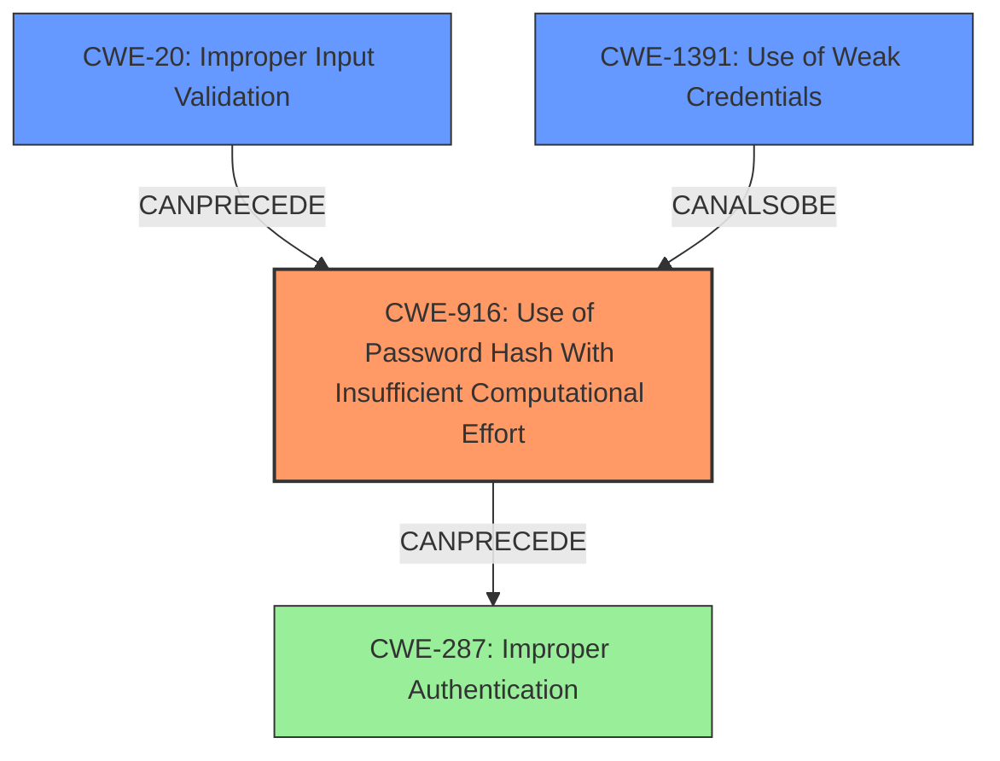

# Final Resolution for CVE-2021-3652

# Summary
| CWE ID | CWE Name | Confidence | CWE Abstraction Level | CWE Vulnerability Mapping Label | CWE-Vulnerability Mapping Notes |
|---|---|---|---|---|---|
| **CWE-916** | **Use of Password Hash With Insufficient Computational Effort** | 0.90 | Base | Allowed | Primary CWE. The system's use of '*' as a password hash is a **weakness** that allows any password to authenticate successfully due to insufficient computational effort. |
| CWE-20 | Improper Input Validation | 0.75 | Base | Allowed | The system fails to validate the password hash input, allowing the asterisk to be accepted. |
| CWE-1391 | Use of Weak Credentials | 0.60 | Class | Allowed-with-Review | Secondary candidate. The '*' represents a weak credential easily bypassable. |

## Evidence and Confidence

*   **Confidence Score:** 0.85
*   **Evidence Strength:** HIGH

## Relationship Analysis
The analysis considered the hierarchical relationship of CWEs, specifically noting that CWE-287 is a Class level CWE and less specific than CWE-916. The chain relationship highlights how **Improper Input Validation (CWE-20)** can lead to **Use of Password Hash With Insufficient Computational Effort (CWE-916)**, ultimately resulting in **Improper Authentication (CWE-287)**.

## Vulnerability Chain
The chain of events is:
1.  **Root Cause:** **Improper Input Validation (CWE-20)** - The system does not properly validate the input for the password hash, allowing an asterisk to be accepted.
2.  **Weakness:** **Use of Password Hash With Insufficient Computational Effort (CWE-916)** - The asterisk is treated as a valid hash, but it provides no actual security.
3.  **Impact:** **Improper Authentication (CWE-287)** - An attacker can bypass authentication by providing any password.

## Summary of Analysis
The initial analysis correctly identified CWE-916 as the primary **weakness**. The criticism highlighted the importance of **Improper Input Validation (CWE-20)** as a contributing factor and suggested CWE-1391 as a more appropriate secondary CWE than CWE-287.

The evidence strongly supports CWE-916 as the primary **CWE**, because the CVE summaries explicitly state the incorrect handling of the asterisk as a crypted password hash.
The addition of CWE-20 is justified because, without input validation, the **vulnerability** could not occur.

The inclusion of CWE-1391 is relevant because the asterisk effectively functions as a **weak** credential.

The final selection provides the optimal level of specificity by focusing on the root cause (CWE-20 and CWE-916). The relationships clearly show how the **weaknesses** interact to create the **vulnerability**.