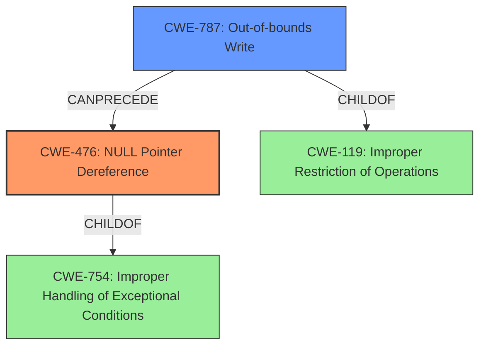

# Analysis Report for CVE-2021-36614

# Vulnerability Analysis Report: CVE-2021-36614

## Description

Mikrotik RouterOs before stable 6.48.2 suffers from a memory corruption vulnerability in the tr069-client process. An authenticated remote attacker can cause a Denial of Service (NULL pointer dereference).

## Vulnerability Description Key Phrases

**Rootcause:** NULL pointer dereference
**Weakness:** memory corruption
**Impact:** Denial of Service
**Attacker:** authenticated remote attacker
**Product:** Mikrotik RouterOs
**Version:** before stable 6.48.2
**Component:** tr069-client process

## Analysis (with Relationship Data)

# Summary
| CWE ID | CWE Name | Confidence | CWE Abstraction Level | CWE Vulnerability Mapping Label | CWE-Vulnerability Mapping Notes |
|---|---|---|---|---|---|
| CWE-476 | NULL Pointer Dereference | 0.95 | Base | Allowed | Primary CWE. The vulnerability results from dereferencing a NULL pointer. |
| CWE-787 | Out-of-bounds Write | 0.6 | Base | Allowed | Secondary CWE. The vulnerability description mentions memory corruption. |

## Evidence and Confidence

*   **Confidence Score:** 0.8
*   **Evidence Strength:** HIGH

- **Analysis and Justification:**  
  - *Explanation:* "The vulnerability description clearly states a **NULL pointer dereference** which directly corresponds to CWE-476 (NULL Pointer Dereference). The description also mentions **memory corruption**, and while that is a more general term, it could be related to CWE-787 (Out-of-bounds Write) if the **NULL pointer dereference** is a result of an out-of-bounds write. The vulnerability leads to a denial of service, which is a common impact of **NULL pointer dereferences** and **memory corruption** issues. The CVE Reference Links Content Summary confirms the **root cause** as **memory corruption** and explicitly lists **NULL pointer dereference** as a weakness."
  
  - *Relationship Analysis:* "CWE-476 is a Base level CWE, which is the preferred level of abstraction. CWE-787 is a related weakness as memory corruption can be a cause or consequence of a **NULL pointer dereference**. While CWE-787 is listed as the Primary CWE match for similar CVE descriptions, the explicit mention of **NULL pointer dereference** in the description makes CWE-476 the more direct and appropriate mapping. The retriever results also rank CWE-476 higher than CWE-787."

- **Confidence Score:**  
  - Confidence: 0.95 (High confidence due to explicit mention of **NULL pointer dereference** in the vulnerability description and confirmed by the CVE Reference Links Content Summary). Confidence for CWE-787 is lower at 0.6, because it's a more general case of **memory corruption** while the primary cause is a **NULL pointer dereference**.

---

## Criticism of Analysis

Okay, here's a review of the provided CWE analysis, incorporating the full CWE specifications.

**Overall Assessment:**

The analysis is generally good, particularly in identifying CWE-476 (NULL Pointer Dereference) as the primary weakness. The justification for this choice is well-reasoned and supported by the vulnerability description and the CVE Reference Links Content Summary. The secondary mapping to CWE-787 (Out-of-bounds Write) is also justifiable, though with lower confidence, given the broader context of "memory corruption." The confidence scores are appropriate.

**Detailed Critique:**

**1. CWE-476: NULL Pointer Dereference**

*   **Mapping Justification:** Excellent. The analysis explicitly acknowledges the presence of the phrase "**NULL pointer dereference**" in the vulnerability description and root cause analysis, which makes this a direct and appropriate mapping. The analysis correctly prioritizes this over CWE-787 due to the directness of the description.
*   **Abstraction Level:** Correct. CWE-476 is a Base level CWE, which is the preferred level of abstraction.
*   **Confidence:** The high confidence score (0.95) is warranted.
*   **Relationship Analysis:** The analysis correctly points out that memory corruption (potentially CWE-787) can be a *cause* or *consequence* of a NULL pointer dereference, indicating a possible chain or contributing factor.
*   **CWE Examples:** The examples provided are relevant and demonstrate how NULL pointer dereferences can occur in various contexts (race conditions, invalid packets, etc.). These real-world examples strengthen the mapping.
*   **Mitigations:** The provided mitigations are directly applicable to CWE-476.
    *   Checking pointers for NULL before use is the most direct mitigation.
    *   Choosing a language with built-in memory management or safety features (like Java or Rust) can prevent NULL pointer dereferences.
    *   Checking function return values is also relevant, as a function might return NULL to indicate an error, which must be handled.

**2. CWE-787: Out-of-bounds Write**

*   **Mapping Justification:** The mapping to CWE-787 is reasonable as a secondary CWE because the vulnerability description includes the term "memory corruption."  However, it's important to recognize that "memory corruption" is a broad term, and the specific type of memory corruption isn't explicitly stated.
*   **Abstraction Level:** Correct. CWE-787 is a Base level CWE.
*   **Confidence:** The confidence score (0.6) is appropriate, reflecting the less direct connection compared to CWE-476.
*   **Relationship Analysis:** The analysis could be strengthened by explicitly stating that if the NULL pointer dereference is a *result* of an out-of-bounds write corrupting a pointer value, then the relationship is a chain: CWE-787 -> CWE-476.  However, without more details, it is difficult to confirm the exact chain of causation. It would also be valid if memory corruption was caused by the dereference, leading to another vulnerability.
*   **CWE Examples:** The provided examples are valid instances of Out-of-bounds Write, but they don't directly illustrate how it might lead to a NULL pointer dereference. A better example might show an out-of-bounds write overwriting a pointer value with NULL.
*   **Mitigations:** The mitigations for CWE-787 are generally relevant to preventing memory corruption:
    *   Using memory-safe languages is a strong preventative measure.
    *   Using vetted libraries with bounds checking (like `Strsafe.h` or safe string libraries) helps avoid overflows.
    *   Compiler-based overflow detection mechanisms (like `/GS` in Visual Studio or `FORTIFY_SOURCE` in GCC) provide runtime protection.

**Improvements and Recommendations:**

1.  **Chain Analysis:** The analysis mentions the possibility of a chain relationship between CWE-787 and CWE-476. It would be beneficial to explore this more explicitly. For example:  "It is *possible* that an out-of-bounds write (CWE-787) corrupts a pointer, causing it to become NULL, which is then dereferenced (CWE-476)." This would add clarity.
2.  **Alternative CWE Considerations:** While CWE-476 and CWE-787 are good primary and secondary mappings, consider whether other CWEs might be relevant, even if they are less direct.
    *   **CWE-822: Untrusted Pointer Dereference:** If the crafted packet contains data that's directly interpreted as a pointer *without proper validation*, leading to the NULL dereference, then CWE-822 might be relevant.
    *   **CWE-825: Expired Pointer Dereference:** If the pointer points to memory that has already been freed, it could lead to a NULL dereference if the memory management scheme sets pointers to NULL upon freeing.
    *   **CWE-456: Missing Initialization of a Variable:** If the pointer was never initialized it could have a NULL value, this may not be likely, but it is important to consider.

3.  **Clarity on Memory Corruption:** Elaborate on the memory corruption aspect. Is it a buffer overflow, heap corruption, or some other form? If the specific type of memory corruption is unknown, state that explicitly.
4.  **Mitigation Prioritization:** When listing mitigations, prioritize those that are most effective and directly address the root cause (in this case, CWE-476).
5.  **Tooling:** Recommend static analysis tools as a mitigation strategy to identify potential NULL pointer dereferences and buffer overflows during development.

**Revised Summary Table (with suggestions):**

| CWE ID | CWE Name | Confidence | CWE Abstraction Level | CWE Vulnerability Mapping Label | CWE-Vulnerability Mapping Notes |
|---|---|---|---|---|---|
| CWE-476 | NULL Pointer Dereference | 0.95 | Base | Primary | The vulnerability results directly from dereferencing a NULL pointer, as indicated in the vulnerability description. |
| CWE-787 | Out-of-bounds Write | 0.6 | Base | Secondary | The vulnerability description mentions memory corruption, which *could* be related to an out-of-bounds write corrupting a pointer value or other memory.  Further investigation is needed. |

**Conclusion:**

The analysis is strong and identifies the key weaknesses. The suggested improvements would enhance the analysis by providing more context, exploring potential chain relationships, and offering a more comprehensive view of the vulnerability. Overall, it's a well-reasoned and justified assessment.

## Final Resolution

# Summary

| CWE ID | CWE Name | Confidence | CWE Abstraction Level | CWE Vulnerability Mapping Label | CWE-Vulnerability Mapping Notes |
|---|---|---|---|---|---|
| CWE-476 | **NULL Pointer Dereference** | 0.95 | Base | Primary | The vulnerability results directly from dereferencing a **NULL pointer**, as indicated in the vulnerability description. |
| CWE-787 | **Out-of-bounds Write** | 0.6 | Base | Secondary | The vulnerability description mentions **memory corruption**, which *could* be related to an **out-of-bounds write** corrupting a pointer value or other memory. Further investigation is needed. |

## Evidence and Confidence

*   **Confidence Score:** 0.85
*   **Evidence Strength:** HIGH

## Relationship Analysis

The primary relationship influencing the decision is the potential chain between CWE-787 (**Out-of-bounds Write**) and CWE-476 (**NULL Pointer Dereference**). While CWE-476 is directly stated in the vulnerability description, the mention of "memory corruption" suggests that an **out-of-bounds write** could potentially corrupt a pointer, leading to the **NULL pointer dereference**. This is a CANPRECEDE relationship, where CWE-787 can precede CWE-476. Both CWEs are at the Base abstraction level, providing the desired specificity.

## Vulnerability Chain

The vulnerability chain, based on the description, involves a potential sequence:

1.  An attacker crafts a malicious packet. (Implicit)
2.  This packet causes **memory corruption**, possibly due to an **out-of-bounds write** (CWE-787).
3.  The **out-of-bounds write** corrupts a pointer, setting it to NULL.
4.  The code then dereferences this **NULL pointer** (CWE-476).
5.  This results in a denial of service.

The **root cause** is likely the handling of the malicious packet leading to **memory corruption**, with the **NULL pointer dereference** being the immediate cause of the denial of service.

## Summary of Analysis

The initial analysis correctly identifies CWE-476 (**NULL Pointer Dereference**) as the primary weakness due to the explicit mention in the vulnerability description: "Mikrotik RouterOs before stable 6.48.2 suffers from a memory corruption vulnerability in the tr069-client process... An authenticated remote attacker can cause a Denial of Service (**NULL pointer dereference**)."

The criticism highlights the possibility of a chain relationship with CWE-787 (**Out-of-bounds Write**). This is plausible because the description also mentions "memory corruption." If the **out-of-bounds write** is what causes a pointer to become NULL, then CWE-787 precedes CWE-476.

The decision to keep CWE-476 as the primary CWE is justified because it is the most direct and specific cause of the vulnerability as described. CWE-787 is retained as a secondary CWE because it represents a potential contributing factor to the **memory corruption**. The evidence supports this classification, even though the exact mechanism of **memory corruption** isn't fully detailed.

The abstraction levels are optimal as both CWEs are at the Base level, providing sufficient specificity without being overly abstract. The relationships between the CWEs, particularly the CANPRECEDE relationship, helped to refine the understanding of the vulnerability and its potential causes.

*Report generated on 2025-03-18 00:28:19*
