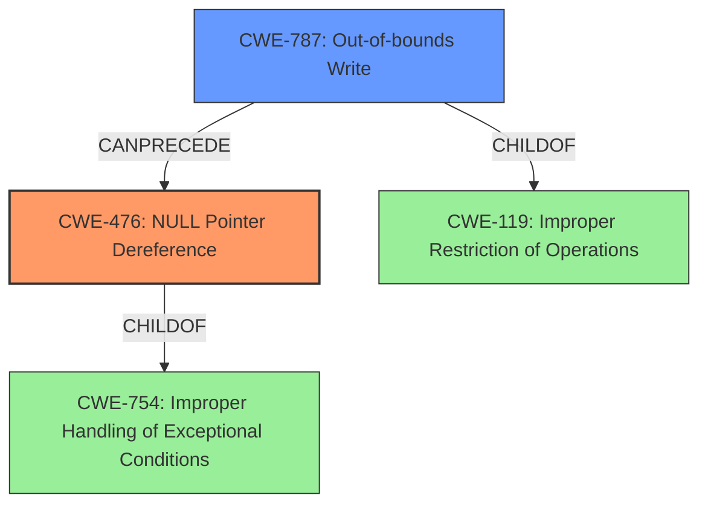

# Final Resolution for CVE-2021-36614

# Summary

| CWE ID | CWE Name | Confidence | CWE Abstraction Level | CWE Vulnerability Mapping Label | CWE-Vulnerability Mapping Notes |
|---|---|---|---|---|---|
| CWE-476 | **NULL Pointer Dereference** | 0.95 | Base | Primary | The vulnerability results directly from dereferencing a **NULL pointer**, as indicated in the vulnerability description. |
| CWE-787 | **Out-of-bounds Write** | 0.6 | Base | Secondary | The vulnerability description mentions **memory corruption**, which *could* be related to an **out-of-bounds write** corrupting a pointer value or other memory. Further investigation is needed. |

## Evidence and Confidence

*   **Confidence Score:** 0.85
*   **Evidence Strength:** HIGH

## Relationship Analysis

The primary relationship influencing the decision is the potential chain between CWE-787 (**Out-of-bounds Write**) and CWE-476 (**NULL Pointer Dereference**). While CWE-476 is directly stated in the vulnerability description, the mention of "memory corruption" suggests that an **out-of-bounds write** could potentially corrupt a pointer, leading to the **NULL pointer dereference**. This is a CANPRECEDE relationship, where CWE-787 can precede CWE-476. Both CWEs are at the Base abstraction level, providing the desired specificity.

## Vulnerability Chain

The vulnerability chain, based on the description, involves a potential sequence:

1.  An attacker crafts a malicious packet. (Implicit)
2.  This packet causes **memory corruption**, possibly due to an **out-of-bounds write** (CWE-787).
3.  The **out-of-bounds write** corrupts a pointer, setting it to NULL.
4.  The code then dereferences this **NULL pointer** (CWE-476).
5.  This results in a denial of service.

The **root cause** is likely the handling of the malicious packet leading to **memory corruption**, with the **NULL pointer dereference** being the immediate cause of the denial of service.

## Summary of Analysis

The initial analysis correctly identifies CWE-476 (**NULL Pointer Dereference**) as the primary weakness due to the explicit mention in the vulnerability description: "Mikrotik RouterOs before stable 6.48.2 suffers from a memory corruption vulnerability in the tr069-client process... An authenticated remote attacker can cause a Denial of Service (**NULL pointer dereference**)."

The criticism highlights the possibility of a chain relationship with CWE-787 (**Out-of-bounds Write**). This is plausible because the description also mentions "memory corruption." If the **out-of-bounds write** is what causes a pointer to become NULL, then CWE-787 precedes CWE-476.

The decision to keep CWE-476 as the primary CWE is justified because it is the most direct and specific cause of the vulnerability as described. CWE-787 is retained as a secondary CWE because it represents a potential contributing factor to the **memory corruption**. The evidence supports this classification, even though the exact mechanism of **memory corruption** isn't fully detailed.

The abstraction levels are optimal as both CWEs are at the Base level, providing sufficient specificity without being overly abstract. The relationships between the CWEs, particularly the CANPRECEDE relationship, helped to refine the understanding of the vulnerability and its potential causes.