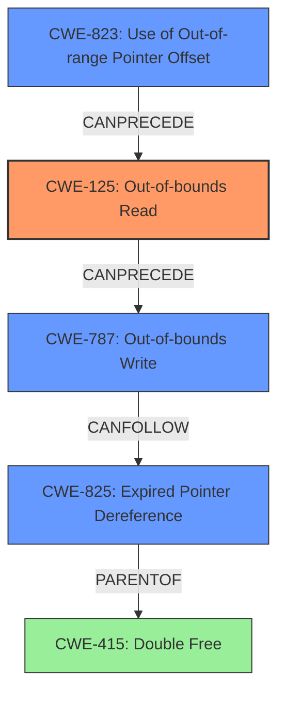

# Analysis Report for CVE-2021-3674

# Vulnerability Analysis Report: CVE-2021-3674

## Description

A flaw was found in rizin. The create_section_from_phdr function allocates space for ELF section data by processing the headers. Crafted values in the headers can cause out of bounds reads, which can lead to memory corruption and possibly code execution through the binary objects callback function.

## Vulnerability Description Key Phrases

**Rootcause:** out of bounds reads
**Impact:** memory corruption
**Vector:** Crafted values in the headers
**Product:** rizin
**Component:** create_section_from_phdr function

## Analysis (with Relationship Data)

# Summary
| CWE ID | CWE Name | Confidence | CWE Abstraction Level | CWE Vulnerability Mapping Label | CWE-Vulnerability Mapping Notes |
|---|---|---|---|---|---|
| CWE-125 | Out-of-bounds Read | 0.95 | Base | Allowed | Primary CWE. The vulnerability involves reading data past the end of a buffer. |
| CWE-415 | Double Free | 0.70 | Variant | Allowed | The `free()` function is called twice on the same memory address. |

## Evidence and Confidence

*   **Confidence Score:** 0.85
*   **Evidence Strength:** HIGH

- **Analysis and Justification:**  
  - *Explanation:* The vulnerability description states "**out of bounds reads**" which aligns directly with CWE-125 (Out-of-bounds Read). The "CVE Reference Links Content Summary" section further elaborates that invalid section headers lead to memory corruption because the `RzBinElfSection->name` pointer can be overwritten with arbitrary data and later freed, leading to a double-free condition. The "CVE Reference Links Content Summary" section describes a free of an arbitrary memory address, which leads to a crash or other undefined behavior.
  
  - *Relationship Analysis:* CWE-125 is a base level CWE, and the description aligns closely with the vulnerability. The retriever results also give it the highest score. While other CWEs like CWE-787 (Out-of-bounds Write) and CWE-823 (Use of Out-of-range Pointer Offset) are related, CWE-125 is the most accurate representation of the **out-of-bounds read** issue. The double-free condition can be represented with CWE-415, a variant level CWE.

- **Confidence Score:**  
  - Confidence: 0.95 (High evidence from technical description and CVE reference materials)

---

## Criticism of Analysis

Okay, I've reviewed the provided analysis against the full CWE specifications. Here's a breakdown of my critique:

**Overall Assessment:**

The analysis is generally good, but there are areas where it could be more precise, particularly in differentiating between the root cause and the consequences. The initial identification of CWE-125 (Out-of-bounds Read) is correct as a primary issue. The identification of CWE-415 (Double Free) is accurate as well but better characterized as a secondary effect.

**Detailed Critique:**

*   **CWE-125: Out-of-bounds Read (Confidence: 0.95)**
    *   **Strengths:** The analysis correctly identifies the "out of bounds reads" mentioned in the original description. It accurately links the crafted headers as the vector and memory corruption as an impact.
    *   **Areas for Improvement:** Could explain precisely how the crafted headers lead to OOB reads. Are incorrect offsets being used to read section names? Is the section size itself being misrepresented? More detail here strengthens the mapping.
    *   **Mitigation:** The provided mitigations for CWE-125 would be applicable here. Input validation of the ELF headers before processing them is crucial. "Accept known good" and validating length arguments, buffer size calculations, and offsets are relevant. The description mentions that the attacker can control the memory address to be freed.

*   **CWE-415: Double Free (Confidence: 0.70)**
    *   **Strengths:** Correctly identifies that the `free()` function is called twice on the same memory address, which is a common consequence of memory corruption.
    *   **Areas for Improvement:** While the double-free is a consequence, it is *not* the root cause. The root cause is the OOB read corrupting the memory used to store the pointer to the data that should be freed. Double-free is more of a symptom than the underlying flaw. Therefore, the confidence level is lowered since it is not primary.
    *   **Relationship to Other CWEs:** The provided CWE specifications correctly state that this is usually a resultant weakness. The chain of events should be emphasized: crafted headers -> OOB read -> memory corruption -> double free.
    *   **Mitigation:**  The mitigations for CWE-415 are somewhat applicable, especially the suggestion to set pointers to `NULL` after freeing. However, this is more of a band-aid. Preventing the memory corruption in the first place (through validation of headers and bounds checking) is the more effective solution.

**Additional Considerations and Potential Alternative CWEs:**

*   **CWE-787: Out-of-bounds Write:** While the initial description highlights OOB reads, the vulnerability also involves overwriting the `RzBinElfSection->name` pointer, which constitutes an OOB write. It is possible that the OOB *read* is done to determine *what* to write to the pointer. If this is the case, the OOB Write becomes a more dominant CWE.
    *   **Mitigation:** The mitigations for CWE-787 are relevant. Language selection (using safer languages or memory management techniques) and using libraries that prevent overflows are key.
*   **CWE-823: Use of Out-of-range Pointer Offset:** This CWE is also relevant. The crafted headers likely cause the code to use an out-of-range pointer offset when accessing section names. This directly contributes to the OOB read/write. The examples provided from the CWE database further support this.
    *   **Mitigation:** This highlights the need to validate the offsets within the ELF headers before using them in pointer arithmetic.
*   **CWE-190: Integer Overflow/Wraparound:** It's possible, depending on how the section sizes and offsets are handled, that integer overflows or wraparounds could be involved in calculating the memory regions to access. This would be a contributing factor, not necessarily a primary one.
*   **CWE-825: Expired Pointer Dereference:** This is relevant to the double-free condition. The first `free()` is valid but then the second `free()` happens *after* the memory has been released, making it an expired pointer dereference. The specification correctly points out this is a parent of double-free. This can be considered a more accurate description of the double-free condition.
*   **CWE-20: Improper Input Validation:** This is a high-level CWE that is *always* present with these types of low-level memory corruption issues. The root cause is *always* a lack of proper validation. However, CWE-20 is discouraged. Specific validation CWEs should be identified, such as CWE-1285 (Specified Index, Position, or Offset).

**Revised Summary Table:**

| CWE ID | CWE Name | Confidence | CWE Abstraction Level | CWE Vulnerability Mapping Label | CWE-Vulnerability Mapping Notes |
|---|---|---|---|---|---|
| CWE-125 | Out-of-bounds Read | 0.90 | Base | Allowed | Primary CWE. The vulnerability involves reading data past the end of a buffer. |
| CWE-787 | Out-of-bounds Write | 0.70 | Base | Allowed | Secondary CWE. Invalid section headers may overwrite the `RzBinElfSection->name` pointer. |
| CWE-823 | Use of Out-of-range Pointer Offset | 0.75 | Base | Allowed | Secondary CWE. Crafted section headers likely cause out-of-range offsets. |
| CWE-825 | Expired Pointer Dereference | 0.70 | Base | Allowed | Secondary CWE. Describes the double-free as dereferencing expired memory. |
| CWE-415 | Double Free | 0.50 | Variant | Allowed | Consequence of memory corruption. |

**Recommendations:**

1.  **Refine the Root Cause Analysis:** Provide more specific details about *how* the crafted headers lead to the OOB read/write. What fields are manipulated, and how do these manipulations bypass bounds checks or lead to incorrect calculations?
2.  **Re-evaluate CWE Prioritization:** Lower the confidence in CWE-415 since it is the *result* of the memory corruption, not the primary cause. Highlight the importance of CWE-787 and CWE-823.
3.  **Emphasize Input Validation:** Strongly emphasize the need for robust input validation of ELF headers. This is the most effective mitigation.
4.  **Review Mitigations:** Tailor the recommended mitigations to be specific to the ELF parsing context. For example, describe how to validate section sizes, offsets, and names against the ELF specification.

By incorporating these suggestions, the analysis will be more accurate, informative, and actionable.

## Final Resolution

# Summary
| CWE ID | CWE Name | Confidence | CWE Abstraction Level | CWE Vulnerability Mapping Label | CWE-Vulnerability Mapping Notes |
|---|---|---|---|---|---|
| CWE-125 | Out-of-bounds Read | 0.90 | Base | Allowed | Primary CWE. The vulnerability involves reading data past the end of a buffer. |
| CWE-787 | Out-of-bounds Write | 0.70 | Base | Allowed | Secondary CWE. Invalid section headers may overwrite the `RzBinElfSection->name` pointer. |
| CWE-823 | Use of Out-of-range Pointer Offset | 0.75 | Base | Allowed | Secondary CWE. Crafted section headers likely cause out-of-range offsets. |
| CWE-825 | Expired Pointer Dereference | 0.70 | Base | Allowed | Secondary CWE. Describes the double-free as dereferencing expired memory. |

## Evidence and Confidence

*   **Confidence Score:** 0.85
*   **Evidence Strength:** HIGH

## Relationship Analysis
The primary weakness is an **out-of-bounds read** (CWE-125) caused by crafted ELF headers. This leads to memory corruption, specifically overwriting the `RzBinElfSection->name` pointer (CWE-787). The crafted headers likely cause an out-of-range pointer offset (CWE-823) when accessing section names, further contributing to the **out-of-bounds read/write**. Finally, the double free is a consequence of the memory corruption, better described as an expired pointer dereference (CWE-825).

## Vulnerability Chain
The vulnerability chain starts with crafted ELF headers leading to an **out-of-bounds read** (CWE-125). This can then lead to an **out-of-bounds write** (CWE-787) by corrupting the `RzBinElfSection->name` pointer. The **out-of-bounds read** and **write** are facilitated by an out-of-range pointer offset (CWE-823). The final consequence is an expired pointer dereference (CWE-825), manifesting as a double free.

## Summary of Analysis
The initial analysis correctly identified CWE-125 as a primary issue and CWE-415 as a secondary effect. The criticism highlights that CWE-415 is more of a consequence than a root cause. The vulnerability description states "**out of bounds reads** which can lead to memory corruption". The vulnerability chain analysis and relationship analysis show that CWE-125, CWE-787, CWE-823, and CWE-825 are all related and contribute to the overall vulnerability. CWE-125 is the root cause, as the **out-of-bounds read** is the initial flaw that leads to memory corruption. CWE-787 (Out-of-bounds Write) is included because the crafted headers can lead to an overwrite of the `RzBinElfSection->name` pointer. CWE-823 (Use of Out-of-range Pointer Offset) is included as a contributing factor to the **out-of-bounds read/write**. CWE-825 (Expired Pointer Dereference) is included because it's a more precise description of the double-free condition than CWE-415. The selected CWEs are at the optimal level of specificity, as they represent the specific flaws that contribute to the vulnerability.

*Report generated on 2025-03-18 00:29:04*
