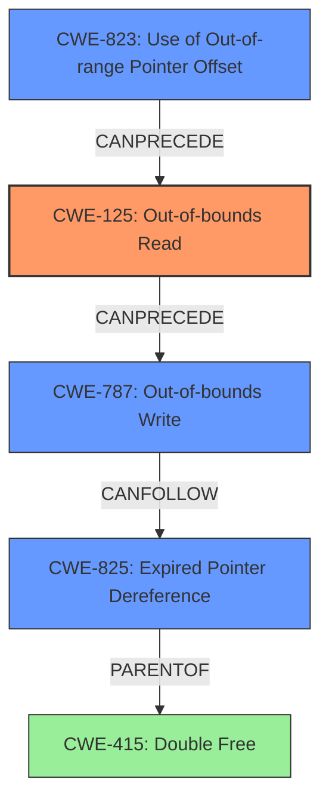

# Final Resolution for CVE-2021-3674

# Summary
| CWE ID | CWE Name | Confidence | CWE Abstraction Level | CWE Vulnerability Mapping Label | CWE-Vulnerability Mapping Notes |
|---|---|---|---|---|---|
| CWE-125 | Out-of-bounds Read | 0.90 | Base | Allowed | Primary CWE. The vulnerability involves reading data past the end of a buffer. |
| CWE-787 | Out-of-bounds Write | 0.70 | Base | Allowed | Secondary CWE. Invalid section headers may overwrite the `RzBinElfSection->name` pointer. |
| CWE-823 | Use of Out-of-range Pointer Offset | 0.75 | Base | Allowed | Secondary CWE. Crafted section headers likely cause out-of-range offsets. |
| CWE-825 | Expired Pointer Dereference | 0.70 | Base | Allowed | Secondary CWE. Describes the double-free as dereferencing expired memory. |

## Evidence and Confidence

*   **Confidence Score:** 0.85
*   **Evidence Strength:** HIGH

## Relationship Analysis
The primary weakness is an **out-of-bounds read** (CWE-125) caused by crafted ELF headers. This leads to memory corruption, specifically overwriting the `RzBinElfSection->name` pointer (CWE-787). The crafted headers likely cause an out-of-range pointer offset (CWE-823) when accessing section names, further contributing to the **out-of-bounds read/write**. Finally, the double free is a consequence of the memory corruption, better described as an expired pointer dereference (CWE-825).

## Vulnerability Chain
The vulnerability chain starts with crafted ELF headers leading to an **out-of-bounds read** (CWE-125). This can then lead to an **out-of-bounds write** (CWE-787) by corrupting the `RzBinElfSection->name` pointer. The **out-of-bounds read** and **write** are facilitated by an out-of-range pointer offset (CWE-823). The final consequence is an expired pointer dereference (CWE-825), manifesting as a double free.

## Summary of Analysis
The initial analysis correctly identified CWE-125 as a primary issue and CWE-415 as a secondary effect. The criticism highlights that CWE-415 is more of a consequence than a root cause. The vulnerability description states "**out of bounds reads** which can lead to memory corruption". The vulnerability chain analysis and relationship analysis show that CWE-125, CWE-787, CWE-823, and CWE-825 are all related and contribute to the overall vulnerability. CWE-125 is the root cause, as the **out-of-bounds read** is the initial flaw that leads to memory corruption. CWE-787 (Out-of-bounds Write) is included because the crafted headers can lead to an overwrite of the `RzBinElfSection->name` pointer. CWE-823 (Use of Out-of-range Pointer Offset) is included as a contributing factor to the **out-of-bounds read/write**. CWE-825 (Expired Pointer Dereference) is included because it's a more precise description of the double-free condition than CWE-415. The selected CWEs are at the optimal level of specificity, as they represent the specific flaws that contribute to the vulnerability.