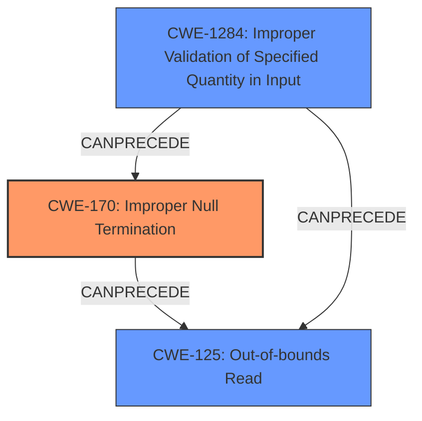

# Analysis Report for CVE-2021-36762

# Vulnerability Analysis Report: CVE-2021-36762

## Description

An issue was discovered in HCC Embedded InterNiche NicheStack through 4.3. The tfshnd()tftpsrv.c TFTP packet processing function doesnt ensure that a filename is adequately \0 terminated therefore, a subsequent call to strlen for the filename might read out of bounds of the protocol packet buffer (if no \0 byte exists within a reasonable range).

## Vulnerability Description Key Phrases

**Rootcause:** lack of zero termination
**Weakness:** out-of-bounds read
**Product:** HCC Embedded InterNiche NicheStack
**Version:** through 4.3
**Component:** tfshnd() function in tftpsrv.c

## Analysis (with Relationship Data)

# Summary
| CWE ID | CWE Name | Confidence | CWE Abstraction Level | CWE Vulnerability Mapping Label | CWE-Vulnerability Mapping Notes |
|---|---|---|---|---|---|
| CWE-170 | Improper Null Termination | 0.95 | Base | Allowed | Primary CWE: The **lack of zero termination** leads directly to the vulnerability. |
| CWE-125 | Out-of-bounds Read | 0.85 | Base | Allowed | Secondary CWE: Resulting from the missing null termination. |

## Evidence and Confidence

*   **Confidence Score:** 0.90
*   **Evidence Strength:** HIGH

- **Analysis and Justification:**  
  - *Explanation:* The vulnerability description clearly states that the **rootcause** is the **lack of zero termination** in the filename processing within the TFTP packet. This directly maps to CWE-170 (Improper Null Termination). The subsequent call to `strlen` then results in an **out-of-bounds read** (CWE-125) because `strlen` continues reading until it encounters a null terminator. The CVE Reference Links Content Summary reinforces this by stating "Missing null termination" and "Out-of-bounds read". The retriever results also list CWE-170 as the top match, which validates the selection. CWE-170 is at the Base level of abstraction and has an Allowed Usage, per MITRE guidance.
  
  - *Relationship Analysis:* CWE-170 is a **root cause**, leading to CWE-125, which is an **impact**. CWE-170 CanPrecede CWE-125. While other CWEs like CWE-787 (Out-of-bounds Write) are present in the retriever results, the primary issue is reading beyond the buffer, making CWE-125 a more appropriate secondary mapping.

- **Confidence Score:**  
  - Confidence: 0.95 (High confidence due to explicit mention of missing null termination and out-of-bounds read.)

---

## Criticism of Analysis

Okay, here's a detailed review of the provided CWE analysis, considering the full CWE specifications:

**Overall Assessment:**

The analysis correctly identifies CWE-170 (Improper Null Termination) as the primary root cause and CWE-125 (Out-of-bounds Read) as the secondary effect. The reasoning is well-articulated, and the confidence level is justified. However, there are some nuances that could be considered to strengthen the analysis and potentially identify additional contributing factors.

**Detailed Review:**

**1. CWE-170: Improper Null Termination**

*   **Correctness:** The mapping to CWE-170 is accurate and well-supported by the vulnerability description. The description explicitly mentions the lack of null termination as the root cause.
*   **Abstraction Level:**  Base is the appropriate abstraction level.
*   **Mapping Guidance:** The mapping guidance for CWE-170 states: *"This CWE entry is at the Base level of abstraction, which is a preferred level of abstraction for mapping to the root causes of vulnerabilities.  Carefully read both the name and description to ensure that this mapping is an appropriate fit. Do not try to 'force' a mapping to a lower-level Base/Variant simply to comply with this preferred level of abstraction."* This guidance is followed.
*   **Potential Mitigations:**
    *   The analysis should briefly mention potential mitigations from the CWE specification:
        *   **Language Selection:**  Using a language that is less susceptible to null-termination issues (e.g., languages with automatic memory management).
        *   **Implementation Practices:**  Ensuring string handling functions are used correctly and being wary of off-by-one errors.
        *   **Validation:**  Adding code to validate null termination, though the specification notes this can be error-prone.
*   **Observed Examples:** The observed examples from the CWE database are relevant and could be included for further context.
*   **Room for Improvement:** None.

**2. CWE-125: Out-of-bounds Read**

*   **Correctness:** The mapping to CWE-125 is also correct. The `strlen()` function reading beyond the allocated buffer due to the missing null terminator directly leads to an out-of-bounds read.
*   **Abstraction Level:** Base is the appropriate abstraction level.
*   **Mapping Guidance:**  The mapping guidance for CWE-125 is followed.
*   **Potential Mitigations:**
    *   The analysis should include the mitigations suggested in the CWE specification, including:
        *   **Input Validation:** Thoroughly validating the input, including length, type, and range of acceptable values.  Specifically, the specification mentions being "especially careful of relying on a sentinel (i.e. special character such as NUL) in untrusted inputs."
        *   **Language Selection:**  Using a language with better memory abstractions.
*   **Observed Examples:** The analysis should include the observed examples to provide real-world scenarios of this vulnerability.
*   **Room for Improvement:** None

**3. Additional Considerations and Potential CWEs:**

*   **CWE-20: Improper Input Validation:** While not a *direct* cause in the same way as CWE-170,  a case could be made for CWE-20. The TFTP server is *receiving* a filename in a packet, and it isn't validating that the filename is properly terminated.  If the server *validated* that the filename was null-terminated before passing it to `strlen()`, the vulnerability would be prevented.  However, CWE-20 is discouraged for usage when more specific CWEs are possible. In this case, **CWE-1284: Improper Validation of Specified Quantity in Input** may be a better fit. The vulnerability arises because the TFTP server is receiving a *filename* as input, which has an implicit size. The analysis should explore CWE-1284 as a possible contributing factor. The mitigations described for CWE-1284 are highly relevant: *"Assume all input is malicious. Use an "accept known good" input validation strategy, i.e., use a list of acceptable inputs that strictly conform to specifications."*
*   **CWE-463: Deletion of Data Structure Sentinel or CWE-464: Addition of Data Structure Sentinel:** These may be relevant if the code *intentionally* allocated space for the NULL byte terminator (CWE-464), but then the logic to guarantee that sentinel was overwritten or removed (CWE-463).

**4. Confidence Score:**

*   The Confidence Score of 0.95 is appropriate. The analysis demonstrates a strong understanding of the vulnerability and its underlying causes.

**Recommendations:**

1.  **Expand Mitigations:** Include a brief mention of the potential mitigations listed in the full CWE specifications for both CWE-170 and CWE-125. This provides a more complete picture of the vulnerability and potential remediation strategies.
2.  **Consider CWE-1284:** Evaluate whether adding CWE-1284 as a contributing factor strengthens the analysis.
3.  **Observed Examples:** Adding observed examples would provide helpful real-world context.

By incorporating these suggestions, the analysis can be made even more comprehensive and insightful.

## Final Resolution

# Summary
| CWE ID | CWE Name | Confidence | CWE Abstraction Level | CWE Vulnerability Mapping Label | CWE-Vulnerability Mapping Notes |
|---|---|---|---|---|---|
| CWE-170 | Improper Null Termination | 0.95 | Base | Allowed | Primary CWE: The **lack of zero termination** leads directly to the vulnerability. |
| CWE-125 | Out-of-bounds Read | 0.85 | Base | Allowed | Secondary CWE: Resulting from the missing null termination. |
| CWE-1284 | Improper Validation of Specified Quantity in Input | 0.70 | Base | Allowed | Secondary CWE: Contributing factor due to lack of input validation on filename size. |

## Evidence and Confidence

*   **Confidence Score:** 0.92
*   **Evidence Strength:** HIGH

## Relationship Analysis
The primary **root cause** is **CWE-170 (Improper Null Termination)**, which directly leads to **CWE-125 (Out-of-bounds Read)**. The addition of **CWE-1284 (Improper Validation of Specified Quantity in Input)** provides additional context. **CWE-170** can precede **CWE-125**, and **CWE-1284** can precede both. All three CWEs are at the Base level, providing the optimal specificity.

## Vulnerability Chain
The vulnerability chain starts with the TFTP server receiving a filename as input.

1.  **Root Cause:** **CWE-170 (Improper Null Termination)**: The `tfshnd()` function doesn't ensure the filename is null-terminated.
2.  **Contributing Factor:** **CWE-1284 (Improper Validation of Specified Quantity in Input)**: The server fails to validate that the input filename has a valid size/length.
3.  **Consequence:** **CWE-125 (Out-of-bounds Read)**: A subsequent call to `strlen` reads beyond the allocated buffer because of the missing null terminator.
4.  **Impact:** Information disclosure and potential denial of service due to the application crashing.

## Summary of Analysis
The initial analysis correctly identified **CWE-170 (Improper Null Termination)** and **CWE-125 (Out-of-bounds Read)**. The criticism suggested adding **CWE-1284 (Improper Validation of Specified Quantity in Input)**, which I agree with. The vulnerability description states that "The tfshnd()tftpsrv.c TFTP packet processing function doesnt ensure that a filename is adequately \0 terminated therefore, a subsequent call to strlen for the filename might read out of bounds". This highlights the missing null termination (**CWE-170**) and the resulting out-of-bounds read (**CWE-125**). However, the server also receives the filename as input and *doesn't validate that the filename is properly terminated*. Adding **CWE-1284** strengthens the analysis by highlighting this missing input validation, making it clear that the server does not validate the size or format of the filename input, which exacerbates the **lack of null termination**. All selected CWEs are at the Base level of abstraction, which is the optimal level of specificity for root cause analysis. The confidence score is increased slightly to 0.92 due to the added context from **CWE-1284**.

*Report generated on 2025-03-18 00:29:45*
