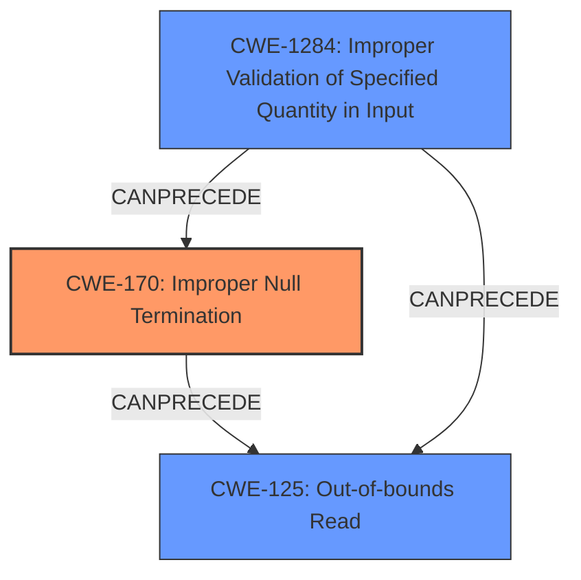

# Final Resolution for CVE-2021-36762

# Summary
| CWE ID | CWE Name | Confidence | CWE Abstraction Level | CWE Vulnerability Mapping Label | CWE-Vulnerability Mapping Notes |
|---|---|---|---|---|---|
| CWE-170 | Improper Null Termination | 0.95 | Base | Allowed | Primary CWE: The **lack of zero termination** leads directly to the vulnerability. |
| CWE-125 | Out-of-bounds Read | 0.85 | Base | Allowed | Secondary CWE: Resulting from the missing null termination. |
| CWE-1284 | Improper Validation of Specified Quantity in Input | 0.70 | Base | Allowed | Secondary CWE: Contributing factor due to lack of input validation on filename size. |

## Evidence and Confidence

*   **Confidence Score:** 0.92
*   **Evidence Strength:** HIGH

## Relationship Analysis
The primary **root cause** is **CWE-170 (Improper Null Termination)**, which directly leads to **CWE-125 (Out-of-bounds Read)**. The addition of **CWE-1284 (Improper Validation of Specified Quantity in Input)** provides additional context. **CWE-170** can precede **CWE-125**, and **CWE-1284** can precede both. All three CWEs are at the Base level, providing the optimal specificity.

## Vulnerability Chain
The vulnerability chain starts with the TFTP server receiving a filename as input.

1.  **Root Cause:** **CWE-170 (Improper Null Termination)**: The `tfshnd()` function doesn't ensure the filename is null-terminated.
2.  **Contributing Factor:** **CWE-1284 (Improper Validation of Specified Quantity in Input)**: The server fails to validate that the input filename has a valid size/length.
3.  **Consequence:** **CWE-125 (Out-of-bounds Read)**: A subsequent call to `strlen` reads beyond the allocated buffer because of the missing null terminator.
4.  **Impact:** Information disclosure and potential denial of service due to the application crashing.

## Summary of Analysis
The initial analysis correctly identified **CWE-170 (Improper Null Termination)** and **CWE-125 (Out-of-bounds Read)**. The criticism suggested adding **CWE-1284 (Improper Validation of Specified Quantity in Input)**, which I agree with. The vulnerability description states that "The tfshnd()tftpsrv.c TFTP packet processing function doesnt ensure that a filename is adequately \0 terminated therefore, a subsequent call to strlen for the filename might read out of bounds". This highlights the missing null termination (**CWE-170**) and the resulting out-of-bounds read (**CWE-125**). However, the server also receives the filename as input and *doesn't validate that the filename is properly terminated*. Adding **CWE-1284** strengthens the analysis by highlighting this missing input validation, making it clear that the server does not validate the size or format of the filename input, which exacerbates the **lack of null termination**. All selected CWEs are at the Base level of abstraction, which is the optimal level of specificity for root cause analysis. The confidence score is increased slightly to 0.92 due to the added context from **CWE-1284**.