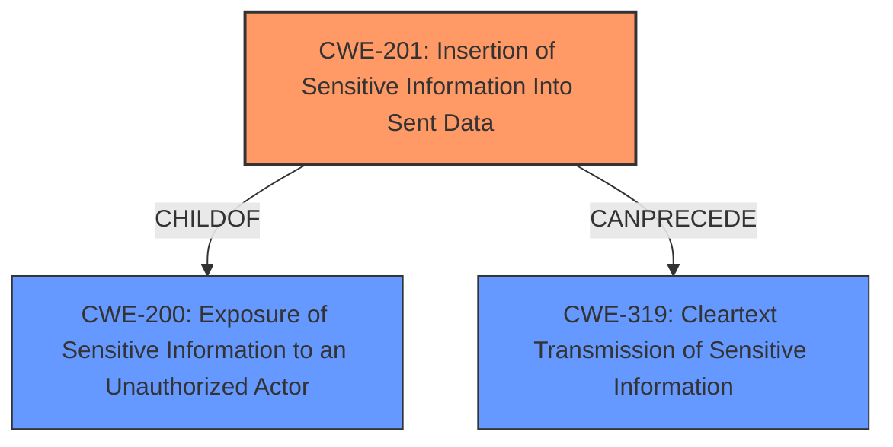

# Final Resolution for CVE-2021-36793

# Summary

| CWE ID | CWE Name | Confidence | CWE Abstraction Level | CWE Vulnerability Mapping Label | CWE-Vulnerability Mapping Notes |
|---|---|---|---|---|---|
| CWE-201 | Insertion of Sensitive Information Into Sent Data | 0.90 | Base | Allowed | Primary CWE |
| CWE-319 | Cleartext Transmission of Sensitive Information | 0.65 | Base | Allowed | Secondary Candidate |

## Evidence and Confidence

*   **Confidence Score:** 0.85
*   **Evidence Strength:** HIGH

## Relationship Analysis
The primary relationship that impacted my decision was the parent-child relationship between CWE-200 [Exposure of Sensitive Information to an Unauthorized Actor] and CWE-201 [Insertion of Sensitive Information Into Sent Data]. The analysis correctly identified CWE-201 as a more specific child of CWE-200 because the vulnerability involves the **sensitive information** being actively inserted into the data sent to the user. This specificity is crucial. CWE-319 [Cleartext Transmission of Sensitive Information] is considered a secondary candidate, as the transmission of the **session identifier** in cleartext is a consequence of its inclusion in the HTML output.

## Vulnerability Chain
The vulnerability chain begins with the improper handling of the **session identifier** by the `CsrfTokenViewHelper`, leading to the **insertion of this sensitive information** into the HTML output (CWE-201). This, in turn, results in the **transmission of the session identifier in cleartext** (CWE-319) to the user's browser. The root cause is the mishandling of the **session identifier**, and the impact is the potential disclosure of sensitive information.

## Summary of Analysis
The initial analysis accurately identified CWE-201 [Insertion of Sensitive Information Into Sent Data] as the primary weakness, supported by the vulnerability description: "a **session identifier** is **unsafely present in HTML output**." This directly indicates that **sensitive information** is being inserted into sent data. The criticism reinforced this selection and suggested a minor refinement for the justification of CWE-319 [Cleartext Transmission of Sensitive Information].

The graph relationships influenced my decision by highlighting the importance of specificity. While CWE-200 [Exposure of Sensitive Information to an Unauthorized Actor] is a relevant parent, CWE-201 [Insertion of Sensitive Information Into Sent Data] provides a more precise description of the vulnerability. The decision to include CWE-319 [Cleartext Transmission of Sensitive Information] as a secondary candidate is based on the understanding that the cleartext transmission is a consequence of the **sensitive information** being included in the HTML output.

The selected CWEs are at the optimal level of specificity because they accurately represent the root cause and the resulting vulnerability. CWE-201 [Insertion of Sensitive Information Into Sent Data] captures the core issue of **sensitive information** being included in the sent data, while CWE-319 [Cleartext Transmission of Sensitive Information] highlights the secondary concern of the **session identifier** being transmitted in cleartext.