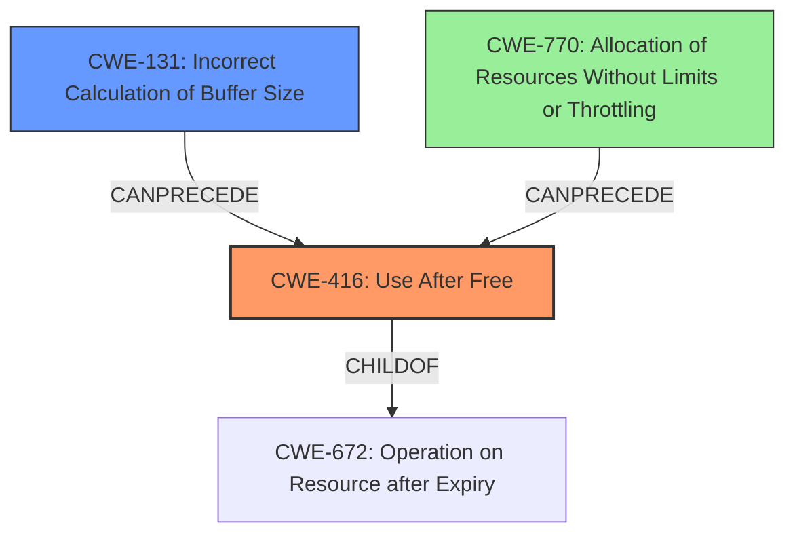

# Final Resolution for CVE-2021-3700

# Summary

| CWE ID  | CWE Name                                                     | Confidence | CWE Abstraction Level | CWE Vulnerability Mapping Label | CWE-Vulnerability Mapping Notes                                                                                                                                                                                        |
| :------- | :----------------------------------------------------------- | :--------- | :-------------------- | :------------------------------ | :--------------------------------------------------------------------------------------------------------------------------------------------------------------------------------------------------------------------- |
| CWE-416  | Use After Free                                               | 1.0        | Variant             | Allowed                         | **Primary CWE**                                                                                                                                                                                                        |
| CWE-131  | Incorrect Calculation of Buffer Size                         | 0.4        | Base                  | Allowed                         | Secondary Candidate; Consider if buffer size calculation does not account for data written.                                                                                                                            |
| CWE-770  | Allocation of Resources Without Limits or Throttling        | 0.3        | Base                  | Allowed                         | Tertiary Candidate; Consider if the design allows unbounded buffering reliably triggering repeated reallocations leading to resource exhaustion. If the DoS depends on the UAF, then it is a consequence of the UAF. |

## Evidence and Confidence

*   **Confidence Score:** 0.9
*   **Evidence Strength:** MEDIUM

## Relationship Analysis

The primary focus is on identifying the most specific CWE that accurately represents the **rootcause** of the vulnerability.

*   **Parent-child hierarchical relationships**: CWE-416 (Use After Free) is a variant of CWE-672 (Operation on Resource after Expiry). Given the explicit "use-after-free" condition mentioned in the vulnerability description, CWE-416 offers a more precise classification than its parent.
*   **Chain relationships showing progression of vulnerability**: The vulnerability description mentions serializing large amounts of buffered write data. This could potentially be linked to CWE-131 (Incorrect Calculation of Buffer Size), suggesting a chain where an incorrect size calculation leads to a buffer overflow, and ultimately a use-after-free.
*   **Peer relationships that offered alternative classifications**: CWE-770 (Allocation of Resources Without Limits or Throttling) was considered, given the reallocation of buffers. However, the analysis suggests that the **rootcause** is more directly related to a failure to manage reallocated buffer, or potentially an incorrect size calculation. The DoS element depends on the UAF.
*   **How abstraction levels influenced your selection**: The selection of CWE-416 (Variant) and CWE-131 (Base) reflects an effort to identify weaknesses at an appropriate level of specificity.

## Vulnerability Chain

The vulnerability chain starts with a potential miscalculation of the buffer size (CWE-131), which is then reallocated due to slow or blocked destination, leading to **improper memory management.** When data is written/serialized to the buffer, the original buffer is freed. A pointer to this freed memory is then used (CWE-416), resulting in a use-after-free condition. The impact is denial of service and potentially arbitrary code execution.

*   **Initial Flaw:** Potential miscalculation of the buffer size or unbounded buffering.
*   **Weakness 1:** Improper memory management/buffer reallocation.
*   **Weakness 2:** Use of dangling pointer (CWE-416).
*   **Impact:** Denial of service, potential code execution.

## Summary of Analysis

The analysis is based on the provided evidence. The vulnerability description states a "use-after-free vulnerability".

The graph relationships influenced the selection by highlighting the parent-child relationship between CWE-416 and CWE-672. It also showed the possible chain relationships with CWE-131 and CWE-770. The analysis also took into account the abstraction levels of the CWEs.

The decision to classify the vulnerability as CWE-416 is strongly supported by the evidence. The vulnerability description clearly states a use-after-free condition. The selection of CWE-416 is at the optimal level of specificity because it accurately reflects the **rootcause** of the vulnerability and is a Variant.

CWE-131 and CWE-770 are less directly supported by the evidence, and are only listed as secondary/tertiary candidates.