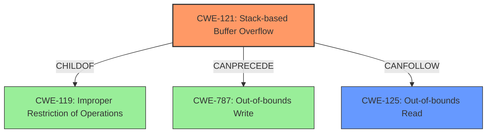

# Final Resolution for CVE-2021-37020

# Summary
| CWE ID | CWE Name | Confidence | CWE Abstraction Level | CWE Vulnerability Mapping Label | CWE-Vulnerability Mapping Notes |
|---|---|---|---|---|---|
| CWE-121 | Stack-based Buffer Overflow | 0.95 | Variant | Allowed | Primary CWE. Vulnerability explicitly describes a stack-based buffer overflow. This is a Variant level CWE, which is a preferred level of abstraction. |
| CWE-125 | Out-of-bounds Read | 0.75 | Base | Allowed | Secondary Candidate. A common consequence of CWE-121, occurring when the overflow causes reads beyond the allocated buffer. CanFollow CWE-121. While CWE-787 is also implied, the impact description focuses on out-of-bounds read. |

## Evidence and Confidence

*   **Confidence Score:** 0.90
*   **Evidence Strength:** MEDIUM

## Relationship Analysis
The primary relationship influencing the decision is the CANFOLLOW relationship between CWE-121 (**Stack-based Buffer Overflow**) and CWE-125 (**Out-of-bounds Read**). The vulnerability description explicitly states a stack-based buffer overflow, which directly maps to CWE-121. The description also mentions that this overflow leads to an out-of-bounds read, which is accurately represented by CWE-125. CWE-121 is a child of CWE-119 (**Improper Restriction of Operations within the Bounds of a Memory Buffer**), but mapping directly to CWE-119 would be less specific.

## Vulnerability Chain
The vulnerability chain starts with the **ROOTCAUSE** CWE-121 (**Stack-based Buffer Overflow**). This overflow leads to CWE-125 (**Out-of-bounds Read**). The sequence is: Improper input handling -> Buffer Overflow on the Stack -> Out-of-bounds Read, which could lead to information disclosure or other unexpected behavior. The overflow also implies CWE-787 (**Out-of-bounds Write**), but the impact description focuses on the read consequence.

## Summary of Analysis
The initial analysis and criticism are well-reasoned and lead to a correct conclusion. The selection of CWE-121 as the primary CWE is justified by the explicit mention of a "stack-based buffer overflow" in the vulnerability description. The choice of CWE-125 as a secondary CWE is also appropriate, as it represents a common consequence of buffer overflows.

The criticism's suggestion to explicitly address why some of the top-ranked CWEs from the retriever (e.g., CWE-131) were not selected is valuable. As the description does not specify that the buffer size calculation was the source of the error, it is more appropriate to select CWE-121, which directly addresses the overflow condition.

The graph relationships also influenced the final selection. The CANFOLLOW relationship between CWE-121 and CWE-125 highlights the vulnerability chain. While CWE-787 is also implied, the focus on out-of-bounds read makes CWE-125 a more direct representation of the described impact.

The selected CWEs are at the optimal level of specificity. CWE-121 is a Variant-level CWE, which is a preferred level of abstraction for mapping to root causes, while CWE-125 is a Base-level CWE, providing a clear description of the resulting out-of-bounds read.

*Evidence:* "There is a Stack-based Buffer Overflow vulnerability in Huawei Smartphone.Successful exploitation of this vulnerability may lead to Out-of-bounds read."